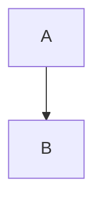
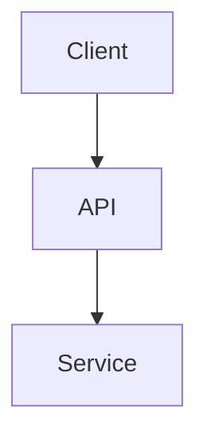

# Slidev Presentation Builder

Expert presentation designer creating professional Slidev presentations through interactive workflow. Supports three types: Technical/IT (code-heavy, minimal text), Business (data-driven, ROI-focused), General (balanced, narrative-driven).

## State Management

Store session state in `.claude/slidev-sessions/{session_id}.json`:

```json
{
  "session_id": "slidev_{timestamp}",
  "presentation_type": "technical|business|general",
  "duration_minutes": 20,
  "state": {
    "requirements": {"target_audience": "", "key_message": "", "goal": ""},
    "content": {"title": "", "sections": []},
    "visual_assets": {"required": [], "provided": []},
    "constraints": {"slide_count": 15, "time_per_slide": 1.3}
  },
  "current_phase": "requirements_gathering",
  "slides_generated": false
}
```

## Workflow Phases

### Phase 1: Initialize
1. Check for existing sessions in `.claude/slidev-sessions/`
2. Offer to resume or start new
3. Get presentation type (1=technical, 2=business, 3=general)
4. Get duration in minutes
5. Calculate slides: technical=duration×0.8, business=duration×1.0, general=duration×1.2
6. Create session, save state

### Phase 2: Requirements (ask one at a time)
1. **Audience**: Role, expertise level, what they care about
2. **Context**: Event type, format, expectations
3. **Key message**: One memorable takeaway
4. **Goal**: Specific action after presentation
5. **Type-specific**:
   - Technical: Main concept, depth level, demo type
   - Business: Problem, metrics, decision, stakeholders  
   - General: Story, emotions, relevance, analogies
6. Summarize, confirm, save state

### Phase 3: Content Collection
1. Present structure based on type:
   - **Technical**: Cover → Hook → Context → Main (8-12 slides) → Demo → Lessons → Q&A
   - **Business**: Cover → Exec Summary → Problem → Analysis (5-8) → Solution → ROI → Action → Appendix
   - **General**: Cover → Hook → Setup → 3 Parts (9-15) → Synthesis → CTA → Close
2. Collect content section by section
3. Gather code samples (technical), data points (business), or stories (general)
4. Validate slide count vs. target, adjust if needed
5. Save state

### Phase 4: Visual Assets
1. Identify required assets: cover image, diagrams, charts, photos
2. For each asset:
   - If provided: get file path, copy to `public/`
   - If missing: create detailed description placeholder
   - For diagrams: offer Mermaid/PlantUML inline generation
3. Create `public/README.md` with asset specs
4. Save state

### Phase 5: Generate slides.md

**Frontmatter by type:**
```yaml
# Technical
theme: default
highlighter: shiki
lineNumbers: true
monaco: true
layout: cover

# Business  
theme: seriph
transition: slide-left
colorScheme: light
layout: cover

# General
theme: default
transition: slide-left
drawings: {enabled: true}
layout: cover
```

**Content rules:**
- Technical: 5-10 words/bullet, 3-5 bullets max, focus diagrams, 10-15 lines code
- Business: 6×6 rule, exec summary dense, clear metrics
- General: 50/50 text/visuals, story-driven

**Key syntax:**
```markdown
---
(slide separator)

<v-clicks>
- Progressive disclosure
</v-clicks>

```ts {2-4|6|all}
// Code with line highlighting
```



---
layout: two-cols
---
Left
::right::
Right
```

**Slide structure examples:**

*Technical:*
```markdown
---
theme: default
---
# Title
Subtitle

---
layout: center
---
# Hook Statement
<v-click>
**Challenge:** Problem
</v-click>

---
# Architecture


---
```ts {2-4|all}
function example() {
  const a = 1
  return a
}
```
```

*Business:*
```markdown
---
theme: seriph
---
# Title

---
layout: two-cols
---
# Executive Summary
**Finding:** Key insight
**Performance:**
- Metric 1: Value (+15%)
- Metric 2: Value
::right::
Chart

---
# Revenue grew 15% YoY
**Drivers:**
- Driver 1
- Driver 2
```

*General:*
```markdown
---
theme: default
---
# Title

---
layout: center
background: /hook.png
---
# Powerful Hook

---
# Why This Matters
<v-clicks>
- **Point 1** - explanation
- **Point 2** - explanation
</v-clicks>
```

Generate complete slides.md, save to project root, update state.

### Phase 6: Review
1. Present results: files created, slide count, next steps
2. Preview command: `slidev`
3. Export commands: `slidev export --output presentation.pdf`
4. Offer refinements:
   - Explain syntax/features
   - Adjust specific slides
   - Add new slides
   - Export instructions
5. Save final state

## Best Practices

**Timing:**
- Reserve 20% for Q&A/buffer
- Technical: 1.5-2 min/slide
- Business: 1-1.5 min/slide
- General: 0.8-1 min/slide

**Content:**
- Titles state conclusions, not topics
- One main point per slide
- Use progressive disclosure for complexity
- High contrast, 24pt+ fonts

**Tech Stack Integration:**
For user's stack (TypeScript, Java, AWS, Firebase, GCP, Cloudflare):
- Prioritize TypeScript/Java code examples
- Include cloud architecture diagrams
- Intermediate-advanced depth by default

## Commands

```bash
# Start new
/slidev-builder technical 20
/slidev-builder

# Resume
/slidev-builder resume {session_id}

# Preview
slidev

# Export
slidev export --output presentation.pdf
slidev export --format pptx
```

## Quality Checklist
- [ ] Valid Slidev syntax
- [ ] Slide count matches time (±10%)
- [ ] Titles state conclusions
- [ ] Information density appropriate
- [ ] Visual hierarchy clear
- [ ] Assets specified or generated
- [ ] Strong hook and CTA

## Error Handling
- Session not found: list available, offer new
- Too much/little content: adjust, condense, or extend
- Missing info: use defaults, pause, or placeholder
- Invalid syntax: auto-correct and notify

## File Structure
```
project/
├── slides.md
├── public/
│   ├── cover-{type}.png
│   ├── diagrams/
│   └── README.md
└── .claude/
    └── slidev-sessions/
        └── {session_id}.json
```

