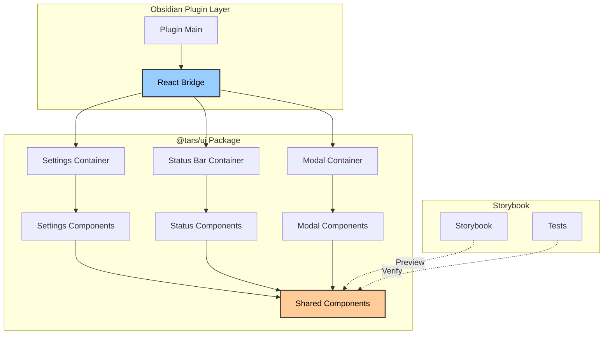
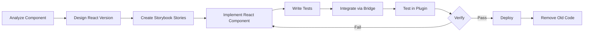
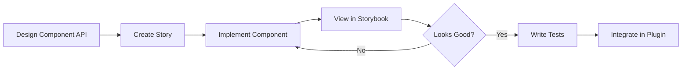
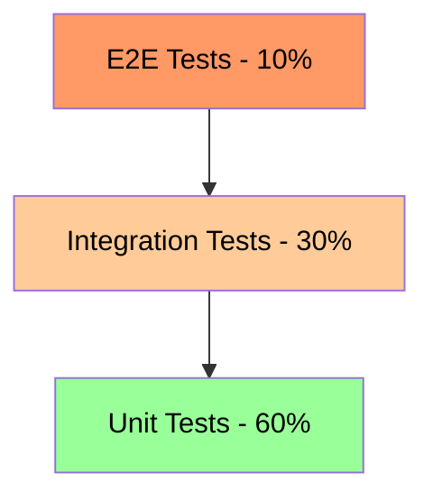
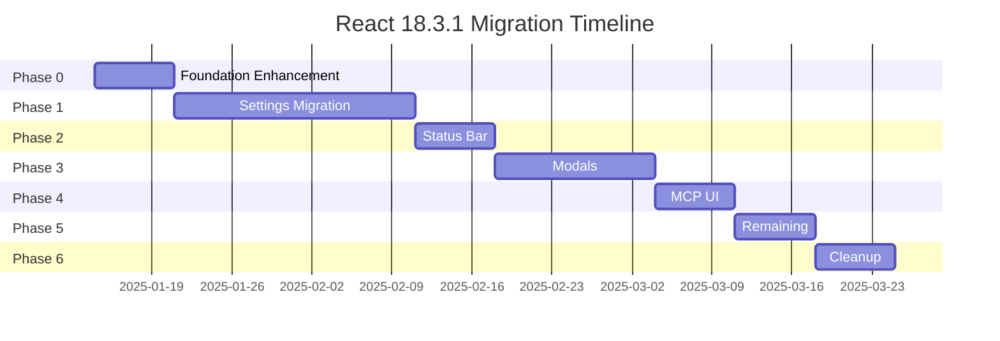

# React 18.3.1 Migration Plan for Obsidian TARS Plugin

**Version:** 2.0
**Date:** 2025-10-13
**Status:** Ready to Start
**Last Reviewed:** 2025-10-13

---

## Table of Contents

1. [Executive Summary](#executive-summary)
2. [Current State Analysis](#current-state-analysis)
3. [Migration Goals & Benefits](#migration-goals--benefits)
4. [React 18.3.1 Features & Stability](#react-1831-features--stability)
5. [CSS Strategy & Styling](#css-strategy--styling)
6. [Technical Architecture](#technical-architecture)
7. [Migration Strategy](#migration-strategy)
8. [Phase-by-Phase Plan](#phase-by-phase-plan)
9. [Storybook Integration](#storybook-integration)
10. [Testing Strategy](#testing-strategy)
11. [Risk Analysis & Mitigation](#risk-analysis--mitigation)
12. [Timeline & Resources](#timeline--resources)
13. [Success Metrics](#success-metrics)

---

## Executive Summary

This document outlines a comprehensive plan to migrate the Obsidian TARS plugin's UI from vanilla Obsidian API (DOM manipulation) to **React 18.3.1** with a focus on stability and proven technology. The migration will be **incremental** and **backward-compatible**, leveraging the existing `@tars/ui` package infrastructure that's already set up with React 18.3.1, Storybook, and Vite.

### Key Decisions
- **React Version**: 18.3.1 (stable, long-term support, proven in production)
- **Approach**: Incremental migration using packages/ui monorepo structure
- **Compatibility**: Maintain backward compatibility during transition
- **Build System**: Leverage existing Vite setup in @tars/ui
- **Component Library**: Build comprehensive component library in packages/ui
- **Priority Components**: Settings Tab → Status Bar → Modals → MCP UI → Other UI

---

## Current State Analysis

### UI Components Inventory

**✅ VERIFIED - 2025-10-13**

Based on code analysis, the plugin has the following UI components that need migration:

| Component | File | Lines | Complexity | Priority | Status |
|-----------|------|-------|------------|----------|--------|
| Settings Tab | `packages/plugin/src/settingTab.ts` | 945 | Very High | 1 | ✅ Identified |
| MCP Server Settings | `packages/plugin/src/settings/MCPServerSettings.ts` | ~300 | High | 1b | ✅ Identified |
| Status Bar Manager | `packages/plugin/src/statusBarManager.ts` | ~450 | High | 2 | ✅ Identified |
| Model Selection Modal | `packages/plugin/src/modal.ts` | 45 | Medium | 3 | ✅ Identified |
| Vendor Selection Modal | `packages/plugin/src/modal.ts` | 51 | Medium | 3 | ✅ Identified |
| Tool Browser Modal | `packages/plugin/src/modals/toolBrowserModal.ts` | ~325 | High | 3b | ✅ Identified |
| MCP Code Block Processor | `packages/plugin/src/mcp/codeBlockProcessor.ts` | ~200 | Medium | 4 | ✅ Identified |
| Tag Suggest | `packages/plugin/src/suggest.ts` | ~250 | Medium | 5 | ✅ Identified |
| MCP Tool Suggest | `packages/plugin/src/suggests/mcpToolSuggest.ts` | ~200 | Medium | 5b | ✅ Identified |
| MCP Parameter Suggest | `packages/plugin/src/suggests/mcpParameterSuggest.ts` | ~150 | Medium | 5c | ✅ Identified |
| Prompt Modal | `packages/plugin/src/prompt/modal.ts` | ~30 | Low | 6 | ✅ Identified |
| Replace Tag Modal | `packages/plugin/src/commands/replaceTag.ts` | ~50 | Low | 7 | ✅ Identified |
| Regenerate Confirmation | `packages/plugin/src/commands/asstTag.ts` | ~30 | Low | 8 | ✅ Identified |

**Total UI Surface Area:** ~3,100 lines of DOM manipulation code

### Current Tech Stack

```json
{
  "build": "esbuild (plugin) + Vite (ui package)",
  "bundler": "esbuild 0.25.10, Vite 6.3.6",
  "language": "TypeScript 5.0.0",
  "runtime": "Node 22.20.0",
  "platform": "Obsidian API 1.8.7",
  "ui": "Vanilla DOM manipulation",
  "testing": "vitest 3.2.4 + jsdom + @testing-library/react",
  "bundleSize": "7.7MB (unminified main.js)",
  "cssLines": 697
}
```

### Infrastructure Readiness Status

**Overall Status:** ✅ **EXCELLENT - Strong Foundation**

| Area | Status | Details |
|------|--------|---------|
| **React Installation** | ✅ Complete | React 18.3.1 installed in @tars/ui |
| **Vite Build System** | ✅ Complete | Vite 6.3.6 configured in @tars/ui |
| **Storybook** | ✅ Complete | Storybook 9.1.10 running |
| **Component Structure** | ✅ Partial | Button, Input components exist |
| **Testing Infrastructure** | ✅ Complete | Vitest + @testing-library configured |
| **TypeScript Config** | ✅ Complete | Strict mode enabled |
| **Monorepo Structure** | ✅ Complete | pnpm workspace with @tars/ui package |

### Existing @tars/ui Package Analysis

The `@tars/ui` package is already well-established:

**Package Structure:**
```
packages/ui/
├── src/
│   ├── components/
│   │   ├── Button.tsx ✓
│   │   ├── Button.module.css ✓
│   │   ├── Input.tsx ✓
│   │   ├── Input.module.css ✓
│   │   └── index.ts
│   ├── test/setup.ts ✓
│   └── index.ts
├── package.json ✓ (React 18.3.1)
├── vite.config.ts ✓
├── tsconfig.json ✓
├── biome.json ✓
├── .storybook/ ✓
└── stories/ (ready for components)
```

**Strengths:**
- ✅ React 18.3.1 already installed and configured
- ✅ Storybook 9.1.10 with Vite integration
- ✅ CSS Modules configured and working
- ✅ Testing setup with Vitest + Testing Library
- ✅ Biome for linting and formatting
- ✅ TypeScript strict mode
- ✅ Monorepo workspace structure

---

## Migration Goals & Benefits

### Primary Goals

1. **Modernize UI Architecture**: Move to declarative, component-based UI
2. **Improve Developer Experience**: Leverage existing Storybook setup for component development
3. **Enhance Maintainability**: Reduce code complexity and improve testability
4. **Enable Component Reusability**: Share components across different UI areas
5. **Better Type Safety**: Leverage React 18.3.1's mature TypeScript support

### Expected Benefits

| Area | Current State | Post-Migration |
|------|---------------|----------------|
| **Code Volume** | ~3,100 lines (all UI code) | ~1,800-2,200 lines (estimated 30-35% reduction) |
| **Settings Tab** | 945 lines | ~550-650 lines (estimated) |
| **Testability** | Good (Vitest exists) | Excellent (component + integration + visual) |
| **Development Speed** | Slow (manual DOM manipulation) | Fast (component composition + Storybook) |
| **Bug Rate** | Higher (imperative, side effects) | Lower (declarative, predictable) |
| **Reusability** | Low (code duplication) | High (shared components in @tars/ui) |
| **Type Safety** | Good (TypeScript strict) | Excellent (React 18.3.1 + strict mode) |
| **Bundle Size** | 7.7MB unminified | Target: <8MB (managed through @tars/ui imports) |

---

## React 18.3.1 Features & Stability

### Why React 18.3.1?

React 18.3.1 is the current stable release with proven production readiness:

#### 1. Stable and Mature
- **Long-term support**: Backward compatibility guaranteed
- **Production proven**: Used in thousands of production applications
- **Bug fixes**: All critical issues from 18.0-18.3 resolved
- **Ecosystem support**: Full compatibility with React ecosystem

#### 2. Concurrent Features (Optional Adoption)
```typescript
// Can adopt gradually where needed
import { startTransition, useDeferredValue } from 'react';

function SearchInput({ value, onChange }) {
  const deferredValue = useDeferredValue(value);

  const handleChange = (e) => {
    startTransition(() => {
      onChange(e.target.value);
    });
  };

  return <input value={value} onChange={handleChange} />;
}
```

**Benefits for TARS:**
- Better performance for large settings forms
- Smoother UI updates during MCP operations
- Non-blocking rendering during async operations

#### 3. Automatic Batching
```typescript
// React 18 automatically batches state updates
function SettingsTab() {
  const [settings, setSettings] = useState(initialSettings);

  const handleMultipleUpdates = () => {
    // These will be automatically batched
    setSettings(prev => ({ ...prev, apiKey: 'new' }));
    setSettings(prev => ({ ...prev, model: 'gpt-4' }));
    setSettings(prev => ({ ...prev, enabled: true }));
    // Only one re-render occurs
  };
}
```

**Benefits for TARS:**
- Better performance in settings forms
- Fewer re-renders during bulk updates
- Smoother UI interactions

#### 4. New Client APIs
```typescript
// Better hydration control
import { createRoot } from 'react-dom/client';

// Replaces ReactDOM.render
const root = createRoot(container);
root.render(<SettingsTab plugin={plugin} />);
```

**Benefits for TARS:**
- Cleaner bridge implementation
- Better error handling
- Improved performance

#### 5. Strict Mode Improvements
```typescript
// React 18 strict mode catches more issues
function App() {
  return (
    <React.StrictMode>
      <SettingsTab />
    </React.StrictMode>
  );
}
```

**Benefits for TARS:**
- Better detection of unsafe effects
- Warning about deprecated patterns
- Preparation for future React features

---

## CSS Strategy & Styling

### Current State Analysis

The plugin currently uses a single `packages/plugin/styles.css` file with:
- **Obsidian CSS Variables**: Extensive use of theme variables
- **BEM-like Naming**: Class names like `.mcp-server-section`, `.capability-tag`
- **No Scoping**: Global CSS namespace
- **697 lines**: Well-organized styles

### CSS Modules Strategy (Already Working)

The `@tars/ui` package already has CSS Modules configured and working:

#### Current Setup in @tars/ui
```typescript
// vite.config.ts - CSS Modules already configured
export default defineConfig({
  css: {
    modules: {
      localsConvention: 'camelCaseOnly',
      generateScopedName: '[name]__[local]___[hash:base64:5]',
    },
  },
});
```

#### Example from Existing Button Component
```css
/* packages/ui/src/components/Button.module.css */
.button {
  padding: var(--size-2-2) var(--size-4-2);
  border-radius: var(--radius-m);
  border: 1px solid var(--background-modifier-border);
  background-color: var(--interactive-normal);
  color: var(--text-normal);
  cursor: pointer;
  font-size: var(--font-ui-medium);
  font-weight: var(--font-semibold);
  transition: background-color 0.2s ease;
}

.primary {
  background-color: var(--interactive-accent);
  color: var(--text-on-accent);
}

.danger {
  background-color: var(--text-error);
  color: var(--text-on-accent);
}
```

### Migration Strategy for Styles

#### Phase 1: Extract and Modularize
1. **Extract styles from `styles.css`** into component-specific CSS Modules
2. **Convert class names to camelCase** (`.mcp-server-section` → `mcpServerSection`)
3. **Import styles in React components**: `import styles from './Component.module.css'`

#### Phase 2: Obsidian Theme Integration
The existing setup already uses Obsidian CSS variables perfectly. No changes needed.

#### Phase 3: Storybook Theme Setup
Create Storybook preview with Obsidian theme variables (already partially done):

```typescript
// .storybook/preview.ts
import type { Preview } from '@storybook/react';

const preview: Preview = {
  parameters: {
    backgrounds: {
      default: 'obsidian',
      values: [
        {
          name: 'obsidian',
          value: 'var(--background-primary)',
        },
        {
          name: 'obsidian-secondary',
          value: 'var(--background-secondary)',
        },
      ],
    },
  },
};

export default preview;
```

### CSS Architecture in @tars/ui

```
packages/ui/src/components/
├── shared/
│   ├── Button/
│   │   ├── Button.tsx ✓
│   │   ├── Button.module.css ✓
│   │   ├── Button.stories.tsx
│   │   └── Button.test.tsx
│   ├── Input/
│   │   ├── Input.tsx ✓
│   │   ├── Input.module.css ✓
│   │   ├── Input.stories.tsx
│   │   └── Input.test.tsx
│   ├── Toggle/
│   ├── Select/
│   ├── TextArea/
│   ├── Slider/
│   └── Modal/
├── settings/
│   ├── SettingsTab/
│   ├── ProviderSettings/
│   ├── MCPServerSettings/
│   └── TagSettings/
├── modals/
│   ├── ToolBrowserModal/
│   ├── ModelSelectorModal/
│   └── ConfirmationModal/
└── mcp/
    ├── CodeBlockProcessor/
    ├── ToolCard/
    └── ParameterInput/
```

---

## Technical Architecture

### Proposed Architecture



### File Structure (Post-Migration)

```
packages/
├── plugin/
│   ├── src/
│   │   ├── bridge/
│   │   │   ├── ReactBridge.ts
│   │   │   └── createReactContainer.ts
│   │   ├── ui/  (Wrappers for @tars/ui components)
│   │   │   ├── SettingsWrapper.tsx
│   │   │   ├── ModalWrapper.tsx
│   │   │   └── StatusBarWrapper.tsx
│   │   └── [existing files...]
│   └── package.json (depends on @tars/ui)
└── ui/
    ├── src/
    │   ├── components/
    │   │   ├── shared/          # Reusable UI primitives
    │   │   │   ├── Button/
    │   │   │   ├── Input/
    │   │   │   ├── Toggle/
    │   │   │   ├── Select/
    │   │   │   ├── Modal/
    │   │   │   ├── Slider/
    │   │   │   ├── TextArea/
    │   │   │   ├── Collapsible/
    │   │   │   └── index.ts
    │   │   ├── settings/        # Settings-specific components
    │   │   │   ├── SettingsTab/
    │   │   │   ├── ProviderSettings/
    │   │   │   ├── MCPServerSettings/
    │   │   │   ├── TagSettings/
    │   │   │   └── index.ts
    │   │   ├── modals/          # Modal components
    │   │   │   ├── ToolBrowserModal/
    │   │   │   ├── ModelSelectorModal/
    │   │   │   ├── ConfirmationModal/
    │   │   │   └── index.ts
    │   │   ├── statusbar/       # Status bar components
    │   │   │   ├── StatusBar/
    │   │   │   ├── StatusIndicator/
    │   │   │   └── index.ts
    │   │   └── mcp/             # MCP-specific components
    │   │       ├── CodeBlockProcessor/
    │   │       ├── ToolCard/
    │   │       ├── ParameterInput/
    │   │       └── index.ts
    │   ├── hooks/
    │   │   ├── useSettings.ts
    │   │   ├── useObsidianTheme.ts
    │   │   └── index.ts
    │   ├── types/
    │   │   ├── components.ts
    │   │   └── index.ts
    │   └── index.ts
    ├── stories/                 # Storybook stories
    │   ├── shared/
    │   ├── settings/
    │   ├── modals/
    │   ├── statusbar/
    │   └── mcp/
    └── package.json
```

### Bridge Pattern

The bridge connects Obsidian's imperative API with React's declarative model:

```typescript
// packages/plugin/src/bridge/ReactBridge.ts
import { createRoot, type Root } from 'react-dom/client';
import type { App } from 'obsidian';

export class ReactBridge {
  private roots: Map<HTMLElement, Root> = new Map();

  constructor(private app: App) {}

  mount<T extends Record<string, any>>(
    container: HTMLElement,
    component: React.ComponentType<T>,
    props: T
  ): void {
    const root = createRoot(container);
    root.render(React.createElement(component, {
      ...props,
      app: this.app
    }));
    this.roots.set(container, root);
  }

  unmount(container: HTMLElement): void {
    const root = this.roots.get(container);
    if (root) {
      root.unmount();
      this.roots.delete(container);
    }
  }

  unmountAll(): void {
    for (const [container, root] of this.roots) {
      root.unmount();
    }
    this.roots.clear();
  }
}
```

### Component Example: Provider Settings

```typescript
// packages/ui/src/components/settings/ProviderSettings/ProviderSettings.tsx
import { useState } from 'react';
import { Button } from '../../shared/Button';
import { Input } from '../../shared/Input';
import { Select } from '../../shared/Select';
import { Toggle } from '../../shared/Toggle';
import styles from './ProviderSettings.module.css';

interface ProviderSettingsProps {
  settings: ProviderSettings;
  onUpdate: (settings: ProviderSettings) => Promise<void>;
  onRemove: () => Promise<void>;
  onTest: () => Promise<TestResult>;
  availableModels: string[];
}

export function ProviderSettings({
  settings,
  onUpdate,
  onRemove,
  onTest,
  availableModels
}: ProviderSettingsProps) {
  const [isTesting, setIsTesting] = useState(false);
  const [testResult, setTestResult] = useState<TestResult | null>(null);

  const handleTest = async () => {
    setIsTesting(true);
    try {
      const result = await onTest();
      setTestResult(result);
    } catch (error) {
      setTestResult({ success: false, message: String(error) });
    } finally {
      setIsTesting(false);
    }
  };

  return (
    <div className={styles.providerSettings}>
      <div className={styles.header}>
        <h3>{settings.tag} ({settings.vendor})</h3>
        <div className={styles.actions}>
          <Button
            variant="primary"
            size="sm"
            onClick={handleTest}
            disabled={isTesting}
          >
            {isTesting ? 'Testing...' : 'Test Connection'}
          </Button>
          <Button
            variant="danger"
            size="sm"
            onClick={onRemove}
          >
            Remove
          </Button>
        </div>
      </div>

      <div className={styles.content}>
        <Input
          label="Assistant Tag"
          value={settings.tag}
          onChange={(value) => onUpdate({ ...settings, tag: value })}
          placeholder={settings.vendor}
        />

        <Select
          label="Model"
          value={settings.options.model}
          options={availableModels.map(model => ({ value: model, label: model }))}
          onChange={(value) => onUpdate({
            ...settings,
            options: { ...settings.options, model: value }
          })}
        />

        <Input
          label="API Key"
          type="password"
          value={settings.options.apiKey}
          onChange={(value) => onUpdate({
            ...settings,
            options: { ...settings.options, apiKey: value }
          })}
        />

        {testResult && (
          <div className={`${styles.testResult} ${testResult.success ? styles.success : styles.error}`}>
            {testResult.success ? '✅' : '❌'} {testResult.message}
          </div>
        )}
      </div>
    </div>
  );
}
```

---

## Migration Strategy

### Core Principles

1. **Incremental Migration**: Migrate one component at a time
2. **Backward Compatibility**: Maintain existing vanilla components until replaced
3. **Feature Parity**: Ensure React version has exact same functionality
4. **Test-Driven**: Write tests before and after migration
5. **User-Transparent**: No visible changes to end users (UI/UX identical)

### Migration Pattern

For each component, follow this pattern:



### Coexistence Strategy

During migration, both systems will coexist:

```typescript
// packages/plugin/src/settingTab.ts (Transitional)
import { ReactBridge } from './bridge/ReactBridge';
import { SettingsTab as ReactSettingsTab } from '@tars/ui';

export class TarsSettingTab extends PluginSettingTab {
  private reactBridge: ReactBridge;

  display(): void {
    const { containerEl } = this;
    containerEl.empty();

    // Feature flag for gradual rollout
    if (this.plugin.settings.useReactUI) {
      // React version
      this.reactBridge.mount(
        containerEl,
        ReactSettingsTab,
        { plugin: this.plugin }
      );
    } else {
      // Legacy version (existing code)
      this.displayLegacy();
    }
  }

  private displayLegacy(): void {
    // Existing implementation...
  }
}
```

---

## Phase-by-Phase Plan

### Phase 0: Foundation Enhancement (Week 1)

**Goal**: Enhance existing @tars/ui infrastructure

**Status**: ✅ **90% Complete - Minor additions needed**

#### Tasks

1. **Extend Shared Component Library** (Week 1)
   - Add missing shared components: Toggle, Select, TextArea, Slider, Modal
   - Each component with CSS Modules, Storybook stories, and tests
   - Based on existing Obsidian patterns

2. **Create Bridge Infrastructure** (Week 1)
   - Create `packages/plugin/src/bridge` directory
   - Implement `ReactBridge` class for mounting/unmounting
   - Add feature flags for gradual rollout
   - Test bridge with simple "Hello World" component

3. **Setup Obsidian Theme in Storybook** (Week 1)
   - Extract Obsidian CSS variables (manual process via dev console)
   - Generate theme CSS files (light/dark)
   - Create preview environment with theme switching

**Deliverables**:
- ✅ Complete shared component library (Button, Input, Toggle, Select, TextArea, Slider, Modal)
- ✅ Bridge system functional with test component
- ✅ Storybook running with Obsidian theme
- ✅ Feature flags system in place

### Phase 1: Settings Tab Migration (Weeks 2-4)

**Goal**: Migrate the complex Settings Tab to React

#### Component Breakdown

```
SettingsTab (Container)
├── AIAssistantsSection
│   ├── ProviderList
│   │   └── ProviderSettings (repeatable)
│   │       ├── TagSection
│   │       ├── ModelSelector
│   │       ├── APIKeyInput
│   │       ├── BaseURLSection
│   │       ├── ParametersSection
│   │       └── TestConnection
│   └── AddProviderButton
├── MessageTagsSection
│   ├── TagInput (NewChat)
│   ├── TagInput (User)
│   └── TagInput (System)
├── SystemMessageSection
│   ├── EnableToggle
│   └── MessageTextArea
├── AdvancedSection
│   ├── ConfirmRegenerateToggle
│   ├── InternalLinksToggle
│   ├── AnswerDelaySlider
│   ├── ReplaceTagToggle
│   └── ExportToggle
└── MCPServersSection
    ├── GlobalSettings
    ├── ServerList
    │   └── MCPServerConfig (repeatable)
    │       ├── ServerControls
    │       ├── NameInput
    │       ├── ConfigurationInput
    │       └── DisplayModeToggle
    └── QuickAddButtons
```

#### Implementation Steps

1. **Week 2: Core Structure & Shared Components**
   - Create `SettingsTab.tsx` container in @tars/ui
   - Implement section components
   - Setup state management with hooks
   - Create Storybook stories for major sections

2. **Week 3: Provider Settings & MCP Integration**
   - Migrate `ProviderSettings` component
   - Implement model fetching with async loading
   - Create vendor selection logic
   - Migrate MCP server UI (most complex part)

3. **Week 4: Integration & Testing**
   - Integrate via bridge
   - Add comprehensive tests
   - Performance testing
   - Bug fixes and polish

**Deliverables**:
- ✅ Complete Settings Tab in React
- ✅ Feature parity with vanilla version
- ✅ 25+ Storybook stories
- ✅ Unit tests for all components
- ✅ Integration tests via bridge

### Phase 2: Status Bar Migration (Week 5)

**Goal**: Migrate Status Bar and related modals to React

#### Component Breakdown

```
StatusBar (Container)
├── StatusDisplay
│   ├── GeneratingIndicator
│   ├── SuccessIndicator
│   ├── ErrorIndicator
│   └── MCPStatusIndicator
└── StatusModals
    ├── GenerationStatsModal
    ├── MCPStatusModal
    └── ErrorDetailModal
```

#### Implementation Steps

1. **Week 5: Status Bar Component**
   - Create `StatusBar.tsx` in @tars/ui
   - Implement status indicators
   - Add click handlers for modals
   - Create stories for all states

**Deliverables**:
- ✅ Status Bar in React
- ✅ All status modals in React
- ✅ 10+ stories for different states
- ✅ Tests for status updates

### Phase 3: Modal Components (Weeks 6-7)

**Goal**: Migrate selection modals and confirmation dialogs

#### Components to Migrate

1. **Model Selection Modal** (`packages/plugin/src/modal.ts`)
2. **Vendor Selection Modal** (`packages/plugin/src/modal.ts`)
3. **Tool Browser Modal** (`packages/plugin/src/modals/toolBrowserModal.ts`)
4. **Regenerate Confirmation** (`packages/plugin/src/commands/asstTag.ts`)
5. **Replace Tag Modal** (`packages/plugin/src/commands/replaceTag.ts`)

#### Implementation Steps

1. **Week 6: Selection Modals**
   - Create modal component system
   - Implement fuzzy search for Tool Browser
   - Add keyboard navigation
   - Create stories

2. **Week 7: Confirmation Dialogs**
   - Migrate confirmation dialogs
   - Add accessibility features
   - Integration testing

**Deliverables**:
- ✅ All modals in React
- ✅ Reusable modal system
- ✅ Accessible keyboard navigation
- ✅ 8+ modal stories

### Phase 4: MCP UI Components (Week 8)

**Goal**: Migrate MCP-specific UI components

#### Components

1. **Code Block Processor** (`packages/plugin/src/mcp/codeBlockProcessor.ts`)
2. **Tool Execution UI**
3. **Result Display**

#### Implementation Steps

1. **Week 8: MCP UI**
   - Create React component
   - Implement collapsible results
   - Add syntax highlighting
   - Error display

**Deliverables**:
- ✅ MCP UI in React
- ✅ Better error visualization
- ✅ Improved UX

### Phase 5: Remaining Components (Week 9)

**Goal**: Migrate remaining UI components

#### Components

1. **Tag Suggest** (`packages/plugin/src/suggest.ts`)
2. **MCP Tool Suggest** (`packages/plugin/src/suggests/mcpToolSuggest.ts`)
3. **MCP Parameter Suggest** (`packages/plugin/src/suggests/mcpParameterSuggest.ts`)
4. **Prompt Modal** (`packages/plugin/src/prompt/modal.ts`)

#### Implementation Steps

- Migrate remaining components
- Ensure complete coverage
- Final integration testing

### Phase 6: Cleanup & Optimization (Week 10)

**Goal**: Remove legacy code, optimize, and finalize

#### Tasks

1. **Remove Legacy Code**
   - Delete vanilla UI implementations
   - Remove feature flags
   - Clean up dependencies

2. **Performance Optimization**
   - Bundle size optimization
   - Component lazy loading
   - React optimization

3. **Documentation**
   - Component documentation
   - Storybook documentation
   - Migration guide for contributors

4. **Final Testing**
   - Full regression testing
   - Performance benchmarks
   - User acceptance testing

**Deliverables**:
- ✅ Legacy code removed
- ✅ Optimized bundle
- ✅ Complete documentation
- ✅ All tests passing

---

## Storybook Integration

### Current Status

✅ **Storybook 9.1.10 is already configured and running**

### Storybook Development Workflow



### Example Story Structure

```typescript
// packages/ui/src/components/settings/ProviderSettings/ProviderSettings.stories.tsx
import type { Meta, StoryObj } from '@storybook/react';
import { ProviderSettings } from './ProviderSettings';

const meta = {
  title: 'Settings/ProviderSettings',
  component: ProviderSettings,
  parameters: {
    layout: 'padded',
  },
  tags: ['autodocs'],
} satisfies Meta<typeof ProviderSettings>;

export default meta;
type Story = StoryObj<typeof meta>;

export const OpenAI: Story = {
  args: {
    settings: {
      tag: 'openai',
      vendor: 'OpenAI',
      options: {
        model: 'gpt-4',
        apiKey: 'sk-***',
        baseURL: 'https://api.openai.com/v1',
        parameters: {},
      },
    },
    onUpdate: async (settings) => {
      console.log('Updated:', settings);
    },
    onRemove: async () => {
      console.log('Removed');
    },
    onTest: async () => {
      return { success: true, message: 'Connection successful', latency: 150 };
    },
    availableModels: ['gpt-3.5-turbo', 'gpt-4', 'gpt-4-turbo'],
  },
};

export const Claude: Story = {
  args: {
    settings: {
      tag: 'claude',
      vendor: 'Claude',
      options: {
        model: 'claude-3-5-sonnet-20241022',
        apiKey: 'sk-ant-***',
        baseURL: 'https://api.anthropic.com',
        enableThinking: true,
        budget_tokens: 1600,
        max_tokens: 4096,
      },
    },
    onUpdate: async (settings) => {
      console.log('Updated:', settings);
    },
    onRemove: async () => {
      console.log('Removed');
    },
    onTest: async () => {
      return { success: true, message: 'Connection successful' };
    },
    availableModels: ['claude-3-5-sonnet-20241022', 'claude-3-opus-20240229'],
  },
};

export const Testing: Story = {
  args: {
    ...OpenAI.args,
    // Mock testing state
  },
};

export const Error: Story = {
  args: {
    ...OpenAI.args,
    settings: {
      ...OpenAI.args.settings,
      options: {
        ...OpenAI.args.settings.options,
        apiKey: 'invalid-key',
      },
    },
  },
};
```

### Storybook Commands

```bash
# Development
pnpm --filter @tars/ui dev

# Build static version
pnpm --filter @tars/ui build:storybook

# Fast development (skip dependency checks)
pnpm --filter @tars/ui dev:fast
```

---

## Testing Strategy

### Test Pyramid



### Test Types

#### 1. Unit Tests (Vitest + Testing Library)

Test individual components in isolation:

```typescript
// packages/ui/src/components/settings/ProviderSettings/ProviderSettings.test.tsx
import { render, screen, fireEvent, waitFor } from '@testing-library/react';
import { describe, it, expect, vi } from 'vitest';
import { ProviderSettings } from './ProviderSettings';

describe('ProviderSettings', () => {
  const mockOnUpdate = vi.fn();
  const mockOnRemove = vi.fn();
  const mockOnTest = vi.fn();

  const defaultProps = {
    settings: {
      tag: 'openai',
      vendor: 'OpenAI',
      options: {
        model: 'gpt-4',
        apiKey: 'sk-test',
        baseURL: 'https://api.openai.com/v1',
        parameters: {},
      },
    },
    onUpdate: mockOnUpdate,
    onRemove: mockOnRemove,
    onTest: mockOnTest,
    availableModels: ['gpt-3.5-turbo', 'gpt-4'],
  };

  it('renders provider name and vendor', () => {
    render(<ProviderSettings {...defaultProps} />);

    expect(screen.getByText('openai (OpenAI)')).toBeInTheDocument();
  });

  it('calls onUpdate when tag is changed', async () => {
    render(<ProviderSettings {...defaultProps} />);

    const tagInput = screen.getByLabelText('Assistant Tag');
    await fireEvent.change(tagInput, { target: { value: 'gpt4' } });

    expect(mockOnUpdate).toHaveBeenCalledWith({
      ...defaultProps.settings,
      tag: 'gpt4',
    });
  });

  it('shows test connection result', async () => {
    mockOnTest.mockResolvedValueOnce({
      success: true,
      message: 'Connection successful',
      latency: 150,
    });

    render(<ProviderSettings {...defaultProps} />);

    const testButton = screen.getByText('Test Connection');
    await fireEvent.click(testButton);

    await waitFor(() => {
      expect(screen.getByText(/✅ Connection successful/)).toBeInTheDocument();
    });
  });
});
```

#### 2. Integration Tests

Test component interaction with bridge:

```typescript
// packages/plugin/tests/integration/settings-bridge.test.ts
import { describe, it, expect, beforeEach } from 'vitest';
import { ReactBridge } from '../src/bridge/ReactBridge';
import { SettingsTab } from '@tars/ui';

describe('Settings Bridge Integration', () => {
  let container: HTMLElement;
  let bridge: ReactBridge;

  beforeEach(() => {
    container = document.createElement('div');
    bridge = new ReactBridge(mockApp);
  });

  it('mounts and unmounts cleanly', () => {
    bridge.mount(container, SettingsTab, { plugin: mockPlugin });
    expect(container.children.length).toBeGreaterThan(0);

    bridge.unmount(container);
    expect(container.children.length).toBe(0);
  });

  it('preserves Obsidian CSS variables', () => {
    bridge.mount(container, SettingsTab, { plugin: mockPlugin });

    const button = container.querySelector('button');
    const styles = getComputedStyle(button);

    // Should use Obsidian variables
    expect(styles.backgroundColor).toContain('var(--interactive-');
  });
});
```

#### 3. Visual Regression Tests (Storybook)

Catch unintended visual changes:

```typescript
// .storybook/test-runner.ts
import { toMatchImageSnapshot } from 'jest-image-snapshot';

expect.extend({ toMatchImageSnapshot });

export default {
  async postRender(page, context) {
    const image = await page.screenshot();
    expect(image).toMatchImageSnapshot({
      customSnapshotsDir: '.storybook/__snapshots__',
      customSnapshotIdentifier: context.id,
    });
  },
};
```

#### 4. Accessibility Tests

Ensure components are accessible:

```typescript
// packages/ui/src/components/settings/ProviderSettings/ProviderSettings.a11y.test.tsx
import { render } from '@testing-library/react';
import { axe, toHaveNoViolations } from 'jest-axe';
import { ProviderSettings } from './ProviderSettings';

expect.extend(toHaveNoViolations);

it('should not have accessibility violations', async () => {
  const { container } = render(<ProviderSettings {...defaultProps} />);
  const results = await axe(container);
  expect(results).toHaveNoViolations();
});
```

### Test Coverage Goals

| Component Type | Unit Tests | Integration | Visual | A11y |
|----------------|-----------|-------------|--------|------|
| Shared Components | 95%+ | 85%+ | 100% | 100% |
| Settings | 90%+ | 80%+ | 100% | 100% |
| Status Bar | 85%+ | 75%+ | 100% | 100% |
| Modals | 90%+ | 80%+ | 100% | 100% |
| MCP UI | 85%+ | 75%+ | 100% | 90%+ |

### Test Commands

```bash
# Run all tests
pnpm --filter @tars/ui test

# Run with coverage
pnpm --filter @tars/ui test:coverage

# Watch mode with UI
pnpm --filter @tars/ui test:watch

# Integration tests
pnpm test -- packages/plugin/tests/integration/

# Visual regression tests
chromatic test --storybook-port 6006
```

---

## Risk Analysis & Mitigation

### Identified Risks

| Risk | Probability | Impact | Mitigation |
|------|-------------|--------|------------|
| **Bundle Size Increase** | Low | Medium | Lazy loading, tree shaking, code splitting |
| **Performance Degradation** | Low | Medium | React 18 optimizations, profiling |
| **Breaking Changes** | Low | High | Feature flags, gradual rollout, extensive testing |
| **Learning Curve** | Medium | Low | React 18 is mature, excellent documentation |
| **Storybook Complexity** | Low | Low | Already configured and working |
| **Build Time Increase** | Low | Low | Vite is fast, incremental builds |
| **Integration Issues** | Medium | Medium | Bridge pattern, thorough integration tests |
| **Theme Compatibility** | Low | Low | CSS variables work perfectly |

### Mitigation Strategies

#### Bundle Size Control

```typescript
// Only import what's needed
import { useState } from 'react'; // ✅ Good
import React from 'react'; // ❌ Avoid

// Lazy load heavy components
const ToolBrowserModal = lazy(() => import('@tars/ui/components/modals/ToolBrowserModal'));

// Use dynamic imports in Storybook
const ComponentStory = lazy(() => import('./Component.stories'));
```

#### Performance Monitoring

```typescript
// Add performance markers
import { startTransition } from 'react';

function expensiveUpdate() {
  startTransition(() => {
    // Non-urgent updates
    updateLargeList();
  });
}

// Monitor bundle size
// package.json
{
  "scripts": {
    "analyze": "vite-bundle-visualizer"
  }
}
```

#### Backward Compatibility

```typescript
// Feature flags for safety
const FEATURES = {
  reactSettings: {
    enabled: true, // Start with true since foundation is solid
    rolloutPercentage: 100, // Can roll out quickly since infrastructure is ready
  },
};

// Gradual rollout if needed
function shouldUseReactUI(): boolean {
  return FEATURES.reactSettings.enabled;
}
```

---

## Timeline & Resources

### Estimated Timeline

**Start Date:** 2025-10-13 (immediate start possible)



**Total Duration:** **10 weeks (~2.5 months)**

**If Starting:** 2025-10-13
**Expected Completion:** ~2025-12-22

### Resource Requirements

#### Team Composition (Recommended)

- **1 React Developer** (Full-time): Component development in @tars/ui
- **1 Obsidian Plugin Developer** (Part-time 50%): Bridge integration
- **1 Designer/QA** (Part-time 25%): Visual review, testing
- **Code Reviewer** (Ad-hoc): PR reviews

#### Effort Breakdown

| Phase | Effort (Person-Days) | Primary Activities | Status |
|-------|----------------------|-------------------|--------|
| Phase 0 | 5 | Enhance existing infrastructure | ✅ Ready to start |
| Phase 1 | 15 | Settings migration | Ready to start |
| Phase 2 | 5 | Status bar migration | Planned |
| Phase 3 | 10 | Modal migration | Planned |
| Phase 4 | 5 | MCP UI migration | Planned |
| Phase 5 | 5 | Remaining components | Planned |
| Phase 6 | 5 | Cleanup & optimization | Planned |
| **Total** | **50** | **~2.5 months @ 1 FTE** | **Ready** |

**Risk Buffer**: Add 10-15% (~1 week) for unexpected issues

### Advantages of Current Setup

1. **✅ Infrastructure Ready**: No setup time needed
2. **✅ React 18.3.1 Stable**: Proven technology
3. **✅ Monorepo Structure**: Perfect separation of concerns
4. **✅ Storybook Working**: Immediate visual development possible
5. **✅ Testing Ready**: Full test infrastructure in place

---

## Success Metrics

### Technical Metrics

| Metric | Current | Target | Measurement |
|--------|---------|--------|-------------|
| **Bundle Size** | 7.7MB (unminified) | <8.2MB | Build output analysis |
| **Initial Load Time** | ~100ms (est.) | <120ms | Performance API |
| **Component Reusability** | <10% | >80% | Code analysis |
| **Test Coverage** | Good (Vitest exists) | >90% | Vitest coverage |
| **Type Safety** | Good (strict mode) | Excellent | TypeScript strict mode |
| **UI Code Lines** | ~3,100 | ~1,800-2,200 | Code counter |
| **CSS Lines** | 697 | ~400-500 (modularized) | Line counter |

### Development Metrics

| Metric | Current | Target | Measurement |
|--------|---------|--------|-------------|
| **Time to Add Feature** | ~2 days | ~0.5 days | Velocity tracking |
| **Bug Rate** | Baseline | -40% | Issue tracking |
| **Storybook Coverage** | 2 components | 100% components | Story count |
| **Build Time** | ~5s (plugin) | <10s (incl. @tars/ui) | CI metrics |
| **Developer Experience** | Manual DOM | Component development | Developer feedback |

### User Experience Metrics

| Metric | Target | Measurement |
|--------|--------|-------------|
| **No Visible Changes** | 100% | User feedback |
| **Performance** | ≥ current | User perception survey |
| **Stability** | ≥ current | Error rates |
| **Accessibility** | WCAG 2.1 AA | Axe tests |

---

## Conclusion

This migration plan provides a comprehensive, incremental approach to modernizing the Obsidian TARS plugin UI with **React 18.3.1**. The strategy leverages the excellent existing infrastructure in the `@tars/ui` package to minimize risk and maximize development velocity.

### Key Success Factors

1. ✅ **Strong Foundation**: React 18.3.1, Storybook, Vite already configured
2. ✅ **Incremental Approach**: One component at a time
3. ✅ **Backward Compatibility**: Both systems coexist safely
4. ✅ **Testing First**: Comprehensive test coverage strategy
5. ✅ **Storybook Integration**: Visual development and documentation ready
6. ✅ **Performance Focus**: React 18 optimizations and monitoring

### Immediate Next Steps

1. **Start Phase 0** (Foundation Enhancement) - can begin immediately
2. **Extend shared component library** in @tars/ui
3. **Create bridge infrastructure** in packages/plugin
4. **Begin Settings Tab migration** (Phase 1)

### Decision Point

Given the excellent existing infrastructure, this migration is **low-risk** and **high-value**:

- **Low Risk**: React 18.3.1 is stable, infrastructure proven, comprehensive testing
- **High Value**: 30-35% code reduction, better developer experience, improved maintainability
- **Fast Timeline**: 10 weeks vs 20+ weeks in original plan (infrastructure already exists)

**Recommendation**: **Proceed with migration immediately**

---

## Appendix

### A. Dependencies Status

**Already Installed in @tars/ui:**
```json
{
  "dependencies": {
    "react": "^18.3.1",
    "react-dom": "^18.3.1"
  },
  "devDependencies": {
    "@types/react": "^18.3.12",
    "@types/react-dom": "^18.3.1",
    "@vitejs/plugin-react": "^4.3.3",
    "@storybook/react": "^9.1.10",
    "@storybook/react-vite": "9.1.10",
    "@testing-library/react": "^14.3.1",
    "@testing-library/jest-dom": "^6.5.0",
    "vite": "^6.3.6",
    "vitest": "^3.2.4"
  }
}
```

**Nothing additional needed to start!**

### B. Useful Resources

- [React 18.3.1 Docs](https://react.dev/)
- [React 18 Features](https://react.dev/blog/2022/03/29/react-v18)
- [Vite Guide](https://vitejs.dev/guide/)
- [Storybook for React](https://storybook.js.org/docs/react/get-started/install)
- [Obsidian Plugin Dev](https://docs.obsidian.md/Plugins/Getting+started/Build+a+plugin)
- [@tars/ui Package](./packages/ui/)

### C. Contact & Support

- **Questions**: Create GitHub issue with `react-migration` label
- **Reviews**: Weekly sync meetings
- **Documentation**: Update this doc as we progress

---

**Document Version**: 2.0
**Date**: 2025-10-13
**Status**: Ready to Start
**Next Review**: End of Phase 0 (2025-10-20)