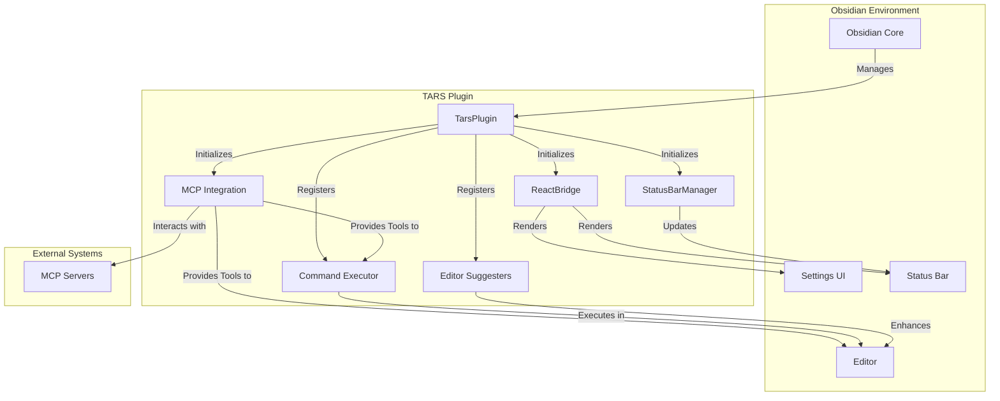

# TARS Plugin Architecture Overview

This document provides a high-level overview of the TARS Obsidian plugin architecture.

## System Components Diagram

The following diagram illustrates the major components and their interactions within the TARS plugin ecosystem.

### Component Descriptions

-   **Obsidian Core**: The main Obsidian application that loads and manages plugins.
-   **TarsPlugin**: The central class of the plugin, responsible for orchestrating all other components.
-   **ReactBridge**: A component that allows rendering React components within Obsidian's native UI.
-   **StatusBarManager**: Manages the plugin's status bar item, providing real-time feedback.
-   **MCP Integration**: Handles communication with external language model servers via the Model Context Protocol (MCP).
-   **Command Executor**: Registers and executes Obsidian commands.
-   **Editor Suggesters**: Provides autocompletion for tags, tools, and parameters within the editor.
-   **MCP Servers**: External processes that provide language model capabilities and tools.

## Plugin Lifecycle

The `TarsPlugin` class manages the plugin's lifecycle through two primary methods: `onload()` and `onunload()`.

### `onload()`

This method is called when the plugin is enabled. It performs the following initialization steps in order:

1.  **Load Settings**: Loads the plugin settings from storage.
2.  **Initialize React Bridge**: Sets up the `ReactBridge` if React is available.
3.  **Initialize Status Bar**: Creates and initializes the status bar manager.
4.  **Initialize MCP**:
    *   Creates an `MCPServerManager` to manage server connections.
    *   Creates a `ToolExecutor` to handle tool calls.
    *   Registers a `CodeBlockProcessor` for executing tools from Markdown.
    *   Starts a health check interval to monitor servers.
5.  **Register Commands**: Builds and registers all commands, including dynamic tag-based and template-based commands.
6.  **Register Editor Suggesters**: Initializes and registers editor suggesters for tags, tools, and parameters.
7.  **Add Settings Tab**: Creates and adds the settings tab to the Obsidian settings dialog.

### `onunload()`

This method is called when the plugin is disabled. It is responsible for cleaning up resources:

1.  **Dispose Status Bar**: Removes the status bar item.
2.  **Unmount React Components**: Unmounts all React components rendered through the bridge.
3.  **Shutdown MCP**: Stops the health check timer and gracefully shuts down the `MCPServerManager`.

## Settings and Feature Flags

The plugin's behavior is heavily configured through settings, managed via the `loadSettings()` and `saveSettings()` methods.

-   **`loadSettings()`**: Reads settings from `data.json` and merges them with `DEFAULT_SETTINGS` to ensure all properties are defined.
-   **`saveSettings()`**: Persists the current settings object to disk.

A key feature of the settings is the `features` object, which controls experimental or optional functionalities. The most significant flag is `reactSettingsTab`, which determines whether to render the legacy `TarsSettingTab` or the modern `ReactSettingsTab`. This allows for a gradual and safe migration to a new UI framework.

## MCP Integration Architecture

The Model Context Protocol (MCP) integration allows the plugin to communicate with external language model servers. This is a cornerstone of the plugin's functionality.

### Core MCP Components

-   **`MCPServerManager`**: This class is responsible for the entire lifecycle of MCP servers. It handles:
    *   **Initialization**: Starts and connects to the servers defined in the settings.
    *   **Health Checks**: Periodically checks the status of each server.
    *   **Shutdown**: Gracefully disconnects from all servers.
    *   **Events**: Emits events for server status changes (`server-started`, `server-stopped`, etc.), which are used to update the UI.

-   **`ToolExecutor`**: This component manages the execution of tools provided by MCP servers. Its responsibilities include:
    *   **Execution**: Sending tool execution requests to the appropriate server.
    *   **Timeout Handling**: Enforcing global timeouts for tool calls.
    *   **Session Management**: Tracking the number of tool executions per document to enforce session limits.
    *   **Caching**: Caching tool results to improve performance and reduce costs.

-   **`CodeBlockProcessor`**: This class integrates tool execution directly into the Obsidian editor. It:
    *   Registers a Markdown code block processor for each configured MCP server.
    *   Parses tool invocations from `mcp` code blocks.
    *   Renders the status of the execution (e.g., "executing", "success", "error") and the final result directly in the document.

### Adapters for Obsidian Integration

To connect the generic MCP components with Obsidian's UI, a set of adapters is used:

-   **`ObsidianLogger`**: Routes logs from the MCP manager to the Obsidian console.
-   **`StatusBarReporter`**: Reports MCP status changes to the `StatusBarManager`.
-   **`ModalNotifier`**: Displays notifications (e.g., errors, session limits) using Obsidian's modal dialogs.

## Command and Editor Suggest Registration

The plugin deeply integrates with Obsidian's user interface through commands and editor "suggesters."

### Dynamic Command Generation

-   **Tag-Based Commands**: The `buildTagCommands()` method dynamically generates Obsidian commands based on the tags defined in the settings. This allows users to create custom workflows (e.g., `#system`, `#user`, `#assistant`) that are directly accessible from the command palette.
-   **Prompt-Based Commands**: Similarly, `buildPromptCommands()` creates commands from prompt templates, enabling users to quickly insert predefined prompts into their documents.

### Editor Suggesters

To provide a fluid user experience, the plugin registers several suggesters that activate as the user types:

-   **`TagEditorSuggest`**: Autocompletes user-defined tags (e.g., `#system`).
-   **`MCPToolSuggest`**: Suggests available MCP tools when the user starts typing a tool call.
-   **`MCPParameterSuggest`**: Provides suggestions for tool parameters based on the tool's input schema.

## UI Bridge and React Integration

To provide a modern and maintainable user interface, the plugin uses React for key components like the settings tab and the status bar.

-   **`ReactBridge`**: This class acts as a bridge between Obsidian's Svelte-based UI and React. It is responsible for:
    *   Mounting React components into the DOM.
    *   Providing a communication channel between the plugin and the React components.
    *   Unmounting components when the plugin is unloaded.

-   **`ReactSettingsTab`**: When the `reactSettingsTab` feature flag is enabled, this class is used instead of the legacy `TarsSettingTab`. It renders a React component that provides a richer user experience for configuring the plugin.

-   **`StatusBarReactManager`**: This class manages the status bar by rendering a React component that can display detailed information about MCP server status, active executions, and session limits.

## User Interaction Model

This section details the primary ways a user interacts with and triggers the TARS plugin's logic.

### 1. Direct Command Execution
Users can directly invoke plugin functionality through the Obsidian Command Palette. This is a primary interaction method for actions such as:
-   Executing predefined prompts from templates.
-   Applying message roles (e.g., `#system`, `#user`, `#assistant`) to text.
-   Opening the MCP Tool Browser.
-   Clearing the MCP tool result cache.

### 2. Editor-Driven Actions
Much of the plugin's logic is triggered implicitly as the user types in the editor:
-   **Tag Autocompletion**: When a user types a known tag prefix (e.g., `#sys`), the `TagEditorSuggest` activates to provide completion suggestions.
-   **MCP Tool Autocompletion**: The `MCPToolSuggest` and `MCPParameterSuggest` provide real-time assistance for authoring tool calls within the editor.

### 3. Code Block Execution
Users can execute MCP tool calls by creating specially formatted Markdown code blocks. The `CodeBlockProcessor` automatically detects these blocks, executes the specified tool, and renders the result directly within the document.

### 4. Document Change Events
The plugin listens for document change events to manage session-based features, such as tracking the number of tool executions within a specific file to enforce session limits.

### 5. Automated Timers
Certain logic is executed on a schedule, independent of direct user action. The most prominent example is the **MCP Health Check**, which runs periodically to monitor the status of connected servers and update the status bar.

## Plugin Feedback Model

This section explains how the TARS plugin communicates status, results, and errors back to the user.

### 1. Status Bar Updates
The `StatusBarManager` provides persistent, at-a-glance feedback on the plugin's state. It displays:
-   The number of running MCP servers.
-   The total number of available tools.
-   The number of active tool executions.
-   Session usage for the current document.
-   Cache hit rates for tool results.

### 2. Notices
For transient, immediate feedback, the plugin uses Obsidian's `Notice` system. This is used for:
-   Confirming that an action was successful (e.g., "Cache cleared").
-   Alerting the user to an error (e.g., "Failed to connect to server").
-   Notifying about session limits.

### 3. Direct Editor Content
The most direct form of feedback is writing content into the editor. This is used when:
-   Executing a prompt template.
-   Receiving a response from a language model via an assistant tag.
-   Rendering the output of an MCP tool call within a code block.

### 4. Modal Dialogs
For more complex interactions or critical notifications, the plugin uses modal dialogs. This includes:
-   The **MCP Tool Browser**, which allows users to explore and insert tool calls.
-   Notifications for session limit approvals, allowing a user to continue or cancel an operation.
-   Detailed error reports from the MCP system.
