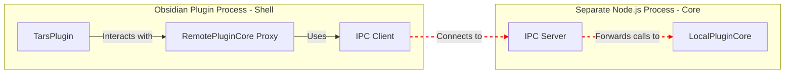

# Future Architecture: Decoupling the Plugin Core

This document outlines a proposed architectural refactor to decouple the core plugin logic from the Obsidian-specific presentation layer. The primary goal is to enhance modularity, testability, and prepare for future adaptations, such as running the core logic in a separate process.

## Guiding Principles

-   **Separation of Concerns**: The Obsidian-facing code ("Shell") should be as thin as possible, primarily responsible for translating Obsidian events into calls to a generic "Core" and rendering UI based on data from the Core.
-   **Platform Agnostic Core**: The "Core" should have no knowledge of Obsidian APIs or its environment. All interactions with the outside world should be handled through well-defined interfaces.
-   **Interface-Driven Design**: Communication between the Shell and Core will be defined by clear, stable interfaces, allowing either side to be replaced or modified with minimal impact on the other.

## Core Concepts

### 1. The Plugin Shell
The **Shell** is the part of the plugin that directly interfaces with Obsidian. Its sole responsibilities are:
-   Hooking into the Obsidian plugin lifecycle (`onload`, `onunload`).
-   Registering commands, editor suggesters, and UI components (status bar, settings tabs).
-   Capturing user input and Obsidian events (e.g., `editor-change`, command palette triggers).
-   Translating these events into calls to the Plugin Core's public API.
-   Receiving data and events from the Core to update the Obsidian UI (e.g., display a `Notice`, update the status bar, render a React component).

### 2. The Plugin Core
The **Core** contains all the business logic of the TARS plugin. It is a self-contained engine that:
-   Manages settings and state.
-   Orchestrates MCP server connections, health checks, and tool execution.
-   Handles all interactions with language models.
-   Processes business logic for commands and editor actions.
-   Exposes a public API for the Shell to interact with and an event system for the Shell to subscribe to.
-   Is completely independent of Obsidian and could, in theory, run in any JavaScript environment (e.g., a browser, a Node.js process).

## Communication Interfaces

The interaction between the Shell and the Core will be mediated by two sets of interfaces: one for the Core's public API (`IPluginCore`) and one for the services the Shell must provide to the Core (`IShellServices`).

### `IPluginCore`: The Core's Public API

This interface defines the commands and queries that the Shell can issue to the Core.

```typescript
interface IPluginCore {
    // Lifecycle
    initialize(settings: PluginSettings): Promise<void>;
    shutdown(): Promise<void>;

    // Settings Management
    getSettings(): Promise<PluginSettings>;
    updateSettings(newSettings: Partial<PluginSettings>): Promise<void>;

    // Command Execution
    executeCommand(commandId: string, context: CommandContext): Promise<CommandResult>;

    // Editor Actions
    getEditorSuggestions(context: EditorContext): Promise<Suggestion[]>;

    // Event Subscription
    on(event: CoreEvent, listener: (...args: any[]) => void): void;
    off(event: CoreEvent, listener: (...args: any[]) => void): void;
}

type CoreEvent = 'settings-updated' | 'status-changed' | 'notice-fired';
```

### `IShellServices`: Services Provided by the Shell

This interface defines the capabilities that the Core requires from its hosting environment. The Shell is responsible for implementing these services using Obsidian's APIs.

```typescript
interface IShellServices {
    // UI Feedback
    showNotice(message: string, duration?: number): void;
    showModal<T>(modalType: string, props: T): Promise<any>;

    // Editor/Workspace Access
    getActiveEditorContent(): Promise<string>;
    replaceEditorSelection(text: string): Promise<void>;
    getWorkspaceFiles(): Promise<string[]>;

    // Data Persistence
    loadData<T>(key: string): Promise<T | null>;
    saveData<T>(key: string, data: T): Promise<void>;
}
```

This dependency inversion (the Core declaring the services it needs) is key to its platform independence. The Core doesn't know *how* `showNotice` is implemented, only that it can call it.

## Implementation Strategy: The Core Factory

To manage the creation of the `PluginCore` and allow for different implementations (e.g., local vs. remote), we will use a factory pattern.

### `CoreFactory`

The `CoreFactory` will be a simple object responsible for instantiating the correct `IPluginCore` implementation based on the application's configuration.

```typescript
// core-factory.ts

import { IPluginCore } from './interfaces';
import { LocalPluginCore } from './implementations/local-core';
import { RemotePluginCore } from './implementations/remote-core';

export type CoreType = 'local' | 'remote';

export class CoreFactory {
    static create(type: CoreType, shellServices: IShellServices): IPluginCore {
        switch (type) {
            case 'remote':
                console.log('Creating Remote Plugin Core...');
                // The remote implementation would handle IPC/HTTP communication
                return new RemotePluginCore(shellServices);
            case 'local':
            default:
                console.log('Creating Local Plugin Core...');
                // The local implementation runs in the same process as the shell
                return new LocalPluginCore(shellServices);
        }
    }
}
```

### Usage within the Plugin Shell

The `TarsPlugin` (our Shell) will use this factory during its `onload` sequence. A setting will determine which type of core to instantiate.

```typescript
// main.ts (The Plugin Shell)

import { Plugin } from 'obsidian';
import { CoreFactory, CoreType } from './core-factory';
import { IPluginCore, IShellServices } from './interfaces';
import { ObsidianShellServices } from './obsidian-shell-services';

export default class TarsPlugin extends Plugin {
    core: IPluginCore;

    async onload() {
        // Create the shell services implementation using Obsidian APIs
        const shellServices: IShellServices = new ObsidianShellServices(this.app);

        // Determine which core type to use from settings
        const coreType: CoreType = this.settings.coreType || 'local';

        // Instantiate the core using the factory
        this.core = CoreFactory.create(coreType, shellServices);

        // Initialize the core
        await this.core.initialize(this.settings);

        // ... continue with plugin setup, subscribing to core events, etc.
    }

    async onunload() {
        await this.core.shutdown();
    }
}
```

This approach makes the `TarsPlugin` class completely unaware of the `PluginCore`'s implementation details. Switching from an in-process to an out-of-process architecture becomes as simple as changing a configuration value.

## Enabling Cross-Process Communication

The true power of this decoupled architecture is realized when we consider running the `PluginCore` in a separate operating system process. This would isolate the potentially heavy work of the Core (like managing multiple MCP connections) from the main Obsidian UI thread, improving performance and stability.

The interfaces and factory pattern we've defined make this possible with minimal changes to the existing `TarsPlugin` shell.

### The `RemotePluginCore` Implementation

When the `CoreFactory` creates a `RemotePluginCore`, it isn't instantiating the business logic directly. Instead, it's creating a **proxy** that handles the communication with an external process where the *real* `PluginCore` is running.

Here’s how it works:

1.  **Core Process Startup**: The shell would be responsible for spawning a new Node.js process that runs the `PluginCore`. This Core process would expose an IPC endpoint (e.g., using WebSockets, or a named pipe).

2.  **Proxy Implementation**: The `RemotePluginCore` proxy in the Obsidian plugin (the shell) would implement the `IPluginCore` interface. Each method call on the proxy would not execute logic directly but would instead:
    a. Serialize the method call and its arguments into a JSON message.
    b. Send the message to the Core process over the IPC channel.
    c. Asynchronously await a response from the Core process.
    d. De-serialize the response and return it to the shell.

3.  **Event Handling**: The proxy would also listen for event messages from the Core process. When an event like `status-changed` is received, it would emit the event locally using its own event emitter, which the shell is subscribed to.

### Architecture Diagram: Remote Core




## Comprehensive Use Case Analysis and Interface Design

Based on a deep analysis of the current TARS plugin codebase, we have identified the following key use cases where the plugin couples with Obsidian. Each use case requires a carefully designed interface to enable proper decoupling while maintaining full functionality.

### Identified Use Cases

1. **Plugin Lifecycle Management** - Plugin initialization, loading, and unloading
2. **Settings and Configuration Persistence** - Loading and saving plugin settings
3. **Command Registration and Execution** - Registering Obsidian commands and handling their execution
4. **Editor Integration** - Accessing editor content, selections, and modifying documents
5. **UI Component Management** - Status bar, settings tabs, modals, and React bridge integration
6. **File and Workspace Management** - Accessing files, workspace state, and document metadata
7. **Event Handling** - Subscribing to Obsidian events and managing event-driven behavior
8. **Notification System** - Displaying notices, modals, and user feedback
9. **MCP Server Integration** - Managing external server connections and tool execution
10. **Editor Suggesters** - Providing autocompletion and suggestions in the editor
11. **Code Block Processing** - Handling special code block types and rendering results
12. **Document Session Management** - Tracking per-document state and session limits

### Comprehensive Interface Specifications

#### 1. Plugin Lifecycle Interface

```typescript
interface IPluginLifecycle {
    // Lifecycle phases
    initialize(context: PluginInitializationContext): Promise<void>
    activate(): Promise<void>
    deactivate(): Promise<void>
    shutdown(): Promise<void>
    
    // State management
    getState(): PluginState
    isInitialized(): boolean
    isActive(): boolean
}

interface PluginInitializationContext {
    appVersion: string
    platform: PlatformInfo
    pluginVersion: string
    dataPath: string
    configPath: string
}

interface PlatformInfo {
    isDesktop: boolean
    isMobile: boolean
    operatingSystem: string
}
```

#### 2. Settings and Configuration Interface

```typescript
interface ISettingsManager {
    // Settings persistence
    loadSettings<T>(): Promise<T>
    saveSettings<T>(settings: T): Promise<void>
    
    // Settings validation
    validateSettings(settings: unknown): ValidationResult
    getDefaultSettings(): unknown
    
    // Settings migration
    migrateSettings(fromVersion: string, toVersion: string, settings: unknown): Promise<unknown>
    
    // Settings events
    onSettingsChanged(callback: (settings: unknown) => void): void
    offSettingsChanged(callback: (settings: unknown) => void): void
}

interface ValidationResult {
    isValid: boolean
    errors: string[]
    warnings: string[]
}
```

#### 3. Command Management Interface

```typescript
interface ICommandManager {
    // Command registration
    registerCommand(command: CommandDefinition): string
    unregisterCommand(commandId: string): void
    
    // Command execution
    executeCommand(commandId: string, context: CommandContext): Promise<CommandResult>
    
    // Command discovery
    getCommands(): CommandDefinition[]
    getCommand(commandId: string): CommandDefinition | undefined
    
    // Command events
    onCommandExecuted(callback: (commandId: string, result: CommandResult) => void): void
}

interface CommandDefinition {
    id: string
    name: string
    description?: string
    category?: string
    icon?: string
    hotkeys?: string[]
    editorCallback?: (editor: IEditor, context: CommandContext) => Promise<void>
    callback?: (context: CommandContext) => Promise<void>
    checkCallback?: (checking: boolean, context: CommandContext) => boolean | void
}

interface CommandContext {
    source: 'command-palette' | 'editor' | 'toolbar' | 'api'
    sourceFile?: string
    editor?: IEditor
    workspace: IWorkspace
}
```

#### 4. Editor Integration Interface

```typescript
interface IEditor {
    // Content access
    getContent(): string
    getSelection(): string
    getLine(line: number): string
    getRange(from: EditorPosition, to: EditorPosition): string
    
    // Content modification
    replaceRange(text: string, from: EditorPosition, to?: EditorPosition): void
    insertText(text: string, position?: EditorPosition): void
    appendText(text: string): void
    
    // Cursor management
    getCursor(): EditorPosition
    setCursor(position: EditorPosition): void
    getSelectionRange(): { from: EditorPosition; to: EditorPosition }
    
    // Editor state
    getLineCount(): number
    getCurrentLine(): number
    isInEditingMode(): boolean
    
    // Editor events
    on(event: EditorEvent, callback: (...args: any[]) => void): void
    off(event: EditorEvent, callback: (...args: any[]) => void): void
}

interface EditorPosition {
    line: number
    ch: number
}

type EditorEvent = 'change' | 'cursor-change' | 'selection-change' | 'focus' | 'blur'
```

#### 5. UI Component Management Interface

```typescript
interface IUIManager {
    // Status bar
    createStatusBarItem(): IStatusBarItem
    updateStatusBar(item: IStatusBarItem, content: StatusBarContent): void
    
    // Settings tabs
    addSettingsTab(tab: ISettingsTab): void
    removeSettingsTab(tab: ISettingsTab): void
    
    // Modals
    showModal<T>(modal: IModal<T>): Promise<T>
    showNotice(message: string, options?: NoticeOptions): void
    
    // React integration
    createReactBridge(): IReactBridge
    mountReactComponent(container: HTMLElement, component: React.ComponentType, props: any): void
    unmountReactComponent(container: HTMLElement): void
}

interface IStatusBarItem {
    setText(text: string): void
    setTooltip(tooltip: string): void
    onClick(callback: () => void): void
    dispose(): void
}

interface ISettingsTab {
    id: string
    name: string
    icon?: string
    render(): HTMLElement
    onOpen(): void
    onClose(): void
}

interface IModal<T> {
    title: string
    content: HTMLElement | React.ComponentType
    width?: number
    height?: number
    open(): Promise<T>
    close(): void
}

interface NoticeOptions {
    timeout?: number
    type?: 'info' | 'success' | 'warning' | 'error'
    persistent?: boolean
}
```

#### 6. File and Workspace Management Interface

```typescript
interface IWorkspace {
    // File access
    getFile(path: string): Promise<IFile | null>
    readFile(path: string): Promise<string>
    writeFile(path: string, content: string): Promise<void>
    deleteFile(path: string): Promise<void>
    
    // File discovery
    getFiles(): Promise<IFile[]>
    getFilesByExtension(extension: string): Promise<IFile[]>
    searchFiles(query: string): Promise<IFile[]>
    
    // Active file management
    getActiveFile(): Promise<IFile | null>
    setActiveFile(file: IFile): Promise<void>
    
    // Workspace events
    on(event: WorkspaceEvent, callback: (...args: any[]) => void): void
    off(event: WorkspaceEvent, callback: (...args: any[]) => void): void
}

interface IFile {
    path: string
    name: string
    basename: string
    extension: string
    size: number
    mtime: number
    ctime: number
    isDirectory: boolean
}

type WorkspaceEvent = 'file-open' | 'file-change' | 'file-delete' | 'workspace-change'
```

#### 7. Event Management Interface

```typescript
interface IEventManager {
    // Event registration
    on(event: string, callback: EventCallback): EventHandle
    off(event: string, callback: EventCallback): void
    offHandle(handle: EventHandle): void
    
    // Event emission
    emit(event: string, ...args: any[]): void
    
    // Once-only events
    once(event: string, callback: EventCallback): EventHandle
    
    // Event filtering
    filter(event: string, predicate: (args: any[]) => boolean, callback: EventCallback): EventHandle
}

interface EventCallback {
    (...args: any[]): void | Promise<void>
}

interface EventHandle {
    event: string
    callback: EventCallback
    dispose(): void
}
```

#### 8. Notification System Interface

```typescript
interface INotificationManager {
    // Notices
    showNotice(message: string, options?: NoticeOptions): INotification
    showSuccess(message: string, options?: NoticeOptions): INotification
    showWarning(message: string, options?: NoticeOptions): INotification
    showError(message: string, error?: Error, options?: NoticeOptions): INotification
    
    // Progress notifications
    showProgress(options: ProgressOptions): IProgressNotification
    
    // Interactive notifications
    showConfirmation(message: string, options?: ConfirmationOptions): Promise<boolean>
    showInput(message: string, options?: InputOptions): Promise<string | null>
    
    // Modal dialogs
    showModal<T>(modal: IModal<T>): Promise<T>
    showDialog(dialog: IDialog): Promise<DialogResult>
}

interface INotification {
    id: string
    message: string
    type: 'info' | 'success' | 'warning' | 'error'
    isVisible: boolean
    update(message: string, options?: NoticeOptions): void
    hide(): void
    dispose(): void
}

interface ProgressOptions {
    title: string
    total?: number
    current?: number
    indeterminate?: boolean
    cancellable?: boolean
}

interface IProgressNotification extends INotification {
    updateProgress(current: number, total?: number): void
    setIndeterminate(indeterminate: boolean): void
}
```

#### 9. MCP Server Integration Interface

```typescript
interface IMCPManager {
    // Server lifecycle
    startServer(config: MCPServerConfig): Promise<IMCPServer>
    stopServer(serverId: string): Promise<void>
    restartServer(serverId: string): Promise<void>
    
    // Server management
    getServers(): IMCPServer[]
    getServer(serverId: string): IMCPServer | null
    isServerRunning(serverId: string): boolean
    
    // Tool execution
    executeTool(request: ToolExecutionRequest): Promise<ToolExecutionResult>
    executeToolWithId(request: ToolExecutionRequest): Promise<ToolExecutionResultWithId>
    cancelExecution(requestId: string): Promise<void>
    
    // Health monitoring
    performHealthCheck(): Promise<HealthCheckResult>
    getHealthStatus(serverId: string): ServerHealthStatus
    
    // Events
    on(event: MCPEvent, callback: (...args: any[]) => void): void
    off(event: MCPEvent, callback: (...args: any[]) => void): void
}

interface IMCPServer {
    id: string
    name: string
    config: MCPServerConfig
    isConnected: boolean
    getTools(): Promise<Tool[]>
    listTools(): Promise<Tool[]>
    executeTool(toolName: string, parameters: Record<string, unknown>): Promise<ToolExecutionResult>
}

type MCPEvent = 'server-started' | 'server-stopped' | 'server-failed' | 'tools-updated' | 'tool-executed'
```

#### 10. Editor Suggesters Interface

```typescript
interface ISuggestManager {
    // Suggester registration
    registerSuggester(suggester: ISuggester): void
    unregisterSuggester(suggester: ISuggester): void
    
    // Suggester lifecycle
    activateSuggester(suggesterId: string, context: SuggestContext): Promise<void>
    deactivateSuggester(suggesterId: string): Promise<void>
    
    // Suggestion management
    getSuggestions(context: SuggestContext): Promise<Suggestion[]>
    selectSuggestion(suggestion: Suggestion, context: SuggestContext): Promise<void>
}

interface ISuggester {
    id: string
    name: string
    triggerPatterns: RegExp[]
    
    // Suggester lifecycle
    canActivate(context: SuggestContext): boolean
    onActivate(context: SuggestContext): Promise<void>
    onDeactivate(): Promise<void>
    
    // Suggestion logic
    getSuggestions(context: SuggestContext): Promise<Suggestion[]>
    onSelectSuggestion(suggestion: Suggestion, context: SuggestContext): Promise<void>
    renderSuggestion(suggestion: Suggestion, container: HTMLElement): void
}

interface SuggestContext {
    editor: IEditor
    cursor: EditorPosition
    line: string
    file: IFile
    trigger: string
}

interface Suggestion {
    id: string
    text: string
    displayText?: string
    description?: string
    icon?: string
    data?: any
}
```

#### 11. Code Block Processing Interface

```typescript
interface ICodeBlockProcessor {
    // Processor registration
    registerProcessor(language: string, processor: IBlockProcessor): void
    unregisterProcessor(language: string): void
    
    // Processing
    canProcess(language: string, source: string): boolean
    process(language: string, source: string, context: BlockContext): Promise<BlockResult>
    
    // Rendering
    renderResult(result: BlockResult, container: HTMLElement, context: BlockContext): void
    renderError(error: Error, container: HTMLElement, context: BlockContext): void
}

interface IBlockProcessor {
    language: string
    
    // Processing logic
    canProcess(source: string): boolean
    process(source: string, context: BlockContext): Promise<BlockResult>
    
    // Rendering
    render(result: BlockResult, container: HTMLElement, context: BlockContext): void
    renderError(error: Error, container: HTMLElement, context: BlockContext): void
    
    // Lifecycle
    onActivate(): void
    onDeactivate(): void
}

interface BlockContext {
    file: IFile
    section: any
    sourcePath: string
    frontmatter?: Record<string, any>
}

interface BlockResult {
    type: 'content' | 'interactive' | 'error'
    content: string | HTMLElement
    metadata?: Record<string, any>
    interactive?: boolean
}
```

#### 12. Document Session Management Interface

```typescript
interface IDocumentSessionManager {
    // Session tracking
    startSession(documentPath: string): IDocumentSession
    endSession(documentPath: string): void
    getSession(documentPath: string): IDocumentSession | null
    
    // Session limits
    getSessionCount(documentPath: string): number
    isSessionLimitReached(documentPath: string, limit: number): boolean
    
    // Session events
    onSessionStarted(callback: (documentPath: string, session: IDocumentSession) => void): void
    onSessionEnded(callback: (documentPath: string) => void): void
    onLimitReached(callback: (documentPath: string, limit: number, current: number) => Promise<LimitAction>): void
    
    // Session persistence
    saveSessions(): Promise<void>
    loadSessions(): Promise<void>
    clearSessions(): void
}

interface IDocumentSession {
    documentPath: string
    startTime: Date
    lastActivity: Date
    actionCount: number
    
    // Session actions
    recordAction(type: string, data?: any): void
    getActions(): SessionAction[]
    getActionCount(): number
    
    // Session lifecycle
    isActive(): boolean
    end(): void
}

interface SessionAction {
    type: string
    timestamp: Date
    data?: any
}

type LimitAction = 'continue' | 'cancel' | 'reset'
```

### Enhanced Core Interface

Building on these use case interfaces, we can now define a more comprehensive and robust core interface:

```typescript
interface IPluginCore {
    // Core lifecycle
    initialize(context: CoreInitializationContext): Promise<void>
    activate(): Promise<void>
    deactivate(): Promise<void>
    shutdown(): Promise<void>
    
    // Feature managers
    getCommandManager(): ICommandManager
    getSettingsManager(): ISettingsManager
    getEventManager(): IEventManager
    getUIManager(): IUIManager
    getWorkspace(): IWorkspace
    getNotificationManager(): INotificationManager
    
    // Specialized managers
    getMCPManager(): IMCPManager
    getSuggestManager(): ISuggestManager
    getCodeBlockProcessor(): ICodeBlockProcessor
    getDocumentSessionManager(): IDocumentSessionManager
    
    // Core configuration
    updateConfiguration(config: CoreConfiguration): Promise<void>
    getConfiguration(): CoreConfiguration
    
    // Core events
    on(event: CoreEvent, callback: (...args: any[]) => void): void
    off(event: CoreEvent, callback: (...args: any[]) => void): void
}

interface CoreInitializationContext {
    shellServices: IShellServices
    platformInfo: PlatformInfo
    pluginVersion: string
    dataPath: string
    configPath: string
}

interface CoreConfiguration {
    features: Record<string, boolean>
    performance: PerformanceConfiguration
    mcp: MCPConfiguration
    ui: UIConfiguration
}
```

### Enhanced Shell Services Interface

The shell services interface must provide implementations for all the core's dependencies:

```typescript
interface IShellServices {
    // Platform services
    getPlatformInfo(): PlatformInfo
    getDataPath(): string
    getConfigPath(): string
    
    // Obsidian-specific services
    getObsidianApp(): any // Obsidian App instance
    getObsidianAPI(): IObsidianAPI
    
    // File system services
    readFile(path: string): Promise<string>
    writeFile(path: string, content: string): Promise<void>
    deleteFile(path: string): Promise<void>
    fileExists(path: string): Promise<boolean>
    
    // UI services
    createStatusBarItem(): IStatusBarItem
    showModal<T>(modal: IModal<T>): Promise<T>
    showNotice(message: string, options?: NoticeOptions): INotification
    
    // Event services
    registerObsidianEvent(event: string, callback: (...args: any[]) => void): () => void
    triggerObsidianEvent(event: string, ...args: any[]): void
    
    // Editor services
    getActiveEditor(): IEditor | null
    getAllEditors(): IEditor[]
    
    // Workspace services
    getActiveFile(): IFile | null
    getWorkspaceFiles(): IFile[]
    
    // React integration
    createReactBridge(): IReactBridge
    
    // Lifecycle services
    onUnload(callback: () => void): void
    onLoad(callback: () => void): void
}

interface IObsidianAPI {
    // Obsidian API methods
    vault: any
    workspace: any
    commands: any
    editor: any
    metadataCache: any
    fileManager: any
}
```

### Implementation Strategy

#### Phase 1: Interface Definition and Core Refactoring
1. Define all interfaces in a dedicated `interfaces/` package
2. Create a `PluginCore` implementation that uses dependency injection
3. Refactor existing functionality to use the new interfaces
4. Implement an `ObsidianShellServices` class

#### Phase 2: Factory Pattern and Core Abstraction
1. Implement the `CoreFactory` with support for local and remote cores
2. Create adapter classes for existing Obsidian-specific code
3. Implement event forwarding between shell and core
4. Add comprehensive error handling and logging

#### Phase 3: Remote Core Implementation
1. Create `RemotePluginCore` proxy implementation
2. Implement IPC/HTTP communication layer
3. Create standalone core process entry point
4. Add serialization/deserialization for all interface calls

#### Phase 4: Testing and Migration
1. Comprehensive unit tests for all interfaces
2. Integration tests for local and remote configurations
3. Performance benchmarking and optimization
4. Gradual migration with feature flags

#### Migration Path

The migration can be performed incrementally:

1. **Dual Implementation**: Keep existing code while implementing new interfaces
2. **Feature Flagging**: Use feature flags to switch between old and new implementations
3. **Gradual Rollout**: Migrate one use case at a time (start with settings, then commands, etc.)
4. **Testing**: Thoroughly test each migrated component before proceeding
5. **Performance Monitoring**: Monitor performance impact and optimize as needed

This comprehensive interface design ensures that the TARS plugin can be fully decoupled from Obsidian while maintaining all existing functionality and enabling future enhancements like remote core execution.
By adhering to the `IPluginCore` and `IShellServices` interfaces, the `TarsPlugin` shell does not need to know whether it's talking to an in-memory `LocalPluginCore` or a `RemotePluginCore` proxy. The "contract" remains the same, fulfilling our goal of a truly decoupled and flexible architecture.

---

## Approach 2: Event-Driven Streams Architecture (Flux-Inspired)

### Overview

The second approach embraces an event-driven, streams-oriented architecture inspired by Flux patterns and modern reactive programming. This design treats the plugin as a reactive system where data flows through unidirectional streams, and components communicate through event emitters. The architecture is particularly well-suited for file system operations and IDE-like functionality where multiple components need to react to changes in documents, settings, or external services.

### Core Principles

1. **Unidirectional Data Flow** - Data flows in a single direction: Actions → Dispatchers → Stores → Views
2. **Event-Driven Communication** - All communication happens through typed events and streams
3. **Reactive Streams** - Components subscribe to data streams and react to changes automatically
4. **Immutable State** - State is never mutated directly; instead, actions create new state
5. **File System Centric** - The architecture is optimized around file operations and document management
6. **IDE-like Patterns** - Borrows patterns from modern IDEs like VS Code (Language Servers, Extensions)

### Architecture Components

#### 1. Event System and Dispatcher

```typescript
// Core event system with typed events
interface IEventDispatcher {
    // Event registration
    registerStore(store: IStore): void
    unregisterStore(store: IStore): void
    
    // Event dispatching
    dispatch<T extends IEvent>(event: T): Promise<void>
    dispatchSync<T extends IEvent>(event: T): void
    
    // Event streaming
    createEventStream<T extends IEvent>(eventType: string): IEventStream<T>
    createMultiEventStream<T extends IEvent>(eventTypes: string[]): IEventStream<T>
    
    // Middleware support
    use(middleware: IEventMiddleware): void
}

// Base event interface
interface IEvent {
    type: string
    timestamp: number
    source: string
    correlationId?: string
    metadata?: Record<string, any>
}

// Specific event types
interface FileEvent extends IEvent {
    filePath: string
    fileType: 'markdown' | 'json' | 'yaml' | 'other'
}

interface EditorEvent extends IEvent {
    editorId: string
    filePath: string
    position?: EditorPosition
    selection?: EditorSelection
}

interface MCPEvent extends IEvent {
    serverId: string
    toolName?: string
    requestId?: string
}

// Event middleware for cross-cutting concerns
interface IEventMiddleware {
    (event: IEvent, next: () => void): void | Promise<void>
}

// Reactive event stream
interface IEventStream<T extends IEvent> {
    subscribe(observer: IEventObserver<T>): ISubscription
    pipe<R>(operator: IStreamOperator<T, R>): IEventStream<R>
    filter(predicate: (event: T) => boolean): IEventStream<T>
    map<R>(mapper: (event: T) => R): IEventStream<R>
    buffer(timeMs: number): IEventStream<T[]>
    debounce(timeMs: number): IEventStream<T>
    throttle(timeMs: number): IEventStream<T>
}

interface IEventObserver<T extends IEvent> {
    next(event: T): void | Promise<void>
    error?(error: Error): void
    complete?(): void
}

interface ISubscription {
    unsubscribe(): void
    isUnsubscribed: boolean
}
```

#### 2. Store System (State Management)

```typescript
// Base store interface
interface IStore<TState = any> {
    readonly name: string
    readonly state: Readonly<TState>
    readonly state$: IEventStream<StateChangeEvent<TState>>
    
    // State access
    getState(): Readonly<TState>
    getStateSelector<TResult>(selector: (state: TState) => TResult): TResult
    
    // Event handling
    handleEvent<T extends IEvent>(event: T): Promise<void>
    canHandle(event: IEvent): boolean
    
    // Lifecycle
    initialize(): Promise<void>
    dispose(): Promise<void>
    
    // Serialization
    serialize(): string
    deserialize(data: string): Promise<void>
}

// State change event
interface StateChangeEvent<TState> extends IEvent {
    type: 'state-change'
    storeName: string
    previousState: Readonly<TState>
    nextState: Readonly<TState>
    changes: StateChanges<TState>
}

interface StateChanges<TState> {
    added: Record<string, any>
    updated: Record<string, { old: any; new: any }>
    removed: string[]
}

// Specific store implementations
interface IFileStore extends IStore<FileStoreState> {
    // File operations
    getFile(path: string): FileEntry | null
    setFile(path: string, content: string): Promise<void>
    deleteFile(path: string): Promise<void>
    moveFile(oldPath: string, newPath: string): Promise<void>
    
    // File watching
    watchFile(path: string): ISubscription
    unwatchFile(path: string): void
    
    // File queries
    getFilesByPattern(pattern: string): FileEntry[]
    getFilesByTag(tag: string): FileEntry[]
    getRecentlyModified(limit: number): FileEntry[]
}

interface FileStoreState {
    files: Record<string, FileEntry>
    activeFile: string | null
    fileWatchers: Record<string, boolean>
    lastModified: number
}

interface FileEntry {
    path: string
    content: string
    mtime: number
    size: number
    tags: string[]
    frontmatter?: Record<string, any>
    isDirty: boolean
}

// Editor store for managing editor state
interface IEditorStore extends IStore<EditorStoreState> {
    // Editor management
    getEditor(id: string): EditorEntry | null
    createEditor(id: string, filePath: string): Promise<void>
    destroyEditor(id: string): Promise<void>
    
    // Cursor and selection
    setCursor(editorId: string, position: EditorPosition): Promise<void>
    setSelection(editorId: string, selection: EditorSelection): Promise<void>
    
    // Content manipulation
    insertText(editorId: string, text: string, position?: EditorPosition): Promise<void>
    replaceRange(editorId: string, text: string, from: EditorPosition, to: EditorPosition): Promise<void>
    
    // Editor events
    onCursorChange(editorId: string): IEventStream<CursorChangeEvent>
    onSelectionChange(editorId: string): IEventStream<SelectionChangeEvent>
    onContentChange(editorId: string): IEventStream<ContentChangeEvent>
}

interface EditorStoreState {
    editors: Record<string, EditorEntry>
    activeEditor: string | null
    layout: EditorLayout
}

interface EditorEntry {
    id: string
    filePath: string
    content: string
    cursor: EditorPosition
    selection: EditorSelection
    isDirty: boolean
    language: string
}

// MCP store for managing server connections and tools
interface IMCPStore extends IStore<MCPStoreState> {
    // Server management
    addServer(config: MCPServerConfig): Promise<void>
    removeServer(serverId: string): Promise<void>
    startServer(serverId: string): Promise<void>
    stopServer(serverId: string): Promise<void>
    
    // Tool execution
    executeTool(request: ToolExecutionRequest): Promise<ToolExecutionResult>
    cancelExecution(requestId: string): Promise<void>
    
    // Health monitoring
    getServerHealth(serverId: string): ServerHealthStatus
    performHealthCheck(): Promise<void>
}

interface MCPStoreState {
    servers: Record<string, MCPServerEntry>
    activeExecutions: Record<string, ToolExecutionRequest>
    healthStatus: Record<string, ServerHealthStatus>
    toolCache: Record<string, Tool[]>
}
```

#### 3. Action System (Command Pattern)

```typescript
// Action creator and dispatcher
interface IActionCreator {
    // File actions
    createFile(filePath: string, content: string): FileAction
    updateFile(filePath: string, content: string): FileAction
    deleteFile(filePath: string): FileAction
    moveFile(oldPath: string, newPath: string): FileAction
    
    // Editor actions
    createEditor(editorId: string, filePath: string): EditorAction
    destroyEditor(editorId: string): EditorAction
    insertText(editorId: string, text: string, position?: EditorPosition): EditorAction
    replaceRange(editorId: string, text: string, from: EditorPosition, to: EditorPosition): EditorAction
    setCursor(editorId: string, position: EditorPosition): EditorAction
    
    // MCP actions
    startMCPServer(serverId: string): MCPAction
    stopMCPServer(serverId: string): MCPAction
    executeMCPTool(request: ToolExecutionRequest): MCPAction
    cancelMCPExecution(requestId: string): MCPAction
    
    // UI actions
    showNotice(message: string, type?: NoticeType): UIAction
    showModal(modal: ModalConfig): UIAction
    updateStatusBar(content: StatusBarContent): UIAction
}

// Base action interface
interface IAction extends IEvent {
    type: string
    payload: any
}

// Specific action types
interface FileAction extends IAction, FileEvent {
    payload: {
        operation: 'create' | 'update' | 'delete' | 'move'
        content?: string
        oldPath?: string
    }
}

interface EditorAction extends IAction, EditorEvent {
    payload: {
        operation: 'create' | 'destroy' | 'insert-text' | 'replace-range' | 'set-cursor' | 'set-selection'
        text?: string
        position?: EditorPosition
        from?: EditorPosition
        to?: EditorPosition
    }
}

interface MCPAction extends IAction, MCPEvent {
    payload: {
        operation: 'start-server' | 'stop-server' | 'execute-tool' | 'cancel-execution'
        config?: MCPServerConfig
        request?: ToolExecutionRequest
    }
}

interface UIAction extends IAction {
    payload: {
        operation: 'show-notice' | 'show-modal' | 'update-status-bar'
        message?: string
        type?: NoticeType
        modal?: ModalConfig
        status?: StatusBarContent
    }
}
```

#### 4. Reactive Stream Processing

```typescript
// Stream processors for complex data flows
interface IStreamProcessor {
    // File processing streams
    createFileStream(path: string): IEventStream<FileEvent>
    createMarkdownProcessingStream(): IEventStream<ProcessedMarkdownEvent>
    createTagExtractionStream(): IEventStream<TagExtractionEvent>
    
    // Editor processing streams
    createAutoCompleteStream(editorId: string): IEventStream<AutoCompleteEvent>
    createSyntaxHighlightingStream(editorId: string): IEventStream<SyntaxHighlightEvent>
    createCodeAnalysisStream(editorId: string): IEventStream<CodeAnalysisEvent>
    
    // MCP processing streams
    createToolExecutionStream(): IEventStream<ToolExecutionEvent>
    createServerHealthStream(): IEventStream<ServerHealthEvent>
    createToolDiscoveryStream(): IEventStream<ToolDiscoveryEvent>
    
    // Cross-cutting streams
    createActivityStream(): IEventStream<ActivityEvent>
    createErrorStream(): IEventStream<ErrorEvent>
    createPerformanceStream(): IEventStream<PerformanceEvent>
}

// Stream operators for data transformation
interface IStreamOperator<T, R> {
    (stream: IEventStream<T>): IEventStream<R>
}

// Built-in operators
const StreamOperators = {
    // Filtering
    filter: <T>(predicate: (event: T) => boolean): IStreamOperator<T, T> =>
        (stream) => stream.filter(predicate),
    
    // Mapping
    map: <T, R>(mapper: (event: T) => R): IStreamOperator<T, R> =>
        (stream) => stream.map(mapper),
    
    // Buffering
    buffer: <T>(timeMs: number): IStreamOperator<T, T[]> =>
        (stream) => stream.buffer(timeMs),
    
    // Debouncing
    debounce: <T>(timeMs: number): IStreamOperator<T, T> =>
        (stream) => stream.debounce(timeMs),
    
    // Throttling
    throttle: <T>(timeMs: number): IStreamOperator<T, T> =>
        (stream) => stream.throttle(timeMs),
    
    // Merging
    mergeWith: <T>(...streams: IEventStream<T>[]): IStreamOperator<T, T> =>
        (stream) => /* merge implementation */ stream,
    
    // Combining latest
    combineLatest: <T, R>(...streams: IEventStream<T>[]): IStreamOperator<T, R> =>
        (stream) => /* combine latest implementation */ stream,
    
    // Error handling
    catchError: <T>(fallback: (error: Error) => T): IStreamOperator<T, T> =>
        (stream) => /* catch error implementation */ stream,
    
    // Retry logic
    retry: <T>(attempts: number): IStreamOperator<T, T> =>
        (stream) => /* retry implementation */ stream
}
```

#### 5. Plugin Core (Flux Controller)

```typescript
// Main plugin controller implementing Flux pattern
interface IFluxPluginCore {
    // Core initialization
    initialize(context: FluxInitializationContext): Promise<void>
    activate(): Promise<void>
    deactivate(): Promise<void>
    dispose(): Promise<void>
    
    // Access to core systems
    getDispatcher(): IEventDispatcher
    getActionCreator(): IActionCreator
    getStreamProcessor(): IStreamProcessor
    
    // Store access
    getFileStore(): IFileStore
    getEditorStore(): IEditorStore
    getMCPStore(): IMCPStore
    getUIStore(): IUIStore
    
    // Stream access
    createStream<T extends IEvent>(eventType: string): IEventStream<T>
    getActivityStream(): IEventStream<ActivityEvent>
    getErrorStream(): IEventStream<ErrorEvent>
    
    // Plugin lifecycle events
    onLifecycleEvent(event: LifecycleEvent): void
    emitLifecycleEvent(event: LifecycleEvent): void
}

// Flux initialization context
interface FluxInitializationContext {
    shellServices: IFluxShellServices
    platformInfo: PlatformInfo
    pluginVersion: string
    dataPath: string
    configPath: string
}

// Flux-specific shell services
interface IFluxShellServices {
    // Event bridge to Obsidian
    createObsidianEventBridge(): IObsidianEventBridge
    
    // File system bridge
    createFileSystemBridge(): IFileSystemBridge
    
    // UI bridge
    createUIBridge(): IUIBridge
    
    // React bridge
    createReactBridge(): IReactBridge
    
    // Lifecycle management
    registerCleanupTask(task: () => Promise<void>): void
    registerStartupTask(task: () => Promise<void>): void
}

// Obsidian event bridge
interface IObsidianEventBridge {
    // Convert Obsidian events to Flux events
    onObsidianEvent(obsidianEvent: string, handler: (...args: any[]) => void): () => void
    emitFluxEvent(event: IEvent): void
    
    // Event transformation
    transformFileChangeEvent(obsidianEvent: any): FileEvent
    transformEditorChangeEvent(obsidianEvent: any): EditorEvent
    
    // Bidirectional communication
    sendToObsidian(action: ObsidianAction): Promise<any>
    requestFromObsidian(request: ObsidianRequest): Promise<any>
}
```

#### 6. Reactive UI Components

```typescript
// Reactive UI component base
interface IReactiveComponent<TProps = any, TState = any> {
    // Component lifecycle
    mount(container: HTMLElement, props: TProps): Promise<void>
    unmount(): Promise<void>
    update(props: Partial<TProps>): Promise<void>
    
    // State management
    setState(state: Partial<TState>): void
    getState(): Readonly<TState>
    
    // Stream subscriptions
    subscribe<T extends IEvent>(stream: IEventStream<T>, handler: (event: T) => void): ISubscription
    
    // Rendering
    render(): HTMLElement
    forceUpdate(): void
}

// Specific reactive components
interface IReactiveStatusBar extends IReactiveComponent<StatusBarProps, StatusBarState> {
    updateMCPStatus(status: MCPStatusInfo): void
    updateEditorStatus(status: EditorStatusInfo): void
    updateActivity(activity: ActivityInfo): void
}

interface IReactiveSettingsTab extends IReactiveComponent<SettingsProps, SettingsState> {
    updateSettings(settings: PluginSettings): void
    showSection(section: string): void
    validateSettings(): ValidationResult
}

interface IReactiveModal extends IReactiveComponent<ModalProps, ModalState> {
    show(): Promise<void>
    hide(): void
    getResult(): Promise<any>
}

// Reactive component factory
interface IReactiveComponentFactory {
    createStatusBar(): IReactiveStatusBar
    createSettingsTab(): IReactiveSettingsTab
    createModal(config: ModalConfig): IReactiveModal
    createSuggester(config: SuggesterConfig): IReactiveSuggester
    createCodeBlockRenderer(config: CodeBlockConfig): IReactiveCodeBlockRenderer
}
```

### Data Flow Examples

#### File Editing Flow

```typescript
// 1. User types in editor (Obsidian event)
const editorChangeEvent = createEditorEvent({
    type: 'editor-content-change',
    editorId: 'editor-1',
    filePath: 'note.md',
    changes: [{ from: {line: 5, ch: 10}, to: {line: 5, ch: 10}, text: 'Hello' }]
})

// 2. Event is dispatched through Flux system
fluxCore.getDispatcher().dispatch(editorChangeEvent)

// 3. EditorStore handles the event
editorStore.handleEvent(editorChangeEvent)
    .then(() => {
        // 4. Store emits state change event
        // State flows to subscribed components
        
        // 5. FileStore detects dirty state
        const fileAction = actionCreator.updateFile('note.md', newContent)
        
        // 6. File action is dispatched
        fluxCore.getDispatcher().dispatch(fileAction)
        
        // 7. FileStore updates file state
        // 8. Reactive components update automatically
    })
```

#### MCP Tool Execution Flow

```typescript
// 1. User executes MCP tool (from code block)
const toolExecutionStream = fluxCore
    .createStream<MCPEvent>('mcp-tool-execution-requested')
    .pipe(
        // Validate request
        map(event => validateToolRequest(event.payload.request)),
        // Check server health
        mergeMap(request => 
            fluxCore.getMCPStore().getServerHealth(request.serverId)
                .then(health => ({ request, health }))
        ),
        // Execute only if healthy
        filter(({ health }) => health.status === 'healthy'),
        // Execute tool
        mergeMap(({ request }) => 
            fluxCore.getMCPStore().executeTool(request)
        ),
        // Handle errors
        catchError(error => createErrorAction(error))
    )

// Subscribe to results
toolExecutionStream.subscribe({
    next: (result) => {
        // Update UI with result
        const renderAction = actionCreator.renderToolResult(result)
        fluxCore.getDispatcher().dispatch(renderAction)
    },
    error: (error) => {
        // Show error notification
        const errorAction = actionCreator.showNotice(error.message, 'error')
        fluxCore.getDispatcher().dispatch(errorAction)
    }
})
```

### Implementation Strategy for Streams Approach

#### Phase 1: Core Infrastructure
1. **Event System Implementation** - Create typed event dispatcher and middleware system
2. **Store Foundation** - Implement base store class and state management
3. **Stream Processing** - Build reactive stream operators and processors
4. **Action System** - Create action creators and dispatchers

#### Phase 2: Store Implementations
1. **File Store** - Implement file system watching and state management
2. **Editor Store** - Create editor state management and cursor tracking
3. **MCP Store** - Build MCP server and tool execution state management
4. **UI Store** - Implement UI state and reactive component management

#### Phase 3: Reactive UI Components
1. **Component Base** - Create reactive component base class
2. **Specific Components** - Implement status bar, settings, modals
3. **Stream Bindings** - Connect UI components to data streams
4. **Performance Optimization** - Implement efficient updates and caching

#### Phase 4: Integration and Testing
1. **Obsidian Bridge** - Create bidirectional event bridge
2. **Middleware Implementation** - Add logging, error handling, performance monitoring
3. **Testing Framework** - Create testing utilities for streams and stores
4. **Migration Strategy** - Gradual migration from existing codebase

### Benefits of Streams Approach

1. **Highly Reactive** - Components automatically update when data changes
2. **Excellent Performance** - Efficient updates through stream processing and batching
3. **Great Debugging** - Clear data flow and event history
4. **IDE-like Experience** - Familiar patterns for developers coming from IDEs
5. **Scalable** - Easy to add new features through new streams and stores
6. **Testable** - Each component can be tested independently
7. **File System Optimized** - Excellent for file-heavy operations like note-taking

### Comparison with Interface-Based Approach

| Aspect                | Interface-Based         | Streams-Based                     |
| --------------------- | ----------------------- | --------------------------------- |
| **Learning Curve**    | Lower (traditional OOP) | Higher (reactive programming)     |
| **Performance**       | Good                    | Excellent (stream batching)       |
| **Debugging**         | Traditional debugging   | Event tracing and time-travel     |
| **Testability**       | High                    | Very High (pure functions)        |
| **File Operations**   | Good                    | Excellent (file streams)          |
| **Real-time Updates** | Manual                  | Automatic (reactive)              |
| **IDE Integration**   | Good                    | Excellent (IDE patterns)          |
| **Code Complexity**   | Moderate                | Higher initially, lower long-term |
| **Scalability**       | Good                    | Excellent (loose coupling)        |

Both approaches provide excellent decoupling from Obsidian, but the streams approach offers superior performance and developer experience for a file-centric, IDE-like plugin such as TARS.