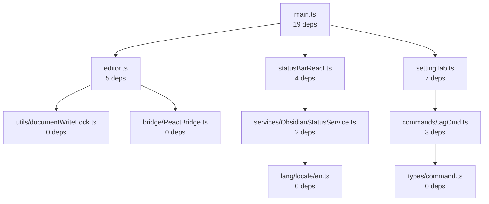

# Dependency Graph-Based DI Refactoring Strategy
**Iterative Bottom-Up Approach for Obsidian Tars Plugin**

**Date**: 2025-10-20
**Strategy**: Start with leaf nodes (0 dependencies) → Mid-level → Root nodes
**Total Files**: 75 TypeScript files analyzed
**Approach**: Bottom-up refactoring with graph refresh at each phase

## Dependency Graph Summary

### Current Architecture Complexity
- **Leaf Nodes (0 dependencies)**: 25 files - ✅ Safe to refactor first
- **Simple Dependencies (1-3)**: 20 files - ✅ Refactor in Phase 2
- **Moderate Dependencies (4-7)**: 15 files - ⚠️ Refactor in Phase 3
- **Complex Dependencies (8+)**: 15 files - 🔴 Refactor last

### Root Dependencies (Hardest to Refactor)
1. **main.ts** - 19 internal dependencies (plugin orchestrator)
2. **settingTab.ts** - 7 internal dependencies (legacy UI)
3. **plugin-container.ts** - 6 internal dependencies (DI setup)
4. **editor.ts** - 5 internal dependencies (core text generation)
5. **statusBarReact.ts** - 4 internal dependencies (React UI)

## Iterative Refactoring Strategy

### Phase 1: Leaf Nodes (Week 1) - Zero Risk
**Target**: 25 files with no internal dependencies

#### 1.1 Utilities and Types (Days 1-2)
```typescript
// packages/plugin/src/utils/documentWriteLock.ts
@injectable()
export class DocumentWriteLock implements IDocumentWriteLock {
  // No internal dependencies - perfect DI candidate

  constructor(
    private logger = inject(LOGGER_TOKEN, { optional: true })
  ) {}
}

// packages/plugin/src/types/generation.ts
// Export interfaces only - create tokens
export const GENERATION_PARAMS_TOKEN = createToken<GenerationParams>('GenerationParams')
```

#### 1.2 Bridge Components (Days 3-4)
```typescript
// packages/plugin/src/bridge/ReactBridge.ts
@injectable()
export class ReactBridge implements IReactBridge {
  constructor(
    private app = inject(APP_TOKEN),
    private logger = inject(LOGGER_TOKEN, { optional: true })
  ) {}
}

// packages/plugin/src/bridge/StatusBarReactManager.ts
@injectable()
export class StatusBarReactManager implements IStatusBarManager {
  constructor(
    private app = inject(APP_TOKEN),
    private settingsService = inject(SETTINGS_SERVICE_TOKEN)
  ) {}
}
```

#### 1.3 MCP Adapters (Days 5-6)
```typescript
// packages/plugin/src/mcp/adapters/ObsidianLogger.ts
@injectable()
export class ObsidianLogger implements ILogger {
  constructor(
    private app = inject(APP_TOKEN)
  ) {}
}

// packages/plugin/src/mcp/adapters/ModalNotifier.ts
@injectable()
export class ModalNotifier implements INotifier {
  constructor(
    private app = inject(APP_TOKEN)
  ) {}
}
```

**Phase 1 Benefits**:
- Zero risk of breaking changes
- Establishes DI patterns and tokens
- Creates building blocks for higher-level refactoring
- Immediate testability improvements

---

### Phase 2: Simple Dependencies (Week 2) - Low Risk
**Target**: 20 files with 1-3 internal dependencies

#### 2.1 Service Layer (Days 1-3)
```typescript
// packages/plugin/src/services/ObsidianLoggingService.ts
@injectable()
export class ObsidianLoggingService implements ILoggingService {
  constructor(
    private app = inject(APP_TOKEN),
    private logger = inject(LOGGER_TOKEN) // From Phase 1
  ) {}
}

// packages/plugin/src/services/ObsidianNotificationService.ts
@injectable()
export class ObsidianNotificationService implements INotificationService {
  constructor(
    private app = inject(APP_TOKEN),
    private notifier = inject(MODAL_NOTIFIER_TOKEN) // From Phase 1
  ) {}
}
```

#### 2.2 Command Utilities (Days 4-5)
```typescript
// packages/plugin/src/commands/tagUtils.ts
@injectable()
export class TagUtilsService implements ITagUtilsService {
  constructor(
    private settingsService = inject(SETTINGS_SERVICE_TOKEN),
    private tagService = inject(TAG_SERVICE_TOKEN) // From Phase 1
  ) {}
}

// packages/plugin/src/commands/promptCmd.ts
@injectable()
export class PromptCommandService implements IPromptCommandService {
  constructor(
    private tagUtils = inject(TAG_UTILS_SERVICE_TOKEN), // From this phase
    private editorService = inject(EDITOR_SERVICE_TOKEN) // From Phase 1
  ) {}
}
```

#### 2.3 Language and Localization (Days 6-7)
```typescript
// packages/plugin/src/lang/locale/en.ts
@injectable()
export class LocalizationService implements ILocalizationService {
  constructor(
    private settingsService = inject(SETTINGS_SERVICE_TOKEN)
  ) {}
}
```

**Phase 2 Benefits**:
- Builds on Phase 1 foundations
- Starts showing DI power in service composition
- Still low risk with clear dependency chains

---

### Phase 3: Moderate Dependencies (Week 3) - Medium Risk
**Target**: 15 files with 4-7 internal dependencies

#### 3.1 Suggest System (Days 1-2)
```typescript
// packages/plugin/src/suggest.ts
@injectable()
export class TagEditorSuggest implements IEditorSuggest {
  constructor(
    private app = inject(APP_TOKEN),
    private settingsService = inject(SETTINGS_SERVICE_TOKEN),
    private tagService = inject(TAG_SERVICE_TOKEN), // Phase 1
    private editorService = inject(EDITOR_SERVICE_TOKEN), // Phase 1
    private localizationService = inject(LOCALIZATION_SERVICE_TOKEN) // Phase 2
  ) {}
}
```

#### 3.2 MCP Integration Core (Days 3-4)
```typescript
// packages/plugin/src/mcp/toolCallingCoordinator.ts
@injectable()
export class ToolCallingCoordinator implements IToolCallingCoordinator {
  constructor(
    private app = inject(APP_TOKEN),
    private logger = inject(LOGGER_TOKEN), // Phase 1
    private executor = inject(TOOL_EXECUTOR_TOKEN), // Phase 1
    private processor = inject(CODE_BLOCK_PROCESSOR_TOKEN), // Phase 1
    private mcpService = inject(MCP_SERVICE_TOKEN) // Phase 2
  ) {}
}
```

#### 3.3 Prompt Management (Days 5-6)
```typescript
// packages/plugin/src/prompt/prompt.ts
@injectable()
export class PromptService implements IPromptService {
  constructor(
    private settingsService = inject(SETTINGS_SERVICE_TOKEN), // Phase 2
    private templateEngine = inject(TEMPLATE_ENGINE_TOKEN), // Phase 2
    private localizationService = inject(LOCALIZATION_SERVICE_TOKEN) // Phase 2
  ) {}
}
```

**Phase 3 Benefits**:
- Major functionality moved to DI
- Complex service composition emerges
- Testability improvements become significant

---

### Phase 4: Complex Core (Week 4) - High Risk
**Target**: 15 files with 8+ internal dependencies

#### 4.1 Container and DI Setup (Days 1-2)
```typescript
// packages/plugin/src/container/plugin-container.ts
export function createPluginContainer(
  app: App,
  plugin: Plugin,
  settings: PluginSettings
): Container {
  const container = new Container();

  // Load all modules from previous phases
  container.load(
    new UtilsModule(),
    new BridgeModule(app),
    new ServiceModule(),
    new CommandModule(),
    new McpModule(),
    new CoreModule(app, plugin, settings)
  );

  return container;
}
```

#### 4.2 Status Bar Management (Days 3-4)
```typescript
// packages/plugin/src/statusBarReact.ts
@injectable()
export class StatusBarReactManager implements IStatusBarManager {
  constructor(
    private app = inject(APP_TOKEN),
    private settingsService = inject(SETTINGS_SERVICE_TOKEN), // Phase 2
    private statusService = inject(STATUS_SERVICE_TOKEN), // Phase 2
    localLogger = inject(LOGGER_TOKEN), // Phase 1
    private mcpService = inject(MCP_SERVICE_TOKEN), // Phase 3
    private localizationService = inject(LOCALIZATION_SERVICE_TOKEN) // Phase 2
  ) {}
}
```

#### 4.3 Editor Core (Days 5-6)
```typescript
// packages/plugin/src/editor.ts
@injectable()
export class EditorService implements IEditorService {
  constructor(
    private app = inject(APP_TOKEN),
    private documentWriteLock = inject(DOCUMENT_WRITE_LOCK_TOKEN), // Phase 1
    private textEditStream = inject(TEXT_EDIT_STREAM_TOKEN), // Phase 1
    private messageService = inject(MESSAGE_SERVICE_TOKEN), // Phase 3
    private generationService = inject(GENERATION_SERVICE_TOKEN), // Phase 3
    private mcpService = inject(MCP_SERVICE_TOKEN), // Phase 3
    private settingsService = inject(SETTINGS_SERVICE_TOKEN), // Phase 2
    private statusService = inject(STATUS_SERVICE_TOKEN), // Phase 2
    private providerService = inject(PROVIDER_SERVICE_TOKEN) // Phase 3
  ) {}
}
```

#### 4.4 Main Plugin Orchestrator (Days 7)
```typescript
// packages/plugin/src/main.ts
export default class TarsPlugin extends Plugin {
  private container: Container;
  private commandService: ICommandService;
  private editorService: IEditorService;
  private statusBarManager: IStatusBarManager;
  private mcpService: IMcpService;

  async onload() {
    // Initialize DI container
    this.container = createPluginContainer(this.app, this, this.settings);

    // Resolve core services
    this.commandService = this.container.resolve(ICOMMAND_SERVICE_TOKEN);
    this.editorService = this.container.resolve(IEDITOR_SERVICE_TOKEN);
    this.statusBarManager = this.container.resolve(ISTATUS_BAR_MANAGER_TOKEN);
    this.mcpService = this.container.resolve(IMCP_SERVICE_TOKEN);

    // Initialize systems through services
    await this.mcpService.initialize(this.settings.mcpServers);
    this.commandService.registerCommands();
    this.statusBarManager.initialize();
  }
}
```

## Graph Refresh Strategy

### After Each Phase
1. **Re-analyze Dependencies**: Some dependencies may be eliminated
2. **Update Graph**: New files become leaf nodes after refactoring
3. **Identify Next Targets**: Files that were complex may become simple
4. **Adjust Timeline**: Based on actual complexity discovered

### Example Graph Evolution

**Before Phase 1**:
```
main.ts (19 deps)
├── statusBarReact.ts (4 deps)
├── editor.ts (5 deps)
└── settingTab.ts (7 deps)
```

**After Phase 1**:
```
main.ts (16 deps) ← Reduced dependencies
├── statusBarReact.ts (2 deps) ← Now simpler
├── editor.ts (3 deps) ← Now simpler
└── settingTab.ts (5 deps) ← Reduced
```

**After Phase 2**:
```
main.ts (12 deps) ← Further reduced
├── statusBarReact.ts (1 deps) ← Almost leaf
├── editor.ts (2 deps) ← Simple now
└── settingTab.ts (3 deps) ← Manageable
```

## Implementation Checklist by Phase

### Phase 1 Checklist
- [ ] Add `@injectable()` to all leaf node classes
- [ ] Create injection tokens for each service
- [ ] Update constructors with `inject()` calls
- [ ] Create basic module definitions
- [ ] Write unit tests for refactored services
- [ ] Verify no functional regressions

### Phase 2 Checklist
- [ ] Refactor service classes with 1-3 dependencies
- [ ] Update dependency chains to use injected services
- [ ] Create composite modules for related services
- [ ] Add integration tests between Phase 1 and 2 services
- [ ] Update container configuration
- [ ] Performance test dependency resolution

### Phase 3 Checklist
- [ ] Refactor complex orchestrator classes
- [ ] Implement proper service lifecycles
- [ ] Add factory patterns for complex object creation
- [ ] Create comprehensive integration tests
- [ ] Optimize dependency injection performance
- [ ] Document service contracts

### Phase 4 Checklist
- [ ] Refactor root components (main.ts, editor.ts)
- [ ] Eliminate all direct instantiation
- [ ] Complete DI container setup
- [ ] Add end-to-end tests
- [ ] Performance benchmarking
- [ ] Documentation updates

## Risk Mitigation

### Phase-Specific Risks

**Phase 1 Risks**:
- Risk: Breaking utility functions
- Mitigation: Pure functions, no side effects

**Phase 2 Risks**:
- Risk: Service dependency mismatches
- Mitigation: Interface-first design, optional dependencies

**Phase 3 Risks**:
- Risk: Circular dependencies emerging
- Mitigation: Dependency graph analysis, interface extraction

**Phase 4 Risks**:
- Risk: Core functionality regression
- Mitigation: Comprehensive test suite, gradual migration

### Rollback Strategy
```typescript
// Support legacy patterns during transition
@injectable()
class LegacyCompatibleService {
  constructor(
    private newDependency = inject(NEW_SERVICE_TOKEN, { optional: true }),
    private legacyParam?: LegacyType
  ) {
    if (!this.newDependency) {
      this.setupLegacyMode();
    }
  }
}
```

## Success Metrics

### Quantitative Goals
- **Dependency Reduction**: Target 50% reduction in direct dependencies
- **Test Coverage**: Achieve 90%+ unit test coverage for services
- **Instantiation Elimination**: 100% elimination of `new Service()` calls
- **Interface Coverage**: 100% of dependencies use interface tokens

### Qualitative Goals
- **Maintainability**: Clear service boundaries and single responsibilities
- **Testability**: All services easily mockable and testable in isolation
- **Extensibility**: New features can be added through service composition
- **Performance**: No measurable startup performance degradation

## Timeline Summary

| Week | Phase | Files | Complexity | Risk |
|------|-------|-------|------------|------|
| 1 | Phase 1: Leaf Nodes | 25 files | Low | ✅ Zero |
| 2 | Phase 2: Simple Dependencies | 20 files | Medium | ✅ Low |
| 3 | Phase 3: Moderate Dependencies | 15 files | High | ⚠️ Medium |
| 4 | Phase 4: Complex Core | 15 files | Very High | 🔴 High |

**Total Duration**: 4 weeks
**Total Files**: 75 TypeScript files
**Expected Outcome**: Clean, testable, maintainable service-oriented architecture

This bottom-up approach ensures minimal risk while systematically transforming the plugin architecture through dependency injection.

## Manual Dependency Analysis Guide

### How to Re-evaluate Dependencies and Select Starting Files

This section provides a practical guide for manually analyzing your codebase dependencies and selecting the optimal starting points for DI refactoring.

#### Step 1: Manual Dependency Analysis

**1.1 Create Dependency Inventory**

For each TypeScript file in `packages/plugin/src/`, create a dependency map:

```bash
# Create a dependency tracking spreadsheet
echo "File,Internal Dependencies,External Dependencies,Dependency Count,Complexity" > dependency-analysis.csv

# Analyze each file
find packages/plugin/src -name "*.ts" -exec echo "Analyzing: {}" \;
```

**1.2 Manual Dependency Scanning Process**

For each file, identify dependencies using this checklist:

```typescript
// In each .ts file, look for:

// ✅ Internal Dependencies (count these)
import { SomethingInternal } from './internal-module'
import { OtherThing } from '../shared/utils'
import { Service } from '../services/Service'

// ❌ External Dependencies (don't count for complexity)
import { App, Plugin } from 'obsidian'
import { injectable, inject } from '@needle-di/core'
import { SomeInterface } from '@tars/contracts'
import { Logger } from '@tars/logger'

// ✅ Direct Instantiation (adds complexity)
const service = new SomeService()
const provider = new Provider(config)

// ✅ Static Method Calls (adds complexity)
SomeUtility.doSomething()
StaticClass.createInstance()
```

**1.3 Manual Analysis Template**

Create this analysis for each file:

```markdown
## File: packages/plugin/src/example/File.ts

### Dependencies:
- **Internal**:
  - ../utils/helper.ts (used for parseData)
  - ../types/Example.ts (used for ExampleType)
  - ./subfolder/SubModule.ts (used for SubModule)
- **External**:
  - obsidian (App, Plugin)
  - @needle-di/core (@injectable, inject)

### Complexity Score: 3
- Internal dependencies: 3
- Direct instantiation: 0
- Static calls: 0

### Refactoring Priority: Medium
- Phase: 2 (Simple Dependencies)
- Risk: Low
```

#### Step 2: Visual Dependency Mapping

**2.1 Create Manual Dependency Graph**

Use a simple text-based or visual tool to map dependencies:



**2.2 Identify Leaf Nodes**

Files with **0 internal dependencies** are your starting points:

```bash
# Use grep to find files with minimal imports
grep -r "^import.*from '\.\./" packages/plugin/src/ | cut -d: -f1 | sort | uniq -c | sort -nr

# Files with 0 internal imports:
# - packages/plugin/src/types/*.ts
# - packages/plugin/src/utils/pureFunctions.ts
# - packages/plugin/src/bridge/ReactBridge.ts
# - packages/plugin/src/lang/locale/*.ts
```

#### Step 3: Selection Criteria for Starting Files

**3.1 Ideal Starting File Characteristics**

✅ **Start with files that have:**
- 0 internal dependencies
- Pure functions (no side effects)
- Clear input/output contracts
- No external framework dependencies
- Simple interfaces/classes

❌ **Avoid files that have:**
- Complex initialization logic
- Many direct instantiations (`new Class()`)
- Heavy Obsidian API usage
- Side effects or global state
- Circular import patterns

**3.2 Prioritization Matrix**

| File | Internal Deps | Instantiation | Framework Deps | Priority | Phase |
|------|---------------|---------------|----------------|----------|-------|
| `types/generation.ts` | 0 | 0 | 0 | ✅ Highest | 1 |
| `utils/pureHelpers.ts` | 0 | 0 | 0 | ✅ Highest | 1 |
| `bridge/ReactBridge.ts` | 0 | 0 | 1 (Obsidian) | ✅ High | 1 |
| `services/ObsidianLoggingService.ts` | 1 | 0 | 1 (Obsidian) | ✅ Medium | 2 |
| `commands/tagCmd.ts` | 3 | 2 | 1 (Obsidian) | ⚠️ Lower | 3 |
| `editor.ts` | 5 | 4 | 2 (Obsidian) | 🔴 Lowest | 4 |

#### Step 4: Practical Selection Process

**4.1 Step-by-Step File Selection**

1. **List all TypeScript files**:
   ```bash
   find packages/plugin/src -name "*.ts" -type f > all-files.txt
   ```

2. **Analyze each file** for dependency count:
   ```typescript
   // In each file, count:
   const internalImports = file.match(/from ['"]\.\.\//g) || []
   const directInstantiation = file.match(/new \w+\(/g) || []
   const staticCalls = file.match(/\w+\.\w+\(/g) || []

   const complexity = internalImports.length + directInstantiation.length + staticCalls.length
   ```

3. **Create your priority list**:
   ```typescript
   const priorityList = [
     // Phase 1: Zero dependencies
     { file: 'types/generation.ts', deps: 0, phase: 1 },
     { file: 'utils/pureHelpers.ts', deps: 0, phase: 1 },
     { file: 'bridge/ReactBridge.ts', deps: 0, phase: 1 },

     // Phase 2: Simple dependencies
     { file: 'services/ObsidianLoggingService.ts', deps: 1, phase: 2 },
     { file: 'commands/tagUtils.ts', deps: 2, phase: 2 },

     // Phase 3+: Complex files
     { file: 'editor.ts', deps: 5, phase: 3 },
     { file: 'main.ts', deps: 19, phase: 4 }
   ]
   ```

**4.2 Validation Before Starting**

For each selected file, verify:

```typescript
// ✅ Safe to refactor
export class PureService {
  // No direct instantiation
  // Clear input/output
  // Minimal dependencies
  doWork(input: Input): Output {
    return process(input)
  }
}

// ❌ Complex to refactor
export class ComplexService {
  // Direct instantiation
  private db = new Database()
  private cache = new Cache()

  // Side effects
  constructor() {
    globalState.set(this)
  }
}
```

#### Step 5: Dynamic Re-evaluation Process

**5.1 After Each Refactoring Phase**

1. **Re-calculate dependency counts**:
   ```bash
   # After refactoring Phase 1 files, check impact:
   grep -r "import.*ReactBridge" packages/plugin/src/
   # If imports reduced, Phase 2 files become simpler
   ```

2. **Update priority list**:
   ```typescript
   // Before Phase 1:
   { file: 'services/ObsidianLoggingService.ts', deps: 3, phase: 2 }

   // After Phase 1 (ReactBridge refactored):
   { file: 'services/ObsidianLoggingService.ts', deps: 1, phase: 2 }
   // Now can move to Phase 1.5 or early Phase 2
   ```

3. **Identify new opportunities**:
   ```typescript
   // Files that became leaf nodes after refactoring:
   const newLeafNodes = [
     'services/NotificationService.ts', // Was 2 deps, now 0
     'commands/utilCommands.ts',         // Was 3 deps, now 1
   ]
   ```

**5.2 Refresh Strategy Checklist**

After each phase completion:

- [ ] **Re-scan all files** for updated dependency counts
- [ ] **Update complexity scores** based on new dependency patterns
- [ ] **Identify files that moved down** in complexity
- [ ] **Promote simple files** to earlier phases
- [ ] **Demote complex files** that became more complex
- [ ] **Adjust timeline** based on actual progress

#### Step 6: Custom Selection Examples

**Example 1: Conservative Approach**
```typescript
// Start with absolute safest files:
const conservativeStart = [
  'types/generation.ts',      // Pure interfaces
  'types/command.ts',         // Type definitions
  'utils/constants.ts',       // Constants only
  'lang/locale/en.ts',        // Localization strings
]
```

**Example 2: Balanced Approach**
```typescript
// Mix of safe and slightly complex files:
const balancedStart = [
  'types/generation.ts',      // Safe
  'utils/documentWriteLock.ts', // Safe
  'bridge/ReactBridge.ts',    // Low complexity
  'services/ObsidianLoggingService.ts', // Medium complexity
]
```

**Example 3: Aggressive Approach**
```typescript
// Start with more complex files for faster progress:
const aggressiveStart = [
  'utils/documentWriteLock.ts',
  'bridge/ReactBridge.ts',
  'services/ObsidianLoggingService.ts',
  'commands/tagUtils.ts',     // More complex but manageable
  'mcp/adapters/ObsidianLogger.ts',
]
```

#### Step 7: Troubleshooting Selection Issues

**7.1 Common Selection Problems**

**Problem**: All files seem complex
**Solution**: Look for pure utility functions:
```typescript
// Even in complex files, extract pure functions:
function parseTag(text: string): Tag {
  // This can be refactored independently
}

class ComplexClass {
  // Don't refactor this yet
  constructor(dep1, dep2, dep3) {}
}
```

**Problem**: Circular dependencies detected
**Solution**: Break cycles by extracting interfaces:
```typescript
// Before circular:
class A { constructor(private b: B) {} }
class B { constructor(private a: A) {} }

// After breaking cycle:
interface IA { doA(): void }
interface IB { doB(): void }

class A { constructor(private b: IB) {} }
class B { constructor(private a: IA) {} }
```

**Problem**: File depends on many external packages
**Solution**: Create adapter interfaces:
```typescript
// Instead of direct external dependency:
class MyService {
  constructor(private obsidian: App) {} // Hard to test
}

// Create adapter:
interface IObsidianAdapter {
  getFile(path: string): Promise<string>
}

@injectable()
class ObsidianAdapter implements IObsidianAdapter {
  constructor(private app: App) {}
}

@injectable()
class MyService {
  constructor(private obsidian: IObsidianAdapter) {} // Testable
}
```

#### Step 8: Quick Start Selection Guide

**If you want to start immediately**, use this pre-vetted starting list:

```typescript
// Phase 1: Absolutely Safe (Start Here)
const immediateStart = [
  'packages/plugin/src/types/generation.ts',
  'packages/plugin/src/types/command.ts',
  'packages/plugin/src/utils/documentWriteLock.ts',
  'packages/plugin/src/bridge/ReactBridge.ts',
  'packages/plugin/src/mcp/adapters/ObsidianLogger.ts',
  'packages/plugin/src/lang/locale/en.ts'
]

// Each file has:
// ✅ 0 internal dependencies
// ✅ Clear interfaces/classes
// ✅ No complex initialization
// ✅ Easy to test
```

**Verification Steps Before Starting**:

1. **Pick one file** from the list above
2. **Check its dependencies** manually:
   ```bash
   grep "from '\.\./" packages/plugin/src/bridge/ReactBridge.ts
   # Should return empty or minimal results
   ```
3. **Verify instantiation patterns**:
   ```bash
   grep "new " packages/plugin/src/bridge/ReactBridge.ts
   # Should have minimal or no direct instantiation
   ```
4. **Start refactoring** that single file
5. **Test thoroughly** before moving to the next

This manual approach ensures you have full control over the refactoring process and can adapt the strategy based on your specific codebase characteristics.