# AI-Powered Monorepo Migration
## From Experimental Plugin to Production Ready Product in Monorepo

**Your Key Takeaway:** Use AI for planning and executing complex tasks with small verifiable steps

<presentation-duration minutes="5" slides="4" timing="1:15"/>

<style>
.migration-title {
  background: linear-gradient(135deg, #667eea 0%, #764ba2 100%);
  -webkit-background-clip: text;
  -webkit-text-fill-color: transparent;
  background-clip: text;
}

.tool-card {
  transition: all 0.3s ease;
  backdrop-filter: blur(10px);
}

.tool-card:hover {
  transform: translateY(-2px);
  box-shadow: 0 10px 25px rgba(0,0,0,0.3);
}

.gradient-text {
  background: linear-gradient(135deg, #667eea 0%, #764ba2 100%);
  -webkit-background-clip: text;
  -webkit-text-fill-color: transparent;
  background-clip: text;
}

.pulse {
  animation: pulse 2s infinite;
}

@keyframes pulse {
  0%, 100% { opacity: 1; }
  50% { opacity: 0.7; }
}

/* Light mode improvements */
.light-mode .tool-card {
  background: rgba(255,255,255,0.8) !important;
  border: 1px solid rgba(0,0,0,0.1) !important;
  box-shadow: 0 2px 8px rgba(0,0,0,0.1);
}

.light-mode .tool-card:hover {
  background: rgba(255,255,255,0.9) !important;
  box-shadow: 0 4px 16px rgba(0,0,0,0.15);
}

.light-mode .bg-blue-900\/30 { background: rgba(59, 130, 246, 0.1) !important; }
.light-mode .bg-purple-900\/30 { background: rgba(147, 51, 234, 0.1) !important; }
.light-mode .bg-green-900\/30 { background: rgba(34, 197, 94, 0.1) !important; }
.light-mode .bg-gray-900\/50 { background: rgba(0,0,0,0.05) !important; }
.light-mode .bg-gray-800\/50 { background: rgba(0,0,0,0.05) !important; }
.light-mode .bg-red-900\/30 { background: rgba(239, 68, 68, 0.1) !important; }

.light-mode .border-blue-400\/30 { border-color: rgba(59, 130, 246, 0.3) !important; }
.light-mode .border-purple-400\/30 { border-color: rgba(147, 51, 234, 0.3) !important; }
.light-mode .border-green-400\/30 { border-color: rgba(34, 197, 94, 0.3) !important; }

.light-mode .bg-gradient-to-r.from-blue-600.to-purple-600 {
  background: linear-gradient(to right, #1d4ed8, #7c3aed) !important;
}

.light-mode .bg-gradient-to-r.from-green-600.to-blue-600 {
  background: linear-gradient(to right, #16a34a, #1d4ed8) !important;
}

.light-mode .bg-gradient-to-br.from-blue-900\/30.to-blue-800\/30 {
  background: linear-gradient(to br, rgba(30, 58, 138, 0.1), rgba(30, 64, 175, 0.1)) !important;
}

.light-mode .bg-gradient-to-br.from-green-900\/30.to-green-800\/30 {
  background: linear-gradient(to br, rgba(21, 128, 61, 0.1), rgba(22, 163, 74, 0.1)) !important;
}

.light-mode .bg-gradient-to-r.from-purple-400.via-pink-400.to-red-400 {
  background: linear-gradient(to right, #8b5cf6, #ec4899, #dc2626) !important;
}

/* Enhanced contrast for light mode */
.light-mode .bg-blue-900\/20 {
  background: rgba(30, 58, 138, 0.15) !important;
  border: 1px solid rgba(30, 58, 138, 0.2) !important;
}

.light-mode .bg-green-900\/20 {
  background: rgba(21, 128, 61, 0.15) !important;
  border: 1px solid rgba(21, 128, 61, 0.2) !important;
}

/* Enhanced contrast for both modes using Tailwind's dark: prefix */
.dark .bg-blue-900\/20 { background: rgba(59, 130, 246, 0.1) !important; }
.dark .bg-purple-900\/20 { background: rgba(147, 51, 234, 0.1) !important; }
.dark .bg-green-900\/20 { background: rgba(34, 197, 94, 0.1) !important; }
.dark .bg-gray-900\/30 { background: rgba(0, 0, 0, 0.3) !important; }

.dark .text-blue-300 { color: #93c5fd !important; }
.dark .text-purple-300 { color: #c084fc !important; }
.dark .text-green-300 { color: #86efac !important; }
.dark .text-gray-300 { color: #d1d5db !important; }

/* Better contrast for light mode */
.bg-blue-900\/20 { background: rgba(30, 58, 138, 0.12) !important; }
.bg-purple-900\/20 { background: rgba(88, 28, 135, 0.12) !important; }
.bg-green-900\/20 { background: rgba(21, 128, 61, 0.12) !important; }
.bg-gray-900\/30 { background: rgba(0, 0, 0, 0.06) !important; }

.text-blue-300 { color: #1d4ed8 !important; }
.text-purple-300 { color: #7c3aed !important; }
.text-green-300 { color: #16a34a !important; }
.text-gray-300 { color: #374151 !important; }

.light-mode .bg-red-900\/40 {
  background: rgba(220, 38, 38, 0.15) !important;
  border-color: rgba(220, 38, 38, 0.4) !important;
}

.light-mode .text-red-200 {
  color: #dc2626 !important;
}

.light-mode .border-red-400 {
  border-color: rgba(248, 113, 113, 0.6) !important;
}

/* Global slide layout improvements */
.slidev-layout {
  padding: 2rem !important;
}

.slidev-page {
  padding: 1.5rem !important;
  max-width: 100% !important;
  margin: 0 auto !important;
}

/* Better content scaling */
.slidev-page > * {
  max-width: 100% !important;
  box-sizing: border-box !important;
}

/* Responsive padding for different screen sizes */
@media (max-width: 1024px) {
  .slidev-layout {
    padding: 1rem !important;
  }

  .slidev-page {
    padding: 1rem !important;
  }
}

@media (max-width: 768px) {
  .slidev-layout {
    padding: 0.75rem !important;
  }

  .slidev-page {
    padding: 0.75rem !important;
  }
}

/* Ensure content doesn't overflow */
.slidev-page-container {
  overflow: hidden !important;
}

/* Better text scaling */
.slidev-page h1,
.slidev-page h2,
.slidev-page h3 {
  margin-top: 0 !important;
  margin-bottom: 0.5em !important;
}

/* Improve grid responsiveness */
.slidev-page .grid {
  width: 100% !important;
}

/* Alternative slide container targeting */
.slidev-page-root {
  padding: 2rem !important;
}

.slidev-page-content {
  max-width: calc(100vw - 4rem) !important;
  margin: 0 auto !important;
}

/* Ensure all slides have consistent padding */
.slidev-vclick-target,
.slidev-vclick-hidden {
  padding: 1rem !important;
}

/* Better responsive behavior */
@media (max-width: 1200px) {
  .slidev-page-root {
    padding: 1.5rem !important;
  }

  .slidev-page-content {
    max-width: calc(100vw - 3rem) !important;
  }
}

@media (max-width: 900px) {
  .slidev-page-root {
    padding: 1rem !important;
  }

  .slidev-page-content {
    max-width: calc(100vw - 2rem) !important;
  }
}

/* Force content to fit within bounds */
.slidev-page * {
  max-width: 100% !important;
  box-sizing: border-box !important;
}

/* Improve mermaid diagram sizing */
.slidev-page .mermaid {
  max-width: 100% !important;
  height: auto !important;
}

/* Better responsive scaling */
@media (max-width: 1400px) {
  .slidev-page .mermaid {
    transform: scale(0.9) !important;
  }
}

@media (max-width: 1200px) {
  .slidev-page .mermaid {
    transform: scale(0.8) !important;
  }
}

@media (max-width: 1000px) {
  .slidev-page .mermaid {
    transform: scale(0.7) !important;
  }
}

/* Ensure all content scales properly */
.slidev-page {
  transform-origin: center center !important;
}

/* Better spacing for mobile */
@media (max-width: 768px) {
  .slidev-page .grid-cols-3 {
    grid-template-columns: 1fr !important;
  }

  .slidev-page .grid-cols-2 {
    grid-template-columns: 1fr !important;
  }

  .slidev-page .text-8xl {
    font-size: 4rem !important;
  }

  .slidev-page .text-6xl {
    font-size: 3rem !important;
  }

  .slidev-page .text-4xl {
    font-size: 2rem !important;
  }

  .slidev-page .text-3xl {
    font-size: 1.5rem !important;
  }
}
</style>

---

# Migration Nightmare?
## 😰 The Overwhelm

<v-clicks>

**The Problem:**
<div class="space-y-2 mb-4">
  <div class="flex items-center space-x-2">
    <span class="text-xl">💥</span>
    <span class="text-sm">Complex refactoring overwhelms developers</span>
  </div>
  <div class="flex items-center space-x-2">
    <span class="text-xl">❓</span>
    <span class="text-sm">Where do you even start?</span>
  </div>
  <div class="flex items-center space-x-2">
    <span class="text-xl">💥</span>
    <span class="text-sm">Risk of breaking existing functionality</span>
  </div>
</div>

**The Reality:**
<div class="bg-gray-100 border-l-4 border-red-500 p-4 mt-4 rounded-r-lg shadow-lg dark:bg-gray-800/50 dark:border-red-400">
  <span class="text-red-600 font-bold text-sm dark:text-red-300">"I know I need to migrate to monorepo, but the complexity is paralyzing"</span>
</div>

<div class="mt-6 text-center">
  <div class="text-6xl opacity-90 animate-bounce">😵‍💫</div>
  <div class="text-xs text-gray-400 mt-1">Developer paralysis sets in... <span class="text-red-400">😱</span></div>
</div>

</v-clicks>

---

# The Monorepo Solution
## 🛠️ Tools That Transform

<v-clicks>

**Core Tools:**
<div class="grid grid-cols-3 gap-3 my-4">
  <div class="tool-card bg-blue-50 p-3 rounded-lg border border-blue-200 hover:border-blue-300 dark:bg-blue-900/30 dark:border-blue-400/30 dark:hover:border-blue-300/50">
    <div class="text-2xl mb-1">📦</div>
    <div class="font-bold text-blue-700 text-sm dark:text-blue-300">pnpm workspaces</div>
    <div class="text-xs text-gray-600 dark:text-gray-300 dark:opacity-80">Fast, disk-efficient package management</div>
  </div>
  <div class="tool-card bg-purple-50 p-3 rounded-lg border border-purple-200 hover:border-purple-300 dark:bg-purple-900/30 dark:border-purple-400/30 dark:hover:border-purple-300/50">
    <div class="text-2xl mb-1">⚡</div>
    <div class="font-bold text-purple-700 text-sm dark:text-purple-300">Turborepo</div>
    <div class="text-xs text-gray-600 dark:text-gray-300 dark:opacity-80">Build orchestration and caching</div>
  </div>
  <div class="tool-card bg-green-50 p-3 rounded-lg border border-green-200 hover:border-green-300 dark:bg-green-900/30 dark:border-green-400/30 dark:hover:border-green-300/50">
    <div class="text-2xl mb-1">🔧</div>
    <div class="font-bold text-green-700 text-sm dark:text-green-300">tsup</div>
    <div class="text-xs text-gray-600 dark:text-gray-300 dark:opacity-80">Zero-config TypeScript bundler</div>
  </div>
</div>

<div class="bg-gradient-to-r from-blue-100 to-purple-100 p-3 rounded-lg border border-blue-200 dark:from-blue-600/20 dark:to-purple-600/20 dark:border-blue-400/30">
  <div class="font-bold text-blue-800 mb-2 text-sm dark:text-blue-300">🚀 Latest Releases:</div>
  <div class="flex justify-center space-x-4 text-xs">
    <div class="text-center">
      <div class="font-bold text-gray-800 dark:text-white">pnpm</div>
      <a href="https://github.com/pnpm/pnpm/releases/latest" class="text-blue-600 hover:text-blue-500 dark:text-blue-400 dark:hover:text-blue-300">v9.12.2</a>
    </div>
    <div class="text-center">
      <div class="font-bold text-gray-800 dark:text-white">Turborepo</div>
      <a href="https://github.com/vercel/turborepo/releases/latest" class="text-blue-600 hover:text-blue-500 dark:text-blue-400 dark:hover:text-blue-300">v2.2.3</a>
    </div>
    <div class="text-center">
      <div class="font-bold text-gray-800 dark:text-white">tsup</div>
      <a href="https://github.com/egoist/tsup/releases/latest" class="text-blue-600 hover:text-blue-500 dark:text-blue-400 dark:hover:text-blue-300">v8.3.0</a>
    </div>
  </div>
</div>

<div class="mt-4 bg-gray-50 p-3 rounded-lg border border-gray-200 dark:bg-gray-900/50 dark:border-gray-700">
  <div class="font-bold text-gray-800 mb-2 text-sm dark:text-gray-300">📁 Example workspace structure:</div>

```bash
packages/
  plugin/       # Your Obsidian plugin
  ui/           # React components
  shared/       # Common utilities
```

</div>

</v-clicks>

---

# AI Does the Heavy Lifting
## 🤖 Intelligence Meets Structure

<v-clicks>

**Step 1: Ask AI to Plan**
<div class="bg-gradient-to-r from-blue-600 to-purple-600 p-4 rounded-lg my-3 text-white">
  <div class="font-mono text-sm">
    "Plan my Obsidian plugin migration to pnpm workspaces + Turborepo + tsup"
  </div>
</div>

**Step 2: Document Each Phase**
<div class="grid grid-cols-2 gap-3 my-4">
  <div class="bg-gray-800/50 p-3 rounded-lg border-l-4 border-blue-400 hover:border-blue-300 transition-all duration-300">
    <div class="text-xl mb-1">🔍</div>
    <div class="font-bold text-blue-300 text-sm">Dependency analysis</div>
    <div class="text-xs opacity-80">Map current dependencies and conflicts</div>
  </div>
  <div class="bg-gray-800/50 p-3 rounded-lg border-l-4 border-green-400 hover:border-green-300 transition-all duration-300">
    <div class="text-xl mb-1">⚙️</div>
    <div class="font-bold text-green-300 text-sm">Workspace configuration</div>
    <div class="text-xs opacity-80">Set up pnpm workspace structure</div>
  </div>
  <div class="bg-gray-800/50 p-3 rounded-lg border-l-4 border-purple-400 hover:border-purple-300 transition-all duration-300">
    <div class="text-xl mb-1">🏗️</div>
    <div class="font-bold text-purple-300 text-sm">Build pipeline setup</div>
    <div class="text-xs opacity-80">Configure Turborepo caching</div>
  </div>
  <div class="bg-gray-800/50 p-3 rounded-lg border-l-4 border-yellow-400 hover:border-yellow-300 transition-all duration-300">
    <div class="text-xl mb-1">🧪</div>
    <div class="font-bold text-yellow-300 text-sm">Testing strategy</div>
    <div class="text-xs opacity-80">Ensure migration doesn't break functionality</div>
  </div>
</div>

</v-clicks>

---

# AI Does the Heavy Lifting
## 🤖 Intelligence Meets Structure

**Step 3: Execute with Verification**
<div class="bg-green-900/40 p-4 rounded-lg border border-green-400/50">
  <div class="grid grid-cols-1 md:grid-cols-2 gap-3">
    <div class="flex items-center space-x-2">
      <span class="text-xl">✅</span>
      <span class="text-green-300 font-bold text-sm">Each step validated before proceeding</span>
    </div>
    <div class="flex items-center space-x-2">
      <span class="text-4xl">👀</span>
      <span class="text-green-300 font-bold text-sm">Developer reviews and approves all changes</span>
    </div>
  </div>
</div>


<div class="mt-4 text-center">
  <div class="text-8xl mb-2">
    <span class="animate-pulse">🧠</span>
    <span class="mx-2 text-2xl">+</span>
    <span class="animate-bounce">👨‍💻</span>
    <span class="mx-2 text-2xl">=</span>
    <span class="animate-pulse text-yellow-400">🚀</span>
  </div>
  <div class="text-sm text-gray-300 font-bold">AI handles complexity, you maintain control</div>
</div>

---

# Your Migration Starts Now
## 🎯 Real Results

<v-clicks>

<div class="mb-6">
  <div class="text-center mb-4">
    <div class="text-sm text-gray-400 uppercase tracking-wide mb-2">Monorepo Architecture</div>
  </div>
  <div class="flex justify-center">



  </div>
</div>

```mermaid {scale: 0.65}
graph LR
    A[Single Plugin] --> B[Monorepo Structure]
    B --> C[packages/plugin<br/>🚀 Production Ready]
    B --> D[packages/ui<br/>⚛️ React Components]
    B --> E[packages/shared<br/>🔧 Common Utilities]
    C --> F[🎉 Success!]
    D --> F
    E --> F

    style A fill:#ef4444,stroke:#dc2626,stroke-width:2px
    style B fill:#3b82f6,stroke:#2563eb,stroke-width:2px
    style F fill:#10b981,stroke:#059669,stroke-width:2px
```

**See It In Action:**
<div class="grid grid-cols-1 md:grid-cols-2 gap-4 my-4">
  <div class="bg-blue-900/20 p-3 rounded-lg border border-blue-400/30">
    <div class="font-bold text-blue-300 mb-2 text-sm">🔗 Git History</div>
    <div class="text-xs">
      Real transformation journey in<br>
      <a href="https://github.com/yourusername/obsidian-tars/commits/main" class="text-blue-400 hover:text-blue-300 underline">
        obsidian-tars
      </a>
    </div>
  </div>
  <div class="bg-green-900/20 p-3 rounded-lg border border-green-400/30">
    <div class="font-bold text-green-300 mb-2 text-sm">📊 From → To</div>
    <div class="text-xs">
      Single plugin architecture<br>
      → Multi-package monorepo
    </div>
  </div>
</div>
</v-clicks>

---


<div class="bg-gradient-to-r from-green-600 to-blue-600 p-6 rounded-xl text-white text-center my-6 shadow-2xl">
  <div class="text-xl font-bold mb-2 animate-pulse">🎯 Your Call to Action:</div>
  <div class="text-lg font-bold mb-1">Go plan your first migration with AI</div>
  <div class="text-sm opacity-90">This project proves it's possible!</div>
</div>


---

# Q&A
## 💬 Let's Discuss

<div class="grid grid-cols-2 gap-4">
  <div class="bg-gradient-to-br from-blue-900/30 to-blue-800/30 p-4 rounded-xl border border-blue-400/40">
    <div class="font-bold text-blue-300 mb-3 flex items-center text-lg">
      <span class="mr-2">❓</span>
      Questions?
    </div>
    <div class="space-y-2 text-xs">
      <div class="flex items-start space-x-1">
        <span class="text-blue-400 mt-0.5">•</span>
        <span>How has AI planning changed your development workflow?</span>
      </div>
      <div class="flex items-start space-x-1">
        <span class="text-blue-400 mt-0.5">•</span>
        <span>What migration challenges are you facing?</span>
      </div>
      <div class="flex items-start space-x-1">
        <span class="text-blue-400 mt-0.5">•</span>
        <span>Ready to try AI-powered planning on your next project?</span>
      </div>
    </div>
  </div>
  <div class="bg-gradient-to-br from-green-900/30 to-green-800/30 p-4 rounded-xl border border-green-400/40">
    <div class="font-bold text-green-300 mb-3 flex items-center text-lg">
      <span class="mr-2">🚀</span>
      Key Insight:
    </div>
    <div class="text-center">
      <div class="text-lg font-bold text-green-200 mb-1">AI handles complexity,</div>
      <div class="text-lg font-bold text-green-200">you maintain control</div>
    </div>
  </div>
</div>

<div class="text-center mt-6">
  <div class="text-3xl font-bold bg-gradient-to-r from-purple-400 via-pink-400 to-red-400 bg-clip-text text-transparent animate-pulse">
    Thank you! 🚀
  </div>
  <div class="text-xs text-gray-400 mt-1">Let's migrate together!</div>
</div>

---

## Appendix: Migration Planning Template
## 📋 Your Next Steps

<div class="bg-gray-900/50 p-6 rounded-lg">

**For your next project migration:**

1. **Define Scope**
   ```bash
   "Migrate X project to monorepo using pnpm + Turborepo"
   ```
2. **Request Planning**
   ```bash
   "Break this into 5-7 verifiable steps with latest tool versions"
   ```
3. **Review Plan**
   - Read, understand, modify each step
4. **Execute Sequentially**
   - Verify each step before proceeding
5. **Document Everything**
   - Git commits show the transformation journey

</div>

---

<div class="mt-6 bg-blue-900/30 p-4 rounded-lg border border-blue-400/30">
  <div class="font-bold text-blue-300 mb-2">Tools to Install:</div>

```bash
npm install -g pnpm@latest turborepo@latest tsup@latest
```

</div>

---

## Further Resources
## 🔗 Learn More

<div class="grid grid-cols-1 md:grid-cols-2 gap-4">
  <div>
    <div class="font-bold text-purple-300">📚 Documentation</div>
    <div class="text-sm space-y-1">
      • <a href="https://pnpm.io/workspaces" class="text-blue-400 hover:underline">pnpm workspaces</a><br>
      • <a href="https://turbo.build/repo/docs" class="text-blue-400 hover:underline">Turborepo docs</a><br>
      • <a href="https://tsup.egoist.dev" class="text-blue-400 hover:underline">tsup guide</a>
    </div>
  </div>
  <div>
    <div class="font-bold text-green-300">🏆 Best Practices</div>
    <div class="text-sm space-y-1">
      • <a href="https://monorepo.tools" class="text-blue-400 hover:underline">Monorepo tools</a><br>
      • <a href="https://github.com/yourusername/obsidian-tars" class="text-blue-400 hover:underline">Real migration example</a>
    </div>
  </div>
</div>

---

## About This Presentation
## 🎨 Technical & Visual

<div class="grid grid-cols-2 gap-6">
  <div class="bg-purple-900/20 p-4 rounded-lg">
    <div class="font-bold text-purple-300 mb-2">⚙️ Technical</div>
    <div class="text-sm">
      • Created with Slidev<br>
      • 5 minutes duration<br>
      • Technical deep-dive<br>
      • Real project demo
    </div>
  </div>
  <div class="bg-blue-900/20 p-4 rounded-lg">
    <div class="font-bold text-blue-300 mb-2">🎨 Visual</div>
    <div class="text-sm">
      • Gradient backgrounds<br>
      • Tool showcase cards<br>
      • Mermaid diagrams<br>
      • Progressive animations
    </div>
  </div>
</div>

<div class="text-center mt-6 text-sm text-gray-400">
  **Key Message**: AI transforms overwhelming complexity into manageable, verifiable steps
</div>
