# @tars/providers

AI provider implementations for TARS - a comprehensive dependency injection-based package containing LLM provider integrations with MCP (Model Context Protocol) tool calling support.

## Purpose

The `@tars/providers` package serves as the central provider abstraction layer in the TARS monorepo, delivering unified access to multiple AI service providers through a dependency injection architecture. It provides consistent interfaces for interacting with different LLM APIs while maintaining provider-specific features, capabilities, and seamless MCP tool integration.

## Architecture Overview

This package has been completely refactored to use **Needle-DI** (https://needle-di.io) as its dependency injection framework, providing:

- **Type-safe dependency injection** with full TypeScript support
- **Automatic lifecycle management** for provider instances
- **Clean separation of concerns** between DI-enabled and legacy providers
- **MCP tool integration** with automatic format conversion
- **Capability-based provider discovery** and selection

### Dual Provider Architecture

The package maintains two distinct provider architectures:

1. **DI-Enabled Providers** - Modern providers using Needle-DI with full dependency injection
2. **Legacy Providers** - Classic implementations maintained for backward compatibility

#### DI-Enabled Providers (`src/implementations/*-di.ts`)
- `ClaudeDIProvider` - Anthropic Claude with full MCP tool calling
- `OpenAIDIProvider` - OpenAI GPT with advanced tool coordination
- `OllamaDIProvider` - Local model hosting with autonomous execution

#### Template-Based Providers (`src/implementations/*-provider.ts`)
- `AzureProvider` - Azure OpenAI service integration
- `DeepSeekProvider` - DeepSeek API with tool calling
- `GeminiProvider` - Google Gemini models (MCP integration missing)
- `GrokProvider` - xAI Grok models
- `KimiProvider` - Moonshot AI Kimi models
- `OpenRouterProvider` - Multi-provider routing service
- `QianFanProvider` - Baidu QianFan platform
- `QwenProvider` - Alibaba Qwen models
- `SiliconFlowProvider` - SiliconFlow API
- `ZhipuProvider` - Zhipu AI models
- `DoubaoProvider` - ByteDance Doubao models
- `GptImageProvider` - Image generation focused provider

## Core Components

### Dependency Injection Framework

```typescript
// ProviderModule.ts - DI container setup
export function createProviderContainer(): Container {
  const container = new Container()

  // Bind services
  container.bind({ provide: tokens.Logger, useValue: loggingService })
  container.bind({ provide: tokens.Notification, useValue: notificationService })
  container.bind({ provide: tokens.Settings, useValue: settingsService })

  // Register providers
  container.bind(ClaudeDIProvider)
  container.bind(OpenAIDIProvider)
  // ... other providers

  return container
}
```

### Provider Registry

The `TarsProviderRegistry` provides capability-based provider discovery:

```typescript
export class TarsProviderRegistry implements ProviderRegistry {
  // Get all providers
  getAll(): LlmProvider[]

  // Filter by capability
  getByCapability(capability: LlmCapability): LlmProvider[]

  // Find by name
  getByName(name: string): LlmProvider | undefined

  // Check capability support
  hasCapability(capability: LlmCapability): boolean
}
```

### Factory Pattern

The `DIProviderFactory` enables seamless vendor creation from DI providers:

```typescript
export class DIProviderFactory {
  createVendor(providerName: string): Vendor
  getAvailableProviders(): string[]
  isDIProviderEnabled(providerName: string): boolean
  createVendors(providerNames: string[]): Vendor[]
}
```

## MCP Tool Integration

This package provides comprehensive MCP tool integration through multiple mechanisms:

### Concrete Implementation (`ConcreteMCPToolInjector`)

The `mcp-tool-injection-impl.ts` provides a complete, production-ready MCP tool injection system:

```typescript
export class ConcreteMCPToolInjector implements MCPToolInjector {
  async injectTools(parameters: Record<string, unknown>, providerName: string): Promise<Record<string, unknown>>

  private validateToolSchema(tool: any): boolean
  private buildToolsForProvider(providerName: string, tools: any[]): any[]
}
```

### Provider-Specific Format Conversion

The implementation automatically converts MCP tools to provider-specific formats:

- **Claude (Anthropic)**: `{name, description, input_schema}`
- **OpenAI/OpenAI-Compatible**: `{type: 'function', function: {name, description, parameters}}`
- **Gemini**: `{functionDeclaration: {name, description, parameters}}`
- **Ollama**: OpenAI-compatible format with model-specific constraints

### Tool Schema Validation

Comprehensive JSON Schema validation ensures tool compatibility:

```typescript
private validateToolSchema(tool: any): boolean {
  // Validates required fields (name, description, inputSchema)
  // Checks JSON Schema compliance
  // Enforces provider-specific naming constraints
  // Validates property types and descriptions
}
```

## MCP Integration Status

| Provider | DI Support | MCP Integration | Tool Format | Status |
|----------|------------|----------------|-------------|---------|
| **Claude** | ✅ DI-Enabled | ✅ Advanced Path | Anthropic | **WORKING** |
| **OpenAI** | ✅ DI-Enabled | ✅ Advanced Path | OpenAI | **WORKING** |
| **Ollama** | ✅ DI-Enabled | ✅ Advanced Path | OpenAI | **WORKING** |
| **Azure** | ✅ Template-Based | ✅ Simple Path | OpenAI | **WORKING** |
| **OpenRouter** | ✅ Template-Based | ✅ Simple Path | OpenAI | **WORKING** |
| **DeepSeek** | ✅ Template-Based | ✅ Simple Path | OpenAI | **WORKING** |
| **SiliconFlow** | ✅ Template-Based | ✅ Simple Path | OpenAI | **WORKING** |
| **Grok** | ✅ Template-Based | ✅ Simple Path | OpenAI | **WORKING** |
| **Kimi** | ✅ Template-Based | ✅ Simple Path | OpenAI | **WORKING** |
| **Qwen** | ✅ Template-Based | ✅ Simple Path | OpenAI | **WORKING** |
| **Zhipu** | ✅ Template-Based | ✅ Simple Path | OpenAI | **WORKING** |
| **Doubao** | ✅ Template-Based | ✅ Simple Path | OpenAI | **WORKING** |
| **QianFan** | ✅ Template-Based | ✅ Simple Path | OpenAI | **WORKING** |
| **Gemini** | ✅ Template-Based | ❌ Missing Implementation | Google | **NEEDS IMPLEMENTATION** |
| **GPT Image** | ✅ Template-Based | ✅ Simple Path | OpenAI | **WORKING** |

## Capabilities

### Provider Capabilities

All providers expose standardized capabilities through the `LlmCapability` union type:

```typescript
type LlmCapability =
  | 'Text Generation'
  | 'Image Vision'
  | 'PDF Vision'
  | 'Tool Calling'
  | 'Reasoning'
```

### Capability Discovery

```typescript
// Get all providers with tool calling support
const toolCallingProviders = registry.getByCapability('Tool Calling')

// Check if any providers support vision
const hasVisionSupport = registry.hasCapability('Image Vision')

// Get all available capabilities
const allCapabilities = registry.getAllCapabilities()
```

## Usage

### Dependency Injection Setup

```typescript
import { Container } from '@needle-di/core'
import { createProviderContainer } from '@tars/providers'
import { TarsProviderRegistry } from '@tars/providers'

// Create DI container with all providers
const container = createProviderContainer()

// Get registry for provider discovery
const registry = container.get(TarsProviderRegistry)

// Find providers by capability
const textProviders = registry.getByCapability('Text Generation')
const toolProviders = registry.getByCapability('Tool Calling')
```

### Factory Pattern Usage

```typescript
import { createDIProviderFactory } from '@tars/providers'

const factory = createDIProviderFactory(container)

// Create vendor for specific provider
const claudeVendor = factory.createVendor('Claude')
const openaiVendor = factory.createVendor('OpenAI')

// Get all available providers
const available = factory.getAvailableProviders()
// Returns: ['Claude', 'OpenAI', 'Ollama']
```

### Direct Provider Usage

```typescript
import { ClaudeDIProvider } from '@tars/providers'
import { providerToVendor } from '@tars/contracts'

// Get provider from container
const provider = container.get(ClaudeDIProvider)

// Convert to legacy vendor interface
const vendor = providerToVendor(provider)

// Use streaming API
const stream = vendor.sendRequestFunc(options)
for await (const chunk of stream(messages, abortController)) {
  console.log(chunk)
}
```

### MCP Tool Injection

```typescript
import { ConcreteMCPToolInjector } from '@tars/providers'

const injector = new ConcreteMCPToolInjector(mcpManager, mcpExecutor)

// Inject tools into provider parameters
const paramsWithTools = await injector.injectTools(baseParams, 'Claude')

// Tools automatically formatted for Claude API:
// {
//   model: 'claude-3-sonnet',
//   tools: [
//     {
//       name: 'search_files',
//       description: 'Search for files',
//       input_schema: { type: 'object', properties: {...} }
//     }
//   ]
// }
```

## Development

### Provider Implementation Architecture

```mermaid
%% Provider Implementation Flowchart %%
%% Title: How to Implement a New Provider with All Capabilities %%

flowchart TD
    %% Provider Implementation Flowchart
    %% Title: How to Implement a New Provider with All Capabilities

    %% Interface Sources
    ISource[Interface Sources] --> Contracts
    ISource --> Base
    ISource --> ContractsTokens

    Contracts["@tars/contracts<br/>Core interfaces and types"]
    Base["src/base/<br/>ProviderTemplate<br/>Base classes"]
    ContractsTokens["@tars/contracts/tokens<br/>DI tokens"]

    %% Available Interfaces
    Contracts --> |provides| LlmProvider
    Contracts --> |provides| Vendor
    Contracts --> |provides| DIBaseProvider
    Base --> |extends| ProviderTemplate

    %% Implementation Choices
    Choice{Choose Implementation<br/>Strategy}

    %% DI-Enabled Path
    Choice --> |Modern DI Approach| DIPath
    DIPath["1. Create DI-Enabled Provider"]
    DIPath --> Step1
    DIPath --> Step2
    DIPath --> Step3

    Step1["Create class in<br/>src/implementations/<br/>newprovider-provider.ts"]
    Step2["Add @injectable() decorator<br/>and extend ProviderTemplate"]
    Step3["Implement abstract methods<br/>getDefaultOptions(),<br/>createVendorImplementation()"]

    %% Legacy Path
    Choice --> |Legacy Approach| LegacyPath
    LegacyPath["2. Create Legacy Vendor"]
    LegacyPath --> StepL1
    LegacyPath --> StepL2
    LegacyPath --> StepL3

    StepL1["Create file in<br/>src/implementations/<br/>newprovider.ts"]
    StepL2["Implement Vendor interface<br/>with name, defaultOptions,<br/>sendRequestFunc, models"]
    StepL3["Export vendor object<br/>with all required properties"]

    %% Registration Steps
    Registration["Provider Registration"]
    Step3 --> Registration
    StepL3 --> Registration

    Registration --> RegStep1["3. Register in DI Container<br/>src/modules/ProviderModule.ts"]
    Registration --> RegStep2["4. Add to Factory<br/>src/factories/provider-factory.ts"]
    Registration --> RegStep3["5. Export in Index<br/>src/implementations/index.ts"]
    Registration --> RegStep4["6. Update Package Exports<br/>src/index.ts"]

    %% Interface Definitions as Nodes
    LlmProvider["LlmProvider Interface<br/>- name: string<br/>- displayName: string<br/>- capabilities: LlmCapability[]<br/>- models: string[]<br/>- websiteToObtainKey: string<br/>- defaultOptions: DIBaseOptions<br/>- createSendRequest()<br/>- validateOptions()"]

    Vendor["Vendor Interface<br/>- name: string<br/>- defaultOptions: BaseOptions<br/>- sendRequestFunc: SendRequest<br/>- models: string[]<br/>- websiteToObtainKey: string<br/>- capabilities: string[]"]

    DIBaseProvider["DIBaseProvider Interface<br/>- loggingService: ILoggingService<br/>- notificationService: INotificationService<br/>- settingsService: ISettingsService<br/>- documentService: IDocumentService"]

    ProviderTemplate["ProviderTemplate (Abstract)<br/>- name: string<br/>- displayName: string<br/>- capabilities: LlmCapability[]<br/>- getDefaultOptions() (abstract)<br/>- createVendorImplementation() (abstract)<br/>- createSendRequest()<br/>- validateOptions()"]

    %% Capability Options
    Capabilities["Provider Capabilities"]
    Capabilities --> TextGen["Text Generation"]
    Capabilities --> ToolCall["Tool Calling"]
    Capabilities --> ImageVis["Image Vision"]
    Capabilities --> PDFVis["PDF Vision"]
    Capabilities --> Reason["Reasoning"]

    %% MCP Integration Options
    MCPIntegration["MCP Tool Integration"]
    MCPIntegration --> Advanced["Advanced Path<br/>- ToolCallingCoordinator<br/>- Autonomous execution<br/>- DI-enabled providers"]
    MCPIntegration --> Simple["Simple Path<br/>- ConcreteMCPToolInjector<br/>- Format conversion<br/>- Template providers"]

    %% Implementation Example
    Example["Example: DI-Enabled Provider"]
    Example --> ExampleCode

    subgraph ExampleCode ["Example Code Structure"]
        EC1["import { injectable } from '@needle-di/core'"]
        EC2["import { ProviderTemplate } from '../base/ProviderTemplate'"]
        EC3["import type { LlmCapability } from '@tars/contracts/providers'"]
        EC4["@injectable()"]
        EC5["export class NewProvider extends ProviderTemplate"]
        EC6["  readonly name = 'newprovider'"]
        EC7["  readonly capabilities: LlmCapability[] = ['Text Generation', 'Tool Calling']"]
        EC8["  protected getDefaultOptions() { ... }"]
        EC9["  protected createVendorImplementation() { ... }"]
    end

    %% Styling
    classDef interface fill:#e1f5fe,stroke:#01579b,stroke-width:2px,color:#000
    classDef implementation fill:#f3e5f5,stroke:#4a148c,stroke-width:2px,color:#000
    classDef registration fill:#e8f5e8,stroke:#1b5e20,stroke-width:2px,color:#000
    classDef source fill:#fff3e0,stroke:#e65100,stroke-width:2px,color:#000
    classDef capability fill:#fce4ec,stroke:#880e4f,stroke-width:2px,color:#000

    class LlmProvider,Vendor,DIBaseProvider,ProviderTemplate interface
    class Step1,Step2,Step3,StepL1,StepL2,StepL3,ExampleCode implementation
    class RegStep1,RegStep2,RegStep3,RegStep4 registration
    class ISource,Contracts,Base,ContractsTokens source
    class Capabilities,TextGen,ToolCall,ImageVis,PDFVis,Reason,MCPIntegration capability

```



### Understanding Implementation Choices

The diagram above shows two main implementation paths for new providers:

#### **DI-Enabled Provider (Recommended Modern Approach)**

**Use this approach for:**
- New providers being developed today
- Providers that need full MCP tool integration
- Providers requiring dependency injection services
- Clean, maintainable code architecture

**Key Benefits:**
- Automatic dependency injection of logging, notifications, settings, document services
- Built-in MCP tool integration via `ConcreteMCPToolInjector`
- Type-safe implementation with comprehensive error handling
- Consistent with modern TARS architecture

**Implementation Steps:**
1. Extend `ProviderTemplate` which provides DI service injection
2. Implement abstract methods: `getDefaultOptions()` and `createVendorImplementation()`
3. Add `@injectable()` decorator for DI container registration
4. Define capabilities from standardized `LlmCapability` union type

#### **Legacy Vendor (Backward Compatibility)**

**Use this approach for:**
- Existing providers that need to remain functional
- Simple providers without complex dependencies
- Temporary implementations during migration

**Limitations:**
- Manual dependency management
- Limited MCP integration options
- Less consistent with modern architecture

### Interface Hierarchy and Sources

#### **Core Interfaces (from @tars/contracts)**

**`LlmProvider`** - Modern DI-enabled interface
```typescript
interface LlmProvider {
  name: string                    // Internal identifier
  displayName: string              // Human-readable name
  capabilities: LlmCapability[]    // Array of supported capabilities
  models: string[]                // Available model names
  websiteToObtainKey: string      // URL for API key acquisition
  defaultOptions: DIBaseOptions    // DI-aware default configuration
  createSendRequest(options: DIBaseOptions): SendRequest
  validateOptions(options: any): boolean
}
```

**`Vendor`** - Legacy interface for backward compatibility
```typescript
interface Vendor {
  name: string                    // Provider identifier
  defaultOptions: BaseOptions      // Legacy configuration format
  sendRequestFunc: SendRequest     // Streaming request function
  models: string[]                // Supported models
  websiteToObtainKey: string      // API key URL
  capabilities: string[]          // String-based capabilities
}
```

**`DIBaseProvider`** - Base class providing DI services
```typescript
class DIBaseProvider {
  protected loggingService: ILoggingService      // Logging utilities
  protected notificationService: INotificationService // User notifications
  protected settingsService: ISettingsService   // Plugin settings
  protected documentService: IDocumentService     // Document operations
}
```

#### **Base Classes (from src/base/)**

**`ProviderTemplate`** - Abstract template for DI-enabled providers
```typescript
abstract class ProviderTemplate extends DIBaseProvider implements LlmProvider {
  // Abstract methods that must be implemented
  protected abstract getDefaultOptions(): any
  protected abstract createVendorImplementation(): any

  // Concrete methods provided by template
  createSendRequest(options: any): SendRequest
  validateOptions(options: any): boolean
}
```

#### **DI Tokens (from @tars/contracts/tokens)**

Tokens used for dependency injection:
- `tokens.Logger` - Logging service
- `tokens.Notification` - Notification service
- `tokens.Settings` - Settings service
- `tokens.Document` - Document service
- `tokens.Providers` - Array of all registered providers

### Provider Capabilities

All providers must declare their capabilities using the `LlmCapability` union type:

```typescript
type LlmCapability =
  | 'Text Generation'  // Basic text generation capability
  | 'Image Vision'     // Process and understand images
  | 'PDF Vision'        // Extract and understand PDF content
  | 'Tool Calling'      // Execute external tools/functions
  | 'Reasoning'         // Advanced reasoning capabilities
```

### MCP Tool Integration Options

#### **Advanced Path (DI-Enabled Providers)**
- Uses `ToolCallingCoordinator` for autonomous tool execution
- Supports parallel tool execution
- Handles multi-turn tool conversations
- Automatic error recovery and retry logic
- Example: `ClaudeDIProvider`, `OpenAIDIProvider`, `OllamaDIProvider`

#### **Simple Path (Template Providers)**
- Uses `ConcreteMCPToolInjector` for format conversion
- Manual tool format conversion
- Relies on provider's native tool calling
- Example: `AzureProvider`, `DeepSeekProvider`, `GrokProvider`

### Adding a New Provider

#### 1. Create Provider Class

For DI-enabled providers using the template pattern:

```typescript
// src/implementations/newprovider-provider.ts
import { injectable } from '@needle-di/core'
import { ProviderTemplate } from '../base/ProviderTemplate'
import { newProviderVendor } from './newprovider'

@injectable()
export class NewProvider extends ProviderTemplate {
  readonly name = 'newprovider'
  readonly displayName = 'NewProvider'
  readonly capabilities: LlmCapability[] = ['Text Generation', 'Tool Calling']
  readonly models = ['model-1', 'model-2']
  readonly websiteToObtainKey = 'https://newprovider.com/api-keys'

  protected getDefaultOptions() {
    return {
      model: 'model-1',
      apiKey: '',
      baseURL: 'https://api.newprovider.com/v1',
      parameters: {}
    }
  }

  protected createVendorImplementation() {
    return newProviderVendor
  }
}
```

#### 2. Register Provider

```typescript
// src/modules/ProviderModule.ts
import { NewProvider } from '../implementations/newprovider-provider'

export function createProviderContainer(): Container {
  const container = new Container()

  // Register new provider
  container.bind(NewProvider)

  // Add to providers array
  container.bind({ provide: tokens.Providers, useFactory: () => {
    return [
      // ... existing providers
      container.get(NewProvider)
    ].filter(Boolean)
  }})

  return container
}
```

#### 3. Export Provider

```typescript
// src/implementations/index.ts
export { NewProvider } from './newprovider-provider'

export const allProviders = [
  // ... existing providers
  NewProvider
]
```

#### 4. Update Factory (if DI-enabled)

```typescript
// src/factories/provider-factory.ts
export class DIProviderFactory {
  getAvailableProviders(): string[] {
    return [
      'Claude',
      'OpenAI',
      'Ollama',
      'NewProvider'  // Add new provider
    ]
  }

  createVendor(providerName: string): Vendor {
    switch (providerName) {
      // ... existing cases
      case 'NewProvider':
        return providerToVendor(this.container.get(NewProvider))
      default:
        throw new Error(`Unknown provider: ${providerName}`)
    }
  }
}
```

### Provider Implementation Guidelines

#### Async Generator Pattern

All providers must implement streaming using async generators:

```typescript
sendRequestFunc: (options: DIBaseOptions) => async function* (
  messages: Message[],
  controller: AbortController
): AsyncGenerator<string> {
  try {
    // Provider-specific streaming logic
    for await (const chunk of streamResponse) {
      if (controller.signal.aborted) {
        throw new Error('Request aborted')
      }
      yield chunk
    }
  } catch (error) {
    // Handle provider-specific errors
    this.loggingService?.error('Provider request failed', error)
    throw error
  }
}
```

#### MCP Tool Integration

For providers supporting MCP tool calling:

1. **Advanced Path** (DI-enabled providers): Implement in vendor with `ToolCallingCoordinator`
2. **Simple Path** (Template providers): Rely on `ConcreteMCPToolInjector` for format conversion

#### Error Handling and Logging

```typescript
// Use injected logging service
this.loggingService?.debug('Starting request', { model: options.model })
this.loggingService?.warn('Rate limit detected', { resetTime: '5s' })
this.loggingService?.error('API request failed', error)
```

### Testing

#### Structure

```
src/
├── implementations/
│   ├── __tests__/
│   │   ├── claude-di.test.ts
│   │   ├── openai-di.test.ts
│   │   └── ollama-di.test.ts
├── factories/
│   └── __tests__/
│       └── provider-factory.test.ts
```

#### Running Tests

```bash
# Run all provider tests
pnpm --filter @tars/providers test

# Run specific test file
pnpm --filter @tars/providers test -- implementations/__tests__/claude-di.test.ts

# Run with coverage
pnpm --filter @tars/providers test:coverage

# Development mode
pnpm --filter @tars/providers test:watch
```

#### Test Patterns

```typescript
// Example: claude-di.test.ts
import { Container } from '@needle-di/core'
import { ClaudeDIProvider } from '../claude-di'

describe('ClaudeDIProvider', () => {
  let container: Container
  let provider: ClaudeDIProvider

  beforeEach(() => {
    container = new Container()
    // Mock dependencies
    container.bind({ provide: tokens.Logger, useValue: mockLogger })
    provider = container.get(ClaudeDIProvider)
  })

  it('should have correct capabilities', () => {
    expect(provider.capabilities).toContain('Text Generation')
    expect(provider.capabilities).toContain('Tool Calling')
    expect(provider.capabilities).toContain('Image Vision')
  })

  it('should create valid send request function', () => {
    const sendRequest = provider.createSendRequest(mockOptions)
    expect(typeof sendRequest).toBe('function')
  })
})
```

## Building

```bash
# Build for production
pnpm --filter @tars/providers build

# Development with watch mode
pnpm --filter @tars/providers dev

# Type checking only
pnpm --filter @tars/providers typecheck

# Linting
pnpm --filter @tars/providers lint
```

## Dependencies

### Runtime Dependencies
- `@tars/contracts`: Core interfaces and DI tokens
- `@tars/logger`: Shared logging utilities
- `@needle-di/core`: Dependency injection framework
- Provider-specific SDKs: `@anthropic-ai/sdk`, `openai`, `@google/generative-ai`, `ollama`
- `axios`: HTTP client for custom providers
- `zod`: Schema validation
- `nanoid`: ID generation
- `async-mutex`: Concurrency control

### Development Dependencies
- `vitest`: Test framework
- `typescript`: Type checking
- `@vitest/coverage-v8`: Test coverage

## Integration Notes

### For Package Consumers

This package provides both modern DI-enabled providers and legacy vendor interfaces:

```typescript
// Modern DI approach (recommended)
import { createProviderContainer, TarsProviderRegistry } from '@tars/providers'
const container = createProviderContainer()
const registry = container.get(TarsProviderRegistry)

// Legacy vendor approach (for compatibility)
import { allVendors } from '@tars/providers'
const vendor = allVendors.find(v => v.name === 'Claude')
```

### MCP Tool Integration

The `ConcreteMCPToolInjector` provides production-ready MCP tool injection:

```typescript
import { ConcreteMCPToolInjector } from '@tars/providers'

const injector = new ConcreteMCPToolInjector(mcpManager, mcpExecutor)

// Automatic format conversion for any provider
const params = await injector.injectTools({
  model: 'claude-3-sonnet',
  messages: [...]
}, 'Claude')
```

### Provider Capabilities

Use the capability-based discovery to find appropriate providers:

```typescript
// Find all providers that can call tools
const toolCallers = registry.getByCapability('Tool Calling')

// Check if vision is supported
const hasVision = registry.hasCapability('Image Vision')

// Get provider details
const claude = registry.getByName('Claude')
console.log(claude.capabilities, claude.models)
```

## Versioning

This package follows semantic versioning:

- **Major**: Breaking changes to provider interfaces or DI structure
- **Minor**: New providers, new capabilities, non-breaking feature additions
- **Patch**: Bug fixes, model updates, documentation improvements

When updating:
- Add models without breaking changes (patch)
- Add capabilities without breaking changes (patch)
- Modify DI interfaces carefully (major/minor)
- Remove deprecated providers/models in major versions

## Troubleshooting

### DI Container Issues

**Provider Resolution Failures:**
- Check that all required dependencies are bound in the container
- Verify provider classes are properly decorated with `@injectable()`
- Ensure circular dependencies don't exist

**Token Registration Problems:**
- Verify tokens are imported from `@tars/contracts/tokens`
- Check that optional dependencies are marked as `{ optional: true }`

### Provider Issues

**Build Failures:**
- Check TypeScript types in provider implementations
- Verify all provider dependencies are installed
- Ensure proper async generator pattern usage

**Runtime Errors:**
- Check provider API key and endpoint configuration
- Verify model names match provider expectations
- Review provider-specific error messages

### MCP Integration Issues

**Tool Format Problems:**
- Verify tool schemas match provider requirements
- Check that all required schema fields are present
- Validate tool name format compliance

**Injection Failures:**
- Ensure MCP manager and executor are properly initialized
- Check tool discovery cache is populated
- Verify provider tool calling capability

## Contributing

### Development Workflow

1. **Setup**: Install monorepo dependencies
2. **Create Provider**: Follow DI-enabled or template-based patterns
3. **Register Provider**: Add to ProviderModule and exports
4. **Test Provider**: Add comprehensive test coverage
5. **Build Verification**: Ensure package builds successfully
6. **Integration Test**: Test in consuming packages
7. **Documentation**: Update provider capabilities and usage

### Code Standards

- Use TypeScript with strict type checking
- Follow dependency injection patterns with Needle-DI
- Implement async generators for streaming responses
- Include comprehensive error handling and logging
- Document provider-specific requirements and constraints
- Maintain test coverage for all provider functionality

### Provider Maintenance

- Regularly update supported models and capabilities
- Monitor API changes from provider services
- Test with different authentication configurations
- Update MCP integration for new tool calling features
- Maintain documentation for new capabilities and deprecations

---

This package is part of the TARS (Tag-based AI Response System) monorepo. It provides the foundational provider abstraction layer that enables seamless integration with multiple AI services while maintaining consistent interfaces and comprehensive MCP tool support.

*Last updated: 2025-10-21*
*Updated for dependency injection architecture and MCP tool integration implementation*