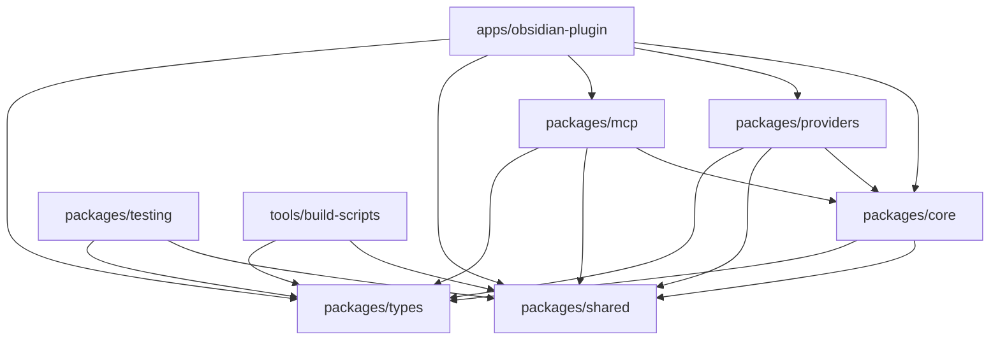

# Data Models: Monorepo Migration

**Created**: 2025-01-24
**Purpose**: Define package structure, interfaces, and data models for monorepo migration

## 1. Package Architecture Model

### Package Hierarchy

```
obsidian-tars/
├── packages/                    # Shared libraries
│   ├── types/                   # TypeScript type definitions
│   ├── core/                    # Core plugin logic
│   ├── providers/               # AI provider implementations
│   ├── mcp/                     # MCP server integration
│   ├── shared/                  # Shared utilities
│   └── testing/                 # Testing utilities
├── apps/                        # Deployable applications
│   └── obsidian-plugin/         # Main Obsidian plugin
└── tools/                       # Development tools
    ├── build-scripts/           # Build automation
    └── dev-tools/               # Development utilities
```

### Package Dependencies Graph



## 2. Core Package Models

### 2.1 Types Package (`@tars/types`)

**Purpose**: Centralized TypeScript definitions and interfaces

```typescript
// packages/types/src/index.ts

// Core plugin interfaces
export interface TarsPlugin {
  id: string
  version: string
  settings: TarsSettings
  providers: ProviderRegistry
  mcpServers: MCPServerRegistry
}

export interface TarsSettings {
  providers: ProviderConfig[]
  mcpServers: MCPServerConfig[]
  commands: CommandConfig[]
  ui: UIConfig
}

// Provider system interfaces
export interface ProviderConfig {
  id: string
  type: ProviderType
  name: string
  apiKey?: string
  baseUrl?: string
  model?: string
  parameters?: Record<string, unknown>
  enabled: boolean
}

export interface Vendor {
  id: string
  name: string
  type: ProviderType
  capabilities: ProviderCapabilities
  initialize(config: ProviderConfig): Promise<void>
  sendRequest(request: AIRequest): AsyncIterable<AIResponse>
  cleanup(): Promise<void>
}

export interface ProviderCapabilities {
  textGeneration: boolean
  vision: boolean
  imageGeneration: boolean
  webSearch: boolean
  streaming: boolean
  multimodal: boolean
}

// MCP system interfaces
export interface MCPServerConfig {
  id: string
  name: string
  command: string
  args?: string[]
  env?: Record<string, string>
  enabled: boolean
  capabilities: MCPCapabilities
}

export interface MCPCapabilities {
  tools: boolean
  resources: boolean
  prompts: boolean
  sampling: boolean
}

// Conversation system interfaces
export interface Conversation {
  id: string
  messages: Message[]
  context?: Record<string, unknown>
  metadata?: ConversationMetadata
}

export interface Message {
  id: string
  role: MessageRole
  content: MessageContent
  timestamp: Date
  metadata?: MessageMetadata
}

export interface MessageContent {
  type: 'text' | 'image' | 'file' | 'multimodal'
  text?: string
  images?: ImageContent[]
  files?: FileContent[]
}

// UI system interfaces
export interface UIConfig {
  theme: 'light' | 'dark' | 'auto'
  fontSize: number
  showStatusBar: boolean
  showSuggestions: boolean
  maxTokens: number
}

// Event system interfaces
export interface TarsEvent {
  type: EventType
  payload: unknown
  timestamp: Date
  source: string
}

export type EventType =
  | 'provider:initialized'
  | 'provider:error'
  | 'mcp:connected'
  | 'mcp:error'
  | 'conversation:started'
  | 'message:received'
  | 'settings:changed'

// Error handling interfaces
export interface TarsError extends Error {
  code: ErrorCode
  provider?: string
  details?: Record<string, unknown>
}

export type ErrorCode =
  | 'PROVIDER_NOT_FOUND'
  | 'PROVIDER_INIT_FAILED'
  | 'MCP_CONNECTION_FAILED'
  | 'CONVERSATION_ERROR'
  | 'SETTINGS_INVALID'
  | 'NETWORK_ERROR'
  | 'AUTHENTICATION_ERROR'
```

### 2.2 Core Package (`@tars/core`)

**Purpose**: Central plugin logic and business rules

```typescript
// packages/core/src/plugin.ts
export class TarsCore {
  private providers: ProviderRegistry
  private mcpServers: MCPServerRegistry
  private settings: SettingsManager
  private eventBus: EventBus

  constructor(config: TarsConfig) {
    this.providers = new ProviderRegistry(config.providers)
    this.mcpServers = new MCPServerRegistry(config.mcpServers)
    this.settings = new SettingsManager(config.settings)
    this.eventBus = new EventBus()
  }

  async initialize(): Promise<void>
  async processMessage(message: Message, targetProvider: string): Promise<AsyncIterable<AIResponse>>
  async handleMCPRequest(request: MCPRequest): Promise<MCPResponse>
  getAvailableProviders(): ProviderInfo[]
  getAvailableMCPServers(): MCPServerInfo[]
}

// packages/core/src/registry.ts
export class ProviderRegistry {
  private providers: Map<string, Vendor> = new Map()

  register(provider: Vendor): void
  unregister(id: string): void
  get(id: string): Vendor | undefined
  getAll(): Vendor[]
  getByCapability(capability: ProviderCapabilities): Vendor[]
}

export class MCPServerRegistry {
  private servers: Map<string, MCPServer> = new Map()

  register(server: MCPServer): void
  unregister(id: string): void
  get(id: string): MCPServer | undefined
  getAll(): MCPServer[]
  getCapabilities(): MCPCapabilities[]
}

// packages/core/src/settings.ts
export class SettingsManager {
  private settings: TarsSettings
  private obsidian: ObsidianAdapter

  load(): Promise<TarsSettings>
  save(settings: TarsSettings): Promise<void>
  update(updates: Partial<TarsSettings>): Promise<TarsSettings>
  validate(settings: TarsSettings): ValidationResult
}

// packages/core/src/events.ts
export class EventBus {
  private listeners: Map<EventType, EventListener[]> = new Map()

  on(event: EventType, listener: EventListener): void
  off(event: EventType, listener: EventListener): void
  emit(event: TarsEvent): void
  clear(): void
}
```

### 2.3 Providers Package (`@tars/providers`)

**Purpose**: AI provider implementations

```typescript
// packages/providers/src/base.ts
export abstract class BaseVendor implements Vendor {
  abstract id: string
  abstract name: string
  abstract type: ProviderType
  abstract capabilities: ProviderCapabilities

  protected config: ProviderConfig
  protected client: unknown

  constructor(config: ProviderConfig) {
    this.config = config
  }

  abstract initialize(): Promise<void>
  abstract sendRequest(request: AIRequest): AsyncIterable<AIResponse>
  abstract cleanup(): Promise<void>

  protected validateRequest(request: AIRequest): void
  protected transformRequest(request: AIRequest): unknown
  protected transformResponse(response: unknown): AIResponse
}

// packages/providers/src/openai.ts
export class OpenAIVendor extends BaseVendor {
  id = 'openai'
  name = 'OpenAI'
  type = ProviderType.OPENAI
  capabilities = {
    textGeneration: true,
    vision: true,
    imageGeneration: true,
    webSearch: false,
    streaming: true,
    multimodal: true
  }

  private client: OpenAI

  async initialize(): Promise<void>
  async sendRequest(request: AIRequest): AsyncIterable<AIResponse>
  async cleanup(): Promise<void>
}

// packages/providers/src/claude.ts
export class ClaudeVendor extends BaseVendor {
  id = 'claude'
  name = 'Claude'
  type = ProviderType.CLAUDE
  capabilities = {
    textGeneration: true,
    vision: true,
    imageGeneration: false,
    webSearch: false,
    streaming: true,
    multimodal: true
  }

  private client: Anthropic

  async initialize(): Promise<void>
  async sendRequest(request: AIRequest): AsyncIterable<AIResponse>
  async cleanup(): Promise<void>
}
```

### 2.4 MCP Package (`@tars/mcp`)

**Purpose**: MCP server integration

```typescript
// packages/mcp/src/client.ts
export class MCPClient {
  private connection: MCPConnection
  private capabilities: MCPCapabilities

  constructor(config: MCPServerConfig) {
    this.connection = new MCPConnection(config)
    this.capabilities = config.capabilities
  }

  async connect(): Promise<void>
  async disconnect(): Promise<void>
  async listTools(): Promise<Tool[]>
  async callTool(name: string, args: unknown): Promise<ToolResult>
  async listResources(): Promise<Resource[]>
  async readResource(uri: string): Promise<ResourceContent>
  async listPrompts(): Promise<Prompt[]>
  async getPrompt(name: string, args?: unknown): Promise<PromptResult>
}

// packages/mcp/src/server.ts
export interface MCPServer {
  id: string
  name: string
  config: MCPServerConfig
  client: MCPClient

  connect(): Promise<void>
  disconnect(): Promise<void>
  isHealthy(): Promise<boolean>
  getCapabilities(): MCPCapabilities
}

// packages/mcp/src/registry.ts
export class MCPServerRegistry {
  private servers: Map<string, MCPServer> = new Map()
  private tools: Map<string, Tool> = new Map()
  private resources: Map<string, Resource> = new Map()

  register(server: MCPServer): void
  unregister(id: string): void
  getServer(id: string): MCPServer | undefined
  getAllServers(): MCPServer[]
  getTools(): Tool[]
  getResources(): Resource[]
  getPrompts(): Prompt[]
}
```

### 2.5 Shared Package (`@tars/shared`)

**Purpose**: Common utilities and helpers

```typescript
// packages/shared/src/utils.ts
export class ConversationParser {
  static parse(text: string): Conversation
  static serialize(conversation: Conversation): string
  static extractMessages(text: string): Message[]
  static validateConversation(conversation: Conversation): ValidationResult
}

export class FileHandler {
  static async readFile(path: string): Promise<FileContent>
  static async writeFile(path: string, content: string): Promise<void>
  static async processEmbed(embed: string): Promise<FileContent>
  static isImageFile(content: FileContent): boolean
  static isPDFFile(content: FileContent): boolean
}

export class CacheManager {
  private cache: Map<string, CacheEntry> = new Map()
  private maxSize: number
  private ttl: number

  constructor(maxSize: number = 1000, ttl: number = 3600000) {
    this.maxSize = maxSize
    this.ttl = ttl
  }

  get(key: string): unknown | null
  set(key: string, value: unknown, ttl?: number): void
  delete(key: string): void
  clear(): void
  has(key: string): boolean
  size(): number
}

// packages/shared/src/constants.ts
export const PROVIDER_TYPES = {
  OPENAI: 'openai',
  CLAUDE: 'claude',
  DEEPSEEK: 'deepseek',
  GEMINI: 'gemini',
  OLLAMA: 'ollama'
} as const

export const MESSAGE_ROLES = {
  SYSTEM: 'system',
  USER: 'user',
  ASSISTANT: 'assistant',
  NEW_CHAT: 'newChat'
} as const

export const ERROR_CODES = {
  PROVIDER_NOT_FOUND: 'PROVIDER_NOT_FOUND',
  MCP_CONNECTION_FAILED: 'MCP_CONNECTION_FAILED',
  INVALID_REQUEST: 'INVALID_REQUEST',
  AUTHENTICATION_FAILED: 'AUTHENTICATION_FAILED'
} as const
```

### 2.6 Testing Package (`@tars/testing`)

**Purpose**: Testing utilities and mocks

```typescript
// packages/testing/src/mocks.ts
export class MockVendor extends BaseVendor {
  id = 'mock'
  name = 'Mock Provider'
  type = ProviderType.MOCK
  capabilities = {
    textGeneration: true,
    vision: false,
    imageGeneration: false,
    webSearch: false,
    streaming: true,
    multimodal: false
  }

  private responses: string[] = []

  setResponses(responses: string[]): void {
    this.responses = responses
  }

  async initialize(): Promise<void> {
    // Mock implementation
  }

  async sendRequest(request: AIRequest): AsyncIterable<AIResponse> {
    // Mock implementation with predictable responses
  }

  async cleanup(): Promise<void> {
    // Mock implementation
  }
}

export class MockMCPServer implements MCPServer {
  id = 'mock-mcp'
  name = 'Mock MCP Server'
  config: MCPServerConfig
  client: MCPClient
  connected = false

  async connect(): Promise<void> {
    this.connected = true
  }

  async disconnect(): Promise<void> {
    this.connected = false
  }

  async isHealthy(): Promise<boolean> {
    return this.connected
  }

  getCapabilities(): MCPCapabilities {
    return {
      tools: true,
      resources: true,
      prompts: true,
      sampling: true
    }
  }
}

// packages/testing/src/fixtures.ts
export const SAMPLE_CONVERSATIONS = {
  simple: {
    id: 'conv-1',
    messages: [
      {
        id: 'msg-1',
        role: 'user',
        content: { type: 'text', text: 'Hello, world!' },
        timestamp: new Date()
      }
    ]
  },

  multimodal: {
    id: 'conv-2',
    messages: [
      {
        id: 'msg-2',
        role: 'user',
        content: {
          type: 'multimodal',
          text: 'What do you see in this image?',
          images: [{ type: 'image', data: 'base64-data', mimeType: 'image/png' }]
        },
        timestamp: new Date()
      }
    ]
  }
}

// packages/testing/src/helpers.ts
export class TestHelper {
  static createMockProvider(type: ProviderType): MockVendor
  static createMockMCPServer(config?: Partial<MCPServerConfig>): MockMCPServer
  static createTestConversation(messages?: Partial<Message>[]): Conversation
  static createTestMessage(content: Partial<MessageContent>): Message
  static waitForEvent(eventBus: EventBus, eventType: EventType): Promise<TarsEvent>
  static assertProviderResponse(response: AIResponse, expectedContent: string): void
}
```

## 3. Application Package Model

### 3.1 Obsidian Plugin Package (`apps/obsidian-plugin`)

**Purpose**: Main Obsidian plugin deployment

```typescript
// apps/obsidian-plugin/src/main.ts
export default class TarsPlugin extends Plugin {
  private core: TarsCore
  private editor: EditorIntegration
  private statusBar: StatusBarManager
  private commands: CommandManager
  private suggestions: SuggestionManager

  async onload(): Promise<void> {
    // Initialize core systems
    this.core = new TarsCore(this.loadSettings())
    await this.core.initialize()

    // Initialize Obsidian integrations
    this.editor = new EditorIntegration(this.app, this.core)
    this.statusBar = new StatusBarManager(this)
    this.commands = new CommandManager(this, this.core)
    this.suggestions = new SuggestionManager(this.app, this.core)

    // Register event handlers
    this.registerEventHandlers()
  }

  async onunload(): Promise<void> {
    await this.core.cleanup()
  }

  async loadSettings(): Promise<TarsSettings>
  async saveSettings(): Promise<void>
}

// apps/obsidian-plugin/src/editor.ts
export class EditorIntegration {
  constructor(private app: App, private core: TarsCore) {}

  async processSelection(editor: Editor, providerId: string): Promise<void>
  async insertResponse(editor: Editor, response: string): Promise<void>
  parseConversation(editor: Editor): Conversation
  validateConversation(text: string): ValidationResult
}

// apps/obsidian-plugin/src/commands.ts
export class CommandManager {
  constructor(private plugin: TarsPlugin, private core: TarsCore) {}

  registerCommands(): void
  unregisterCommands(): void
  private async handleUserTag(editor: Editor): Promise<void>
  private async handleAssistantTag(editor: Editor, providerId: string): Promise<void>
  private async handleSystemTag(editor: Editor): Promise<void>
}
```

## 4. Configuration Models

### 4.1 Workspace Configuration

```yaml
# pnpm-workspace.yaml
packages:
  - 'apps/*'
  - 'packages/*'
  - 'tools/*'
```

### 4.2 Build Configuration

```json
// turbo.json
{
  "$schema": "https://turborepo.com/schema.json",
  "globalDependencies": ["**/.env.*local", "**/tsconfig.json"],
  "pipeline": {
    "build": {
      "dependsOn": ["^build"],
      "outputs": ["dist/**", "main.js", "manifest.json"]
    },
    "build:esm": {
      "dependsOn": ["^build"],
      "outputs": ["dist/**/*.js", "dist/**/*.d.ts"],
      "inputs": ["src/**/*.ts", "tsconfig.json"]
    },
    "build:iife": {
      "dependsOn": ["^build"],
      "outputs": ["main.js", "manifest.json"],
      "inputs": ["src/**/*.ts", "tsconfig.json", "tsup.config.ts"]
    },
    "test": {
      "dependsOn": ["build"],
      "outputs": ["coverage/**"]
    },
    "lint": { "outputs": [] },
    "type-check": { "dependsOn": ["^build"], "outputs": [] },
    "cli": {
      "cache": false,
      "dependsOn": ["^build"]
    },
    "demo": {
      "cache": false,
      "dependsOn": ["^build"]
    },
    "quality-check": {
      "dependsOn": ["build"],
      "outputs": [],
      "cache": false
    }
  }
}
```

### 4.3 Package Configuration Models

#### Plugin Package (IIFE Bundle)
```json
// apps/obsidian-plugin/package.json
{
  "name": "@tars/plugin",
  "version": "3.6.0",
  "type": "commonjs",
  "main": "main.js",
  "scripts": {
    "build": "tsup",
    "dev": "tsup --watch",
    "type-check": "tsc --noEmit"
  },
  "dependencies": {
    "@tars/core": "workspace:*",
    "@tars/providers": "workspace:*",
    "@tars/mcp": "workspace:*",
    "@tars/shared": "workspace:*",
    "@tars/types": "workspace:*",
    "obsidian": "^1.5.8"
  }
}

// apps/obsidian-plugin/tsup.config.ts
export default defineConfig({
  entry: ['src/main.ts'],
  format: ['iife'],
  dts: false,
  clean: true,
  minify: process.env.NODE_ENV === 'production',
  sourcemap: process.env.NODE_ENV === 'development',
  external: ['obsidian'],
  globalName: 'module.exports',
  banner: {
    js: '// Tars Obsidian Plugin v3.6.0'
  }
})
```

#### Shared Packages (ESM + TSX)
```json
// packages/core/package.json
{
  "name": "@tars/core",
  "version": "3.6.0",
  "type": "module",
  "main": "./dist/index.js",
  "types": "./dist/index.d.ts",
  "exports": {
    ".": {
      "import": "./dist/index.js",
      "types": "./dist/index.d.ts"
    },
    "./cli": {
      "import": "./src/cli/tars-cli.ts"
    }
  },
  "scripts": {
    "build": "tsup",
    "dev": "tsx --watch src/index.ts",
    "type-check": "tsc --noEmit",
    "cli": "tsx src/cli/tars-cli.ts",
    "test": "vitest"
  },
  "dependencies": {
    "@tars/types": "workspace:*",
    "@tars/shared": "workspace:*"
  },
  "devDependencies": {
    "tsx": "^4.19.0"
  },
  "bin": {
    "tars-core": "./bin/tars-cli.ts"
  }
}

// packages/core/tsup.config.ts
export default defineConfig({
  entry: ['src/index.ts'],
  format: ['esm'],
  dts: true,
  clean: true,
  external: ['obsidian'],
  onSuccess: 'echo "Core package built (ESM)"'
})
```

### 4.4 TSX Configuration Models

#### Root TSX Configuration
```json
// package.json (root)
{
  "scripts": {
    "tsx": "tsx",
    "cli:core": "tsx packages/core/src/cli/tars-cli.ts",
    "cli:providers": "tsx packages/providers/src/demo/provider-demo.ts",
    "cli:mcp": "tsx packages/mcp/src/cli/mcp-cli.ts",
    "cli:shared": "tsx packages/shared/src/cli/utils-cli.ts",
    "demo": "tsx packages/shared/src/cli/tui.ts"
  },
  "devDependencies": {
    "tsx": "^4.19.0"
  }
}
```

#### TSX Executable Templates
```typescript
// packages/core/bin/tars-cli.ts
#!/usr/bin/env tsx

import { Command } from 'commander'
import { TarsCore } from '../src/plugin.js'
import { loadConfig } from '../src/config.js'

const program = new Command()

program
  .name('tars-core')
  .description('TARS Core CLI utilities')
  .version('3.6.0')

program
  .command('init')
  .description('Initialize TARS configuration')
  .option('-d, --dir <path>', 'Configuration directory')
  .action(async (options) => {
    const config = await loadConfig(options.dir)
    const core = new TarsCore(config)
    await core.initialize()
    console.log('✓ TARS Core initialized')
  })

program
  .command('test')
  .description('Test core functionality')
  .action(async () => {
    // Core testing implementation
  })

program.parse()
```

### 4.5 Quality Configuration

```json
// biome.json (root)
{
  "organizeImports": { "enabled": true },
  "linter": { "enabled": true, "rules": { "recommended": true } },
  "formatter": { "enabled": true },
  "javascript": { "formatter": { "quoteStyle": "single" } }
}

// knip.json (root)
{
  "entry": ["src/index.ts", "src/**/*.ts"],
  "project": ["src/**/*.ts"],
  "ignore": ["**/node_modules/**", "**/dist/**"]
}
```

## 5. Migration State Models

### 5.1 Migration Progress

```typescript
interface MigrationState {
  phase: 'setup' | 'packages' | 'quality' | 'optimization' | 'complete'
  currentPackage: string
  completedPackages: string[]
  failedPackages: string[]
  qualityGates: {
    compilation: boolean
    typeCheck: boolean
    biome: boolean
    knip: boolean
    tests: boolean
  }
  issues: MigrationIssue[]
}

interface MigrationIssue {
  package: string
  type: 'compilation' | 'dependency' | 'test' | 'quality'
  severity: 'error' | 'warning' | 'info'
  message: string
  resolution?: string
}
```

### 5.2 Validation Models

```typescript
interface ValidationResult {
  valid: boolean
  errors: ValidationError[]
  warnings: ValidationWarning[]
}

interface ValidationError {
  code: string
  message: string
  path: string
  severity: 'error'
}

interface ValidationWarning {
  code: string
  message: string
  path: string
  severity: 'warning'
}
```

This comprehensive data model provides the foundation for implementing the monorepo migration with clear separation of concerns, proper dependency management, and comprehensive quality assurance.