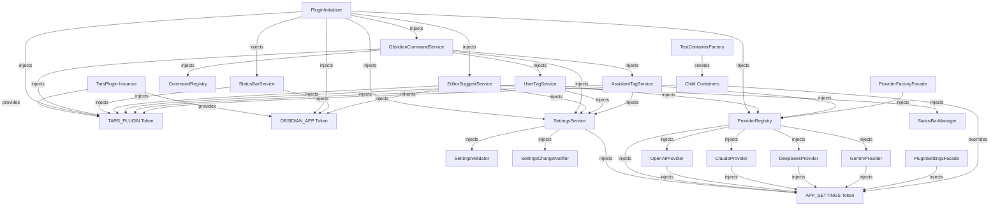
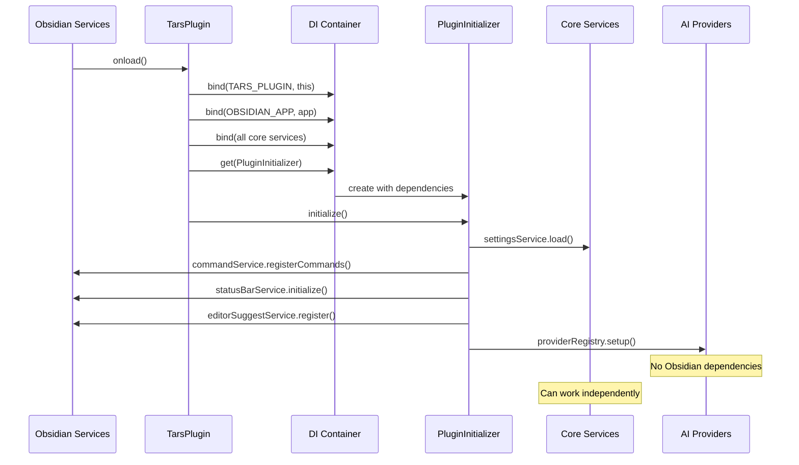
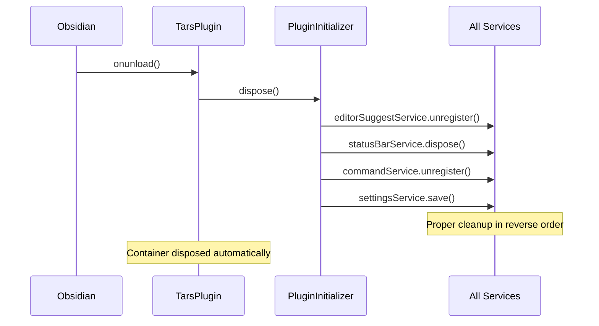
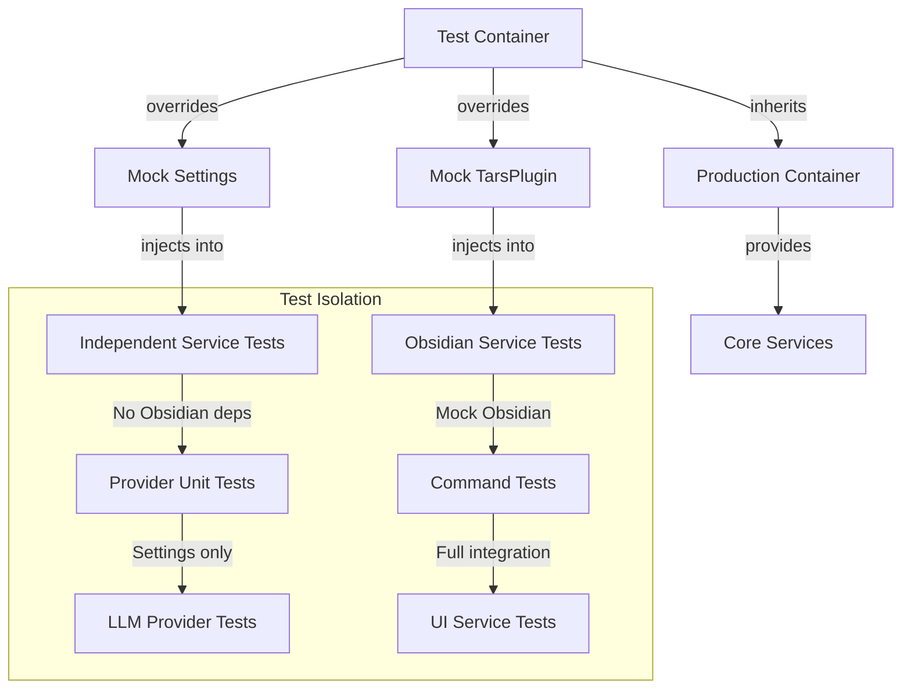

# Implementation Plan: Needle DI Migration

**Branch**: `003-needle-di-migration` | **Date**: 2025-11-02 | **Spec**: [spec.md](./spec.md)
**Input**: Feature specification from `/specs/003-needle-di-migration/spec.md`

## Summary

The Needle DI migration will transform the Tars Obsidian plugin from direct instantiation to dependency injection using Needle DI v1.1.0+. The implementation will create a centralized DI container where the TarsPlugin class itself becomes a service provider, and all Obsidian logic (addCommand, addStatusBarItem, registerEditorSuggest, etc.) moves into injectable services that request the plugin instance via DI. This creates a clean separation where TarsPlugin only handles initialization, and all business logic lives in properly injected services.

**Language/Version**: TypeScript 5.7+ with strict mode enabled, stage-3 decorators (no experimentalDecorators)
**Primary Dependencies**: PNPM 9.x, TURBO 2.x, BIOME 1.x, KNIP 5.x, TSX latest, TSUP 8.x, ESBUILD latest, Obsidian API, @needle-di/core v1.1.0+, various AI provider SDKs
**Storage**: Obsidian's encrypted settings for configuration, file system for notes, monorepo package management
**Testing**: Vitest 2.x for unit tests with child container isolation, turbo test orchestration, 85%+ coverage requirement
**Target Platform**: Obsidian plugin (desktop + mobile) with monorepo build system
**Project Type**: Monorepo with multiple TypeScript packages and shared dependencies
**Performance Goals**: <50ms plugin initialization overhead, <10ms configuration propagation, <5s incremental builds, responsive UI during streaming responses
**Constraints**: Must work within Obsidian's security sandbox and API limitations, maintain monorepo package boundaries, zero breaking changes
**Scale/Scope**: Transform main.ts from manual dependency management to DI container, convert 15+ AI providers to injectable classes, create comprehensive test infrastructure

## Dependency Injection Hierarchy

### Overview

The DI system follows a layered architecture where dependencies flow from the root `TarsPlugin` instance down through specialized services. Services are categorized by their dependency on Obsidian APIs:

- **Obsidian-Dependent Services**: Require `TARS_PLUGIN` token to access Obsidian APIs
- **Independent Services**: No Obsidian dependencies, can function standalone (LLM providers, settings, etc.)
- **Core Infrastructure**: Foundational services that other services depend on

### Dependency Graph



### Service Categories & Lifecycle

#### 1. Root Provider (TarsPlugin)
- **Role**: Provides itself and Obsidian App instance to DI container
- **Lifecycle**: Managed by Obsidian (onload/onunload)
- **Dependencies**: None (root of dependency tree)

```typescript
// TarsPlugin.onload()
this.container.bind({ provide: TARS_PLUGIN, useValue: this })
this.container.bind({ provide: OBSIDIAN_APP, useValue: this.app })
```

#### 2. Core Orchestrator (PluginInitializer)
- **Role**: Root orchestrator that coordinates all plugin initialization
- **Lifecycle**: Singleton, created by TarsPlugin, disposed on plugin unload
- **Dependencies**: TARS_PLUGIN, OBSIDIAN_APP, core services

```typescript
@injectable()
export class PluginInitializer {
  constructor(
    private plugin = inject(TARS_PLUGIN),
    private app = inject(OBSIDIAN_APP),
    private settingsService = inject(SettingsService),
    private commandService = inject(ObsidianCommandService),
    private statusBarService = inject(StatusBarService),
    private editorSuggestService = inject(EditorSuggestService),
    private providerRegistry = inject(ProviderRegistry)
  ) {}

  async initialize(): Promise<void> {
    await this.settingsService.load()
    this.setupObsidianFeatures()
    this.setupProviders()
  }

  async dispose(): Promise<void> {
    this.editorSuggestService.unregister()
    this.statusBarService.dispose()
    this.commandService.unregister()
    await this.settingsService.save()
  }
}
```

#### 3. Independent Services (No Obsidian Dependencies)

**Settings Service Layer**:
```typescript
@injectable()
export class SettingsService {
  constructor(
    private settings = inject(APP_SETTINGS),
    private validator = inject(SettingsValidator),
    private changeNotifier = inject(SettingsChangeNotifier)
  ) {}
  // No TARS_PLUGIN dependency - can work standalone
}
```

**Provider Layer** (LLM/AI Services):
```typescript
@injectable()
export class OpenAIProvider implements Vendor {
  constructor(private settings = inject(APP_SETTINGS)) {}
  // No TARS_PLUGIN dependency - independent service
}

@injectable()
export class ProviderRegistry {
  constructor(private settings = inject(APP_SETTINGS)) {}
  // Manages providers without needing Obsidian APIs
}
```

#### 4. Obsidian-Dependent Services

**Command Services**:
```typescript
@injectable()
export class ObsidianCommandService {
  constructor(
    private plugin = inject(TARS_PLUGIN),
    private settingsService = inject(SettingsService),
    private userTagService = inject(UserTagService),
    private assistantTagService = inject(AssistantTagService)
  ) {}

  registerCommands(): void {
    // Uses plugin.addCommand()
    this.plugin.addCommand(this.createSelectMsgCommand())
    this.plugin.addCommand(this.createCancelCommand())
  }
}
```

**UI Services**:
```typescript
@injectable()
export class StatusBarService {
  constructor(
    private plugin = inject(TARS_PLUGIN),
    private app = inject(OBSIDIAN_APP)
  ) {}

  initialize(): void {
    this.statusBarItem = this.plugin.addStatusBarItem()
  }
}

@injectable()
export class EditorSuggestService {
  constructor(
    private plugin = inject(TARS_PLUGIN),
    private app = inject(OBSIDIAN_APP),
    private settingsService = inject(SettingsService)
  ) {}

  register(): void {
    this.plugin.registerEditorSuggest(
      new TagEditorSuggest(this.app, this.settingsService, ...)
    )
  }
}
```

### Initialization Flow



### Disposal Flow



### Testing Architecture



### Key Principles

1. **Dependency Direction**: Dependencies flow from Obsidian-dependent services → independent services → core infrastructure
2. **Lifecycle Management**: `PluginInitializer` coordinates all setup/teardown, respecting Obsidian's `onload`/`onunload`
3. **Test Isolation**: Independent services can be tested without Obsidian mocks; Obsidian services need only targeted mocking
4. **Backward Compatibility**: Facade layer maintains existing APIs while internal architecture uses DI
5. **Separation of Concerns**: Obsidian API calls isolated in dedicated services, business logic in independent services

## Constitution Check

*GATE: Must pass before Phase 0 research. Re-check after Phase 1 design.*

All features MUST pass these constitutional gates:

**Gate 1: Plugin Architecture Excellence**
- Feature integrates cleanly with Obsidian APIs (file cache, editor, suggestions)
- Clear separation between provider logic and Obsidian-specific code
- Self-contained and independently testable implementation

**Gate 2: Provider Abstraction**
- Uses existing `Vendor` interface without modifications (unless explicitly justified)
- No provider-specific logic leaks into core plugin code
- Supports streaming responses with proper AbortController handling

**Gate 3: Test-First Development (TDD)**
- Red-Green-Refactor cycle strictly enforced
- Tests MUST be written before implementation, MUST fail initially
- All provider implementations MUST include contract tests
- Code and branch coverage MUST exceed 85%
- All unit tests MUST include Given/When/Then comments in format `// {GIVEN|WHEN|THEN}: {description}`
- Test comments MUST focus on business value, not implementation details

**Gate 4: Cross-Platform Compatibility**
- Works on both desktop and mobile Obsidian clients
- Supports both mouse/keyboard and touch interfaces
- Uses Obsidian's cross-platform file system abstraction

**Gate 5: Performance & Responsiveness**
- UI remains responsive during AI operations
- Uses streaming responses for long operations
- No blocking operations in the main thread

**Gate 6: MCP Integration Capability**
- MCP server integrations follow same abstraction patterns as AI providers
- Clean separation between core plugin logic and MCP server implementations
- MCP functionality is independently testable

**Gate 7: Development Standards & Tooling**
- Uses PNPM for package management and workspaces
- Uses TURBO for build orchestration and caching
- Uses BIOME for linting and formatting (replaces ESLint/Prettier)
- Uses KNIP for dependency analysis
- Uses TSX for TypeScript execution
- Uses TSUP/ESBUILD for bundling
- Follows monorepo architecture requirements
- TypeScript targets ES2022+ for decorator and modern feature support

**Gate 8: TypeScript Code Excellence**
- Follows domain-scoped file structure with composable component suites
- Uses generic type names within domains (Result, Config, Options)
- Preserves error causes with proper chaining using Object.assign
- Implements async generators for streaming with cancellation support
- Favors composition over inheritance with EventEmitter patterns
- Isolates side effects to application edges
- Uses static factories for clean declarative APIs

**Gate 9: Needle DI Architecture Standards**
- Uses Needle DI v1.1.0+ with stage-3 decorators (no experimentalDecorators)
- Implements @injectable() decorators with constructor injection via inject()
- Supports child containers for test isolation
- Uses configuration tokens for type-safe settings binding
- Implements factory patterns for complex initialization
- Validates all container bindings can be resolved at startup
- Maintains proper singleton and transient lifecycle scopes

**Gate 10: React Component Architecture**
- Follows atomic hierarchy (Atoms → Components → Views) with minimal state in Atoms
- Uses TypeScript props typing with type over interface, 80%+ required props
- Implements React 18+ patterns (automatic batching, Suspense boundaries)
- Uses composition over prop drilling with proper performance patterns
- Maintains hooks discipline with proper dependency arrays
- Implements conditional rendering with early returns and extracted subcomponents
- Wraps all user-facing text in t('...') function for i18n readiness

**Gate 11: Security & Privacy**
- API keys stored in Obsidian's encrypted settings
- No sensitive data exposed in logs or error messages
- Content only transmitted to configured AI provider or MCP server
- MCP server connections have appropriate security controls and user consent
- React components sanitize HTML and validate URL protocols
- Never expose secrets in client bundles or use insecure storage

## Project Structure

### Documentation (this feature)

```text
specs/[###-feature]/
├── plan.md              # This file (/speckit.plan command output)
├── research.md          # Phase 0 output (/speckit.plan command)
├── data-model.md        # Phase 1 output (/speckit.plan command)
├── quickstart.md        # Phase 1 output (/speckit.plan command)
├── contracts/           # Phase 1 output (/speckit.plan command)
└── tasks.md             # Phase 2 output (/speckit.tasks command - NOT created by /speckit.plan)
```

### Source Code (repository root)
<!--
  ACTION REQUIRED: Replace the placeholder tree below with the concrete layout
  for this feature. Delete unused options and expand the chosen structure with
  real paths (e.g., apps/admin, packages/something). The delivered plan must
  not include Option labels.
-->

```text
# Obsidian Plugin Project Structure
src/
├── main.ts                    # Plugin entry point
├── settings.ts                # Settings management
├── editor.ts                  # Core text processing and AI request handling
├── suggest.ts                 # Tag-based autocomplete system
├── providers/                 # AI provider implementations
│   ├── base.ts               # Base vendor interface
│   ├── openai.ts             # OpenAI provider
│   ├── claude.ts             # Claude provider
│   └── [other-providers].ts  # Other AI providers
├── commands/                  # Tag-based command system
├── prompt/                    # Prompt template management
├── lang/                      # Internationalization support
└── mcp/                       # MCP server integrations (NEW)
    ├── base.ts               # MCP server interface
    └── [server-implementations].ts

tests/
├── unit/                     # Unit tests for core logic
├── integration/              # Integration tests for providers/MCP
└── contract/                 # Contract tests for interface compliance

# Build Output
main.js                      # Compiled plugin bundle
styles.css                   # Plugin-specific styles
```

**Structure Decision**: Obsidian plugin architecture with modular provider and MCP integration patterns

## Complexity Tracking

> **Fill ONLY if Constitution Check has violations that must be justified**

| Violation | Why Needed | Simpler Alternative Rejected Because |
|-----------|------------|-------------------------------------|
| [e.g., 4th project] | [current need] | [why 3 projects insufficient] |
| [e.g., Repository pattern] | [specific problem] | [why direct DB access insufficient] |
