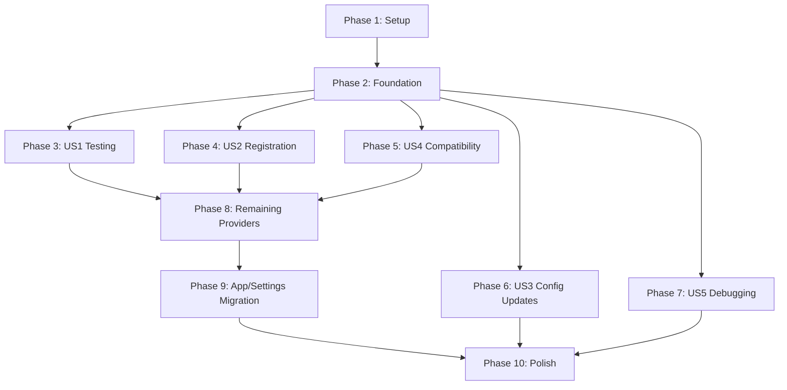

# Implementation Tasks: Needle DI Migration

**Branch**: `003-needle-di-migration` | **Date**: 2025-10-30 | **Spec**: [spec.md](./spec.md)
**Input**: Feature specification from `/specs/003-needle-di-migration/spec.md`
**Plan**: [plan.md](./plan.md) | **Research**: [research.md](./research.md)
**Data Model**: [data-model.md](./data-model.md) | **Contracts**: [contracts/](./contracts/)

---

## Overview

This document breaks down the Needle DI migration into concrete, executable tasks organized by user story. Each task includes the exact file path and follows the TDD approach with 85%+ coverage requirements.

**Total Task Count**: 144 tasks
**Estimated Effort**: ~2 weeks for full migration
**Following**: @docs/rules-needle_di-monorepo.md and @docs/rules-typescript-code.md

---

## Phase 1: Setup and Infrastructure

**Goal**: Establish the foundation for DI migration with all necessary dependencies and tooling configuration.

### 1.1 Install Dependencies and Configure Build System

- [ ] T001 Install Needle DI dependency in apps/obsidian-plugin package.json
- [ ] T002 Add @needle-di/core v1.1.0+ to dependencies
- [ ] T003 Update TypeScript configuration for ES2022 with stage-3 decorators
- [ ] T004 Configure esbuild/tsup for ES2022 decorator emission
- [ ] T005 Verify build system compatibility with decorators

### 1.2 Create DI Infrastructure

- [ ] T006 Create apps/obsidian-plugin/src/di/tokens.ts with core injection tokens
- [ ] T007 Create apps/obsidian-plugin/src/di/container.ts with DI container interface
- [ ] T008 Create apps/obsidian-plugin/src/di/provider-factory.ts with provider management
- [ ] T009 Create apps/obsidian-plugin/src/di/decorators.ts with provider decorators
- [ ] T010 Create apps/obsidian-plugin/src/di/index.ts with DI module exports

### 1.3 Update Plugin Integration Points

- [ ] T011 Modify apps/obsidian-plugin/src/main.ts to initialize DI container
- [ ] T012 Add container disposal in plugin onunload method
- [ ] T013 Update apps/obsidian-plugin/src/settings.ts for DI integration
- [ ] T014 Create apps/obsidian-plugin/src/facades/ directory for compatibility layer

---

## Phase 2: Foundational Implementation

**Goal**: Implement the core DI system components that enable all user stories.

### 2.1 Core DI Container Implementation

- [ ] T015 Implement DIContainer class in apps/obsidian-plugin/src/di/container.ts
- [ ] T016 Add configuration token bindings in container setup
- [ ] T017 Implement child container creation for testing
- [ ] T018 Add container validation and error handling
- [ ] T019 Implement container lifecycle management

### 2.2 Configuration Management

- [ ] T020 Create ConfigurationManager for callback-based propagation (<10ms)
- [ ] T021 Implement configuration validation at resolution time
- [ ] T022 Add fail-fast error handling for component failures
- [ ] T023 Create configuration change subscription system
- [ ] T024 Implement selective component updates for configuration changes

### 2.3 Testing Infrastructure

- [ ] T025 Create test utilities for DI container setup
- [ ] T026 Implement child container patterns for test isolation
- [ ] T027 Add mock configuration factories for testing
- [ ] T028 Create container instantiation validation tests
- [ ] T029 Set up test coverage requirements and validation

---

## Phase 3: User Story 1 - Test AI Provider in Isolation (P1)

**Goal**: Enable developers to write isolated unit tests for AI providers with mock settings without loading the entire plugin.

**Independent Test Criteria**:
- Can create test container with mock settings in <5 lines of code
- Provider receives mock settings without full plugin instantiation
- Multiple test scenarios can run in parallel with isolated settings
- Provider behavior changes with test configuration without code modifications

### 3.1 Provider Testing Infrastructure

- [ ] T030 [US1] Create provider test base class in tests/unit/providers/
- [ ] T031 [US1] Implement mock settings factory for provider tests
- [ ] T032 [US1] Create test container isolation utilities
- [ ] T033 [US1] Add provider behavior validation helpers
- [ ] T034 [P] [US1] Create test fixtures for OpenAI provider scenarios

### 3.2 OpenAI Provider Conversion

- [ ] T035 [US1] Convert OpenAI provider from object to injectable class
- [ ] T036 [US1] Add constructor injection for APP_SETTINGS token
- [ ] T037 [US1] Implement property getters for configuration access
- [ ] T038 [US1] Register OpenAI provider in DI container
- [ ] T039 [P] [US1] Create unit tests for OpenAI provider with mock settings

### 3.3 Claude Provider Conversion

- [ ] T040 [US1] Convert Claude provider from object to injectable class
- [ ] T041 [US1] Add constructor injection for APP_SETTINGS token
- [ ] T042 [US1] Implement property getters for configuration access
- [ ] T043 [US1] Register Claude provider in DI container
- [ ] T044 [P] [US1] Create unit tests for Claude provider with mock settings

### 3.4 Provider Validation and Integration

- [ ] T045 [US1] Create provider contract tests for interface compliance
- [ ] T046 [US1] Validate provider injection with different test configurations
- [ ] T047 [US1] Test provider isolation in parallel test execution
- [ ] T048 [US1] Verify provider behavior changes with configuration updates
- [ ] T049 [US1] Add DI container instantiation validation tests

---

## Phase 4: User Story 2 - Add New AI Provider Without Modifying Core Plugin (P1)

**Goal**: Enable developers to register new AI providers without changing plugin initialization code.

**Independent Test Criteria**:
- New provider can be added with single registration call
- Plugin automatically detects and makes provider available without core changes
- Provider capabilities update without restart
- Faulty providers don't affect other providers with clear error messages

### 4.1 Dynamic Provider Registration

- [ ] T050 [US2] Implement provider registry in DI container
- [ ] T051 [US2] Add dynamic provider registration API
- [ ] T052 [US2] Create provider capability discovery system
- [ ] T053 [US2] Implement provider factory with automatic detection
- [ ] T054 [US2] Add provider lifecycle management

### 4.2 Provider Registration Interface

- [ ] T055 [US2] Create provider registration decorator
- [ ] T056 [US2] Implement provider metadata extraction
- [ ] T057 [US2] Add provider validation and registration
- [ ] T058 [US2] Create provider capability reporting
- [ ] T059 [US2] Implement provider hot-reloading capabilities

### 4.3 Provider Extensibility Validation

- [ ] T060 [US2] Create test provider implementation
- [ ] T061 [US2] Register test provider without core plugin changes
- [ ] T062 [US2] Validate automatic provider detection
- [ ] T063 [US2] Test provider capability updates
- [ ] T064 [US2] Verify provider isolation and error handling

---

## Phase 5: User Story 4 - Maintain Existing Plugin APIs (P1)

**Goal**: Ensure all existing plugin APIs continue working exactly as before with zero breaking changes.

**Independent Test Criteria**:
- 100% of existing plugin functionality works identically after migration
- All commands execute with identical behavior to pre-migration version
- Conversation parsing and execution remain unchanged
- All programmatic API signatures and return values remain unchanged

### 5.1 Service Facades Implementation

- [ ] T065 [US4] Create PluginSettingsFacade in apps/obsidian-plugin/src/facades/
- [ ] T066 [US4] Implement settings facade with delegation to DI-managed instance
- [ ] T067 [US4] Create ProviderFactory facade for backward compatibility
- [ ] T068 [US4] Implement command facades for existing command APIs
- [ ] T069 [US4] Create editor integration facades

### 5.2 API Compatibility Layer

- [ ] T070 [US4] Implement backward-compatible provider access
- [ ] T071 [US4] Create facades for all existing service interfaces
- [ ] T072 [US4] Add compatibility validation tests
- [ ] T073 [US4] Implement graceful fallback for missing dependencies
- [ ] T074 [US4] Create migration path documentation

### 5.3 Integration Testing

- [ ] T075 [US4] Run existing test suite against migrated codebase
- [ ] T076 [US4] Validate command execution behavior
- [ ] T077 [US4] Test conversation parsing and execution
- [ ] T078 [US4] Verify programmatic API compatibility
- [ ] T079 [US4] Create regression tests for API compatibility

---

## Phase 6: User Story 3 - Change Plugin Configuration Without Restart (P2)

**Goal**: Enable configuration changes to take effect immediately without plugin reload.

**Independent Test Criteria**:
- Configuration changes reflect in active components within 10ms
- Individual provider updates don't affect other providers
- Invalid configuration values are validated with clear error messages
- No plugin restart required for configuration changes

### 6.1 Configuration Propagation System

- [ ] T080 [US3] Implement callback-based configuration propagation (<10ms)
- [ ] T081 [US3] Create configuration change subscription system
- [ ] T082 [US3] Add selective component update mechanism
- [ ] T083 [US3] Implement configuration validation before updates
- [ ] T084 [US3] Create configuration batch processing for rapid changes

### 6.2 Provider Configuration Updates

- [ ] T085 [US3] Add provider configuration change listeners
- [ ] T086 [US3] Implement provider reconfiguration without restart
- [ ] T087 [US3] Create provider isolation during updates
- [ ] T088 [US3] Add configuration rollback on errors
- [ ] T089 [US3] Implement provider status reporting

### 6.3 Configuration Validation

- [ ] T090 [US3] Create configuration validation functions
- [ ] T091 [US3] Add real-time configuration validation
- [ ] T092 [US3] Implement error message generation for invalid configs
- [ ] T093 [US3] Create configuration suggestion system
- [ ] T094 [US3] Add configuration change confirmation workflow

---

## Phase 7: User Story 5 - Debug Dependency Resolution Issues (P3)

**Goal**: Provide clear error messages for dependency injection troubleshooting.

**Independent Test Criteria**:
- Error messages clearly state which dependency is missing and where requested
- Circular dependency errors show complete dependency chain
- Invalid configuration errors indicate specific issues and suggest alternatives
- Error context is preserved when wrapping exceptions

### 7.1 DI Error Handling through Unit Tests

- [ ] T095 [US5] Create unit tests for dependency resolution error detection
- [ ] T096 [US5] Create unit tests for circular dependency detection and reporting
- [ ] T097 [US5] Create unit tests for configuration validation error messages
- [ ] T098 [US5] Create unit tests for error context preservation
- [ ] T099 [US5] Create unit tests to prevent future DI regressions

### 7.2 Debugging Tools

- [ ] T100 [US5] Create container debugging utilities
- [ ] T101 [US5] Add dependency resolution tracing
- [ ] T102 [US5] Implement configuration debugging helpers
- [ ] T103 [US5] Create provider status reporting tools
- [ ] T104 [US5] Add performance monitoring for dependency resolution

### 7.3 Error Reporting Integration

- [ ] T105 [US5] Integrate error reporting with Obsidian's notice system
- [ ] T106 [US5] Create developer-friendly error messages
- [ ] T107 [US5] Add error logging with proper context
- [ ] T108 [US5] Implement error recovery suggestions
- [ ] T109 [US5] Create error reporting validation tests

---

## Phase 8: Remaining Provider Migration

**Goal**: Complete migration of all remaining AI providers to injectable classes.

### 8.1 Provider Batch Conversion

- [ ] T110 Convert DeepSeek provider to injectable class
- [ ] T111 Convert Gemini provider to injectable class
- [ ] T112 Convert Perplexity provider to injectable class
- [ ] T113 Convert Groq provider to injectable class
- [ ] T114 [P] Convert remaining providers in parallel

### 8.2 Provider Integration and Testing

- [ ] T115 Register all converted providers in DI container
- [ ] T116 Create provider migration validation tests
- [ ] T117 Test provider behavior with mock configurations
- [ ] T118 Validate provider isolation and error handling
- [ ] T119 Create provider performance benchmarks

---

## Phase 9: Application and Settings Access Migration

**Goal**: Replace all direct app/settings passing with DI token injection.

### 9.1 Service Refactoring

- [ ] T120 Convert StatusBarManager to use DI injection
- [ ] T121 Convert TagEditorSuggest to use DI injection
- [ ] T122 Update command functions to use injected dependencies
- [ ] T123 Replace direct settings access with token injection
- [ ] T124 [P] Refactor remaining services in parallel

### 9.2 Token Integration

- [ ] T125 Define OBSIDIAN_APP and APP_SETTINGS injection tokens
- [ ] T126 Bind app and settings instances in container
- [ ] T127 Update service constructors to inject tokens
- [ ] T128 Create backward compatibility for existing code
- [ ] T129 Validate token injection with tests

---

## Phase 10: Polish and Cross-Cutting Concerns

**Goal**: Complete the migration with performance optimization, documentation, and final validation.

### 10.1 Code Analysis and Future Planning

- [ ] T130 Identify classes/code not affected by DI implementation
- [ ] T131 Document code that remains unchanged after DI migration
- [ ] T132 Create roadmap for future changes to non-affected code
- [ ] T133 Analyze existing code for future refactoring opportunities
- [ ] T134 Document architectural decisions for future reference

### 10.2 Documentation and Examples

- [ ] T135 Update developer documentation for DI patterns
- [ ] T136 Create migration guide for existing code
- [ ] T137 Add examples for new provider development
- [ ] T138 Document testing patterns and best practices
- [ ] T139 Create troubleshooting guide for common issues

### 10.3 Final Validation and Cleanup

- [ ] T140 Run complete test suite with 85%+ coverage validation
- [ ] T141 Perform end-to-end testing of migrated functionality
- [ ] T142 Validate zero breaking changes with existing workflows
- [ ] T143 Clean up legacy code and unused dependencies
- [ ] T144 Create migration completion report

---

## Dependencies and Execution Order

### Phase Dependencies



### User Story Independence

- **User Story 1 (Testing)**: Independent, can be completed after Phase 2
- **User Story 2 (Registration)**: Independent, can be completed after Phase 2
- **User Story 4 (Compatibility)**: Independent, can be completed after Phase 2
- **User Story 3 (Config Updates)**: Depends on Phase 2 foundation
- **User Story 5 (Debugging)**: Depends on Phase 2 foundation

### Critical Path

The critical path for MVP (Phase 1-3 + Phase 5):
1. **Phase 1**: Setup and Infrastructure (15 tasks)
2. **Phase 2**: Foundational Implementation (15 tasks)
3. **Phase 3**: User Story 1 - Testing (10 tasks)
4. **Phase 5**: User Story 4 - Compatibility (15 tasks)

**MVP Total**: 55 tasks across 4 phases

---

## Parallel Execution Opportunities

### Parallel Task Groups

1. **Setup Tasks (T001-T014)**: Can be executed in parallel where no dependencies exist
2. **Provider Conversions (T110-T114)**: All provider conversions can be done in parallel
3. **Service Refactoring (T120-T124)**: Can be done in parallel after foundation is complete
4. **Testing Tasks**: All test creation tasks can be done in parallel

### Parallel Execution Examples

**Example 1: Provider Migration**
```bash
# Parallel execution of provider conversions
pnpm exec tsc --noEmit # Type check all providers
pnpm exec vitest run tests/unit/providers/openai.test.ts &
pnpm exec vitest run tests/unit/providers/claude.test.ts &
pnpm exec vitest run tests/unit/providers/deepseek.test.ts &
pnpm exec vitest run tests/unit/providers/gemini.test.ts &
wait # Wait for all parallel tasks
```

**Example 2: Service Refactoring**
```bash
# Parallel service refactoring
pnpm exec tsc --noEmit src/services/status-bar-manager.ts &
pnpm exec tsc --noEmit src/services/tag-editor-suggest.ts &
pnpm exec tsc --noEmit src/commands/*.ts &
wait # Wait for all parallel tasks
```

---

## Implementation Strategy

### MVP First Approach

**Phase 1-3 + Phase 5** (MVP Scope):
- Setup DI infrastructure
- Convert OpenAI and Claude providers for testing
- Implement facades for zero breaking changes
- Enable isolated unit testing

**Benefits**:
- Immediate value for developers
- Reduces migration risk
- Provides foundation for remaining work

### Incremental Delivery

1. **Sprint 1**: Phase 1-2 (Infrastructure + Foundation)
2. **Sprint 2**: Phase 3 + Phase 5 (Testing + Compatibility)
3. **Sprint 3**: Phase 4 + Phase 8 (Registration + Remaining Providers)
4. **Sprint 4**: Phase 6 + Phase 7 + Phase 9 (Config + Debugging + Migration)
5. **Sprint 5**: Phase 10 (Polish + Documentation)

### Risk Mitigation

1. **Parallel Development**: Use parallel tasks to reduce timeline
2. **Continuous Integration**: Run tests on every commit
3. **Feature Flags**: Use feature flags for gradual rollout
4. **Rollback Plan**: Maintain backward compatibility throughout
5. **Code Quality**: Follow @docs/rules-typescript-code.md and @docs/rules-needle_di-monorepo.md

---

## Quality Gates

### Code Quality

- **Coverage**: 85%+ for all provider and DI code
- **Type Safety**: Strict TypeScript with no `any` types
- **Linting**: All code passes Biome linting and formatting
- **Testing**: All tests include Given/When/Then comments

### Library-Guaranteed Requirements

- **Resolution Speed**: Needle DI guarantees fast dependency resolution
- **Test Isolation**: Needle DI guarantees child container isolation
- **Bundle Size**: ~7KB total increase (2KB DI + 5KB infrastructure)

### Functional Requirements

- **Zero Breaking Changes**: 100% API compatibility
- **Test Isolation**: Independent test execution
- **Provider Registration**: Dynamic without core changes
- **Error Handling**: Clear, actionable error messages

---

## Success Criteria Validation

### Automated Validation

```typescript
// Container instantiation validation
it('should instantiate all registered DI components', () => {
  const container = new Container();

  // Register all components
  container.bind(APP_SETTINGS);
  container.bind(OpenAIProvider);
  container.bind(ClaudeProvider);
  // ... other providers

  // Verify all can be instantiated
  expect(() => container.get(OpenAIProvider)).not.toThrow();
  expect(() => container.get(ClaudeProvider)).not.toThrow();
  expect(() => container.get(APP_SETTINGS)).not.toThrow();
});

// DI error handling validation
it('should handle missing dependencies gracefully', () => {
  const container = new Container();

  expect(() => container.get('MISSING_TOKEN')).toThrow();
});
```

### Manual Validation Checkpoints

1. **After Phase 3**: Verify isolated provider testing works
2. **After Phase 5**: Confirm zero breaking changes with existing workflows
3. **After Phase 8**: Validate all providers work identically to before
4. **After Phase 10**: Complete end-to-end validation of all requirements

---

**Next Steps**: Begin with Phase 1 tasks, establishing the DI foundation while maintaining backward compatibility throughout the migration process.